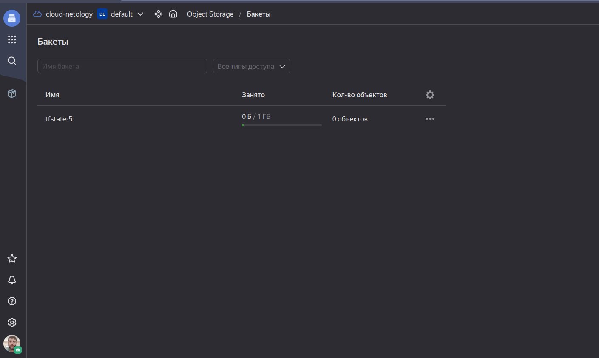
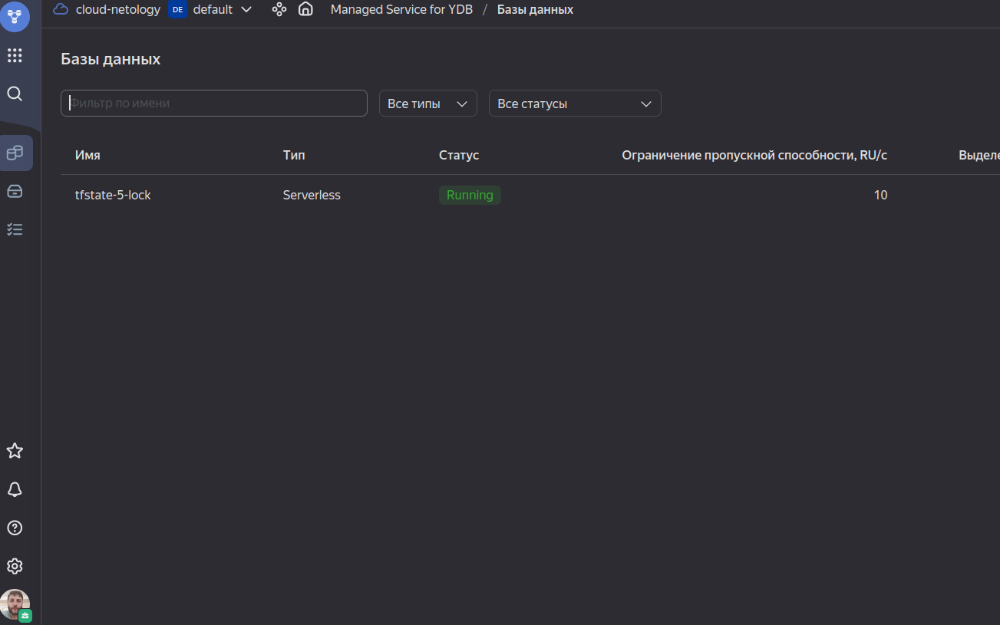
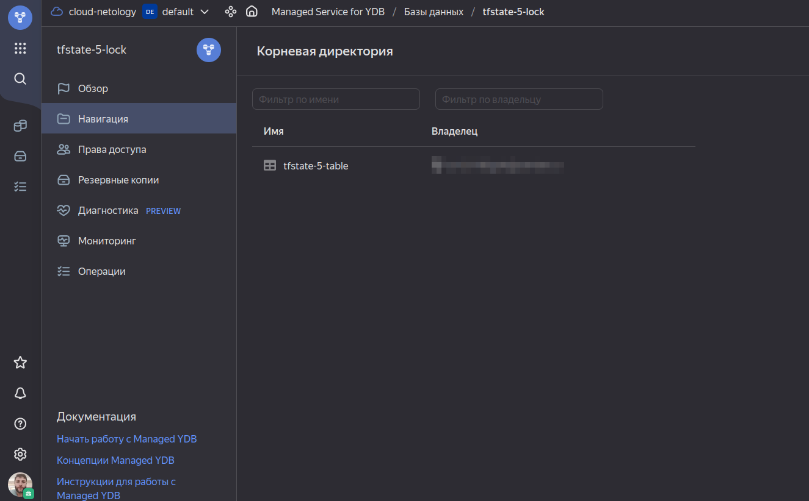
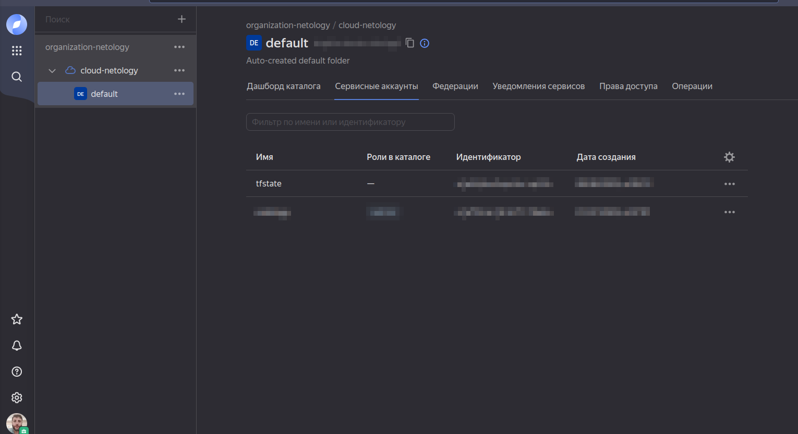
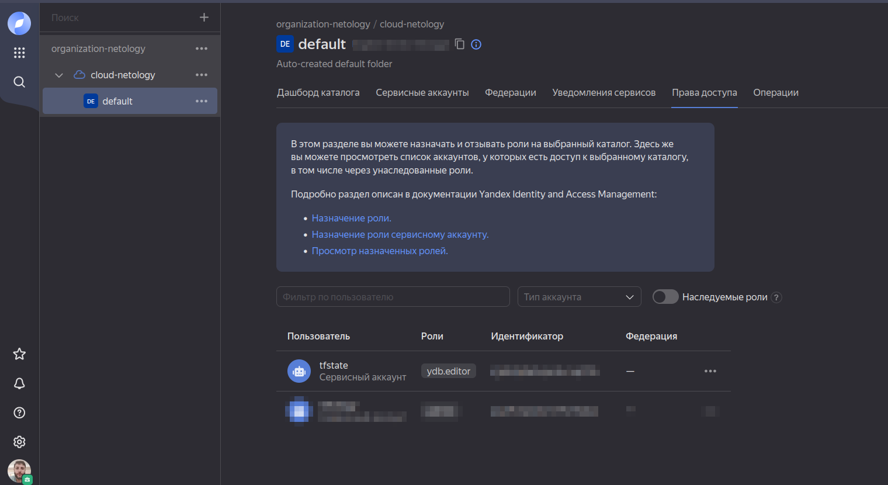
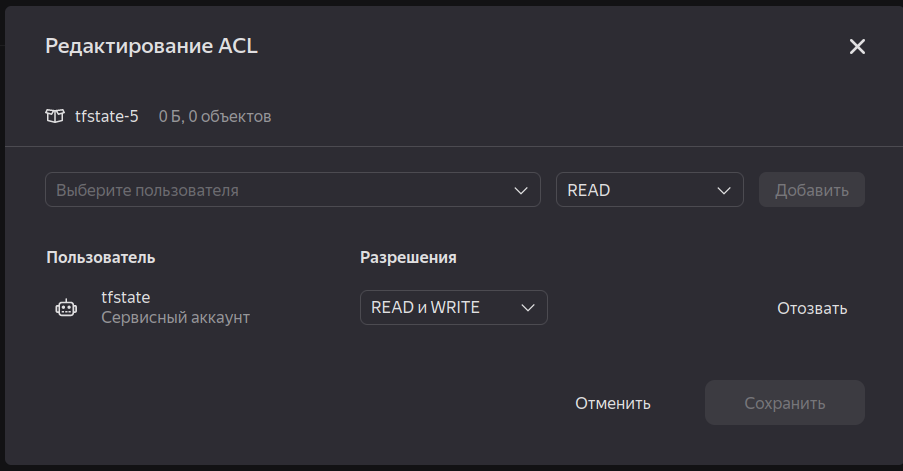
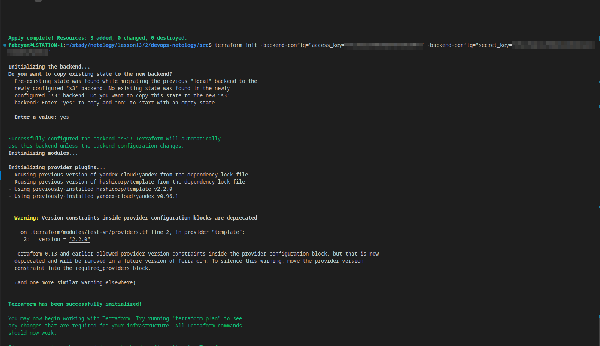
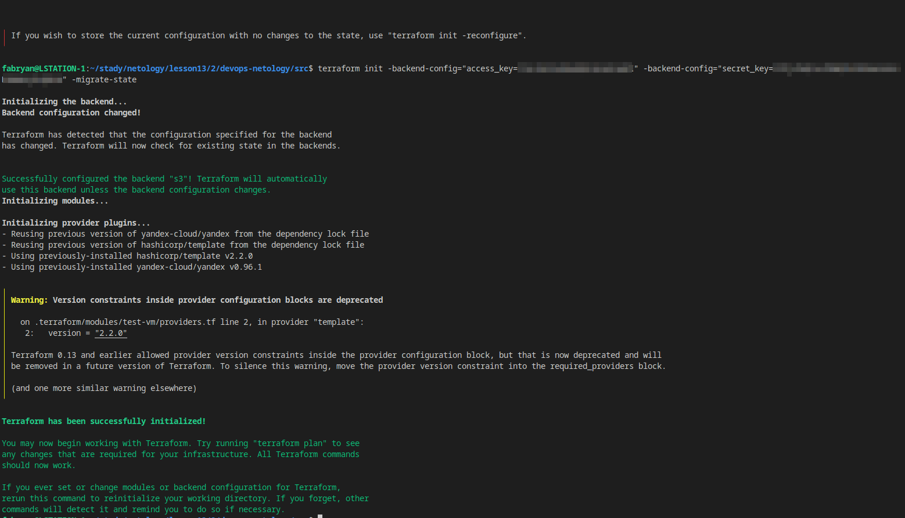
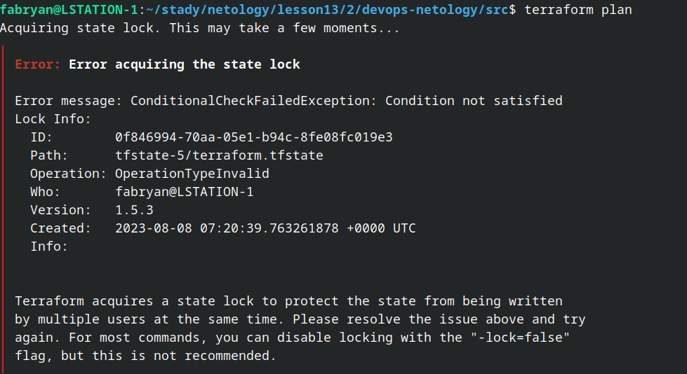

# Использование Terraform в команде

### Задание 1
- Проверьте код с помощью tflint и checkov. Перечислите, какие типы ошибок обнаружены в проекте (без дублей).

**TFlint**
```
Warning: Missing version constraint for provider "yandex" in `required_providers` (terraform_required_providers)

  on main.tf line 3:
   3:     yandex = {
   4:       source = "yandex-cloud/yandex"
   5:     }

Warning: Module source "git::https://github.com/udjin10/yandex_compute_instance.git?ref=main" uses a default branch as ref (main) (terraform_module_pinned_source)

  on main.tf line 33:
  33:   source          = "git::https://github.com/udjin10/yandex_compute_instance.git?ref=main"

Warning: [Fixable] variable "vpc_name" is declared but not used (terraform_unused_declarations)

  on variables.tf line 28:
  28: variable "vpc_name" {
```

**Checkov**
```
Check: CKV_YC_2: "Ensure compute instance does not have public IP."
        FAILED for resource: module.test-vm.yandex_compute_instance.vm[0]
        File: /.external_modules/github.com/udjin10/yandex_compute_instance/main/main.tf:24-73
        Calling File: /main.tf:32-48

Check: CKV_YC_11: "Ensure security group is assigned to network interface."
        FAILED for resource: module.test-vm.yandex_compute_instance.vm[0]
        File: /.external_modules/github.com/udjin10/yandex_compute_instance/main/main.tf:24-73
        Calling File: /main.tf:32-48

Check: CKV_TF_1: "Ensure Terraform module sources use a commit hash"
        FAILED for resource: test-vm
        File: /main.tf:32-48


```

### Задание 2
- Повторите демонстрацию лекции: настройте YDB, S3 bucket, yandex service account, права доступа и мигрируйте state проекта в S3 с блокировками. Предоставьте скриншоты процесса в качестве ответа.

<p align="center">
  
</p>

<p align="center">
  
</p>

<p align="center">
  
</p>

<p align="center">
  
</p>

<p align="center">
  
</p>

<p align="center">
  
</p>

<p align="center">
  
</p>

<p align="center">
  
</p>

- Откройте в проекте terraform console, а в другом окне из этой же директории попробуйте запустить terraform apply.
Пришлите ответ об ошибке доступа к state.

<p align="center">
  
</p>

- Принудительно разблокируйте state. Пришлите команду и вывод.
```
terraform force-unlock 0f846994-70aa-05e1-b94c-8fe08fc019e3
Do you really want to force-unlock?
  Terraform will remove the lock on the remote state.
  This will allow local Terraform commands to modify this state, even though it
  may still be in use. Only 'yes' will be accepted to confirm.

  Enter a value: yes

Terraform state has been successfully unlocked!

The state has been unlocked, and Terraform commands should now be able to
obtain a new lock on the remote state.

```