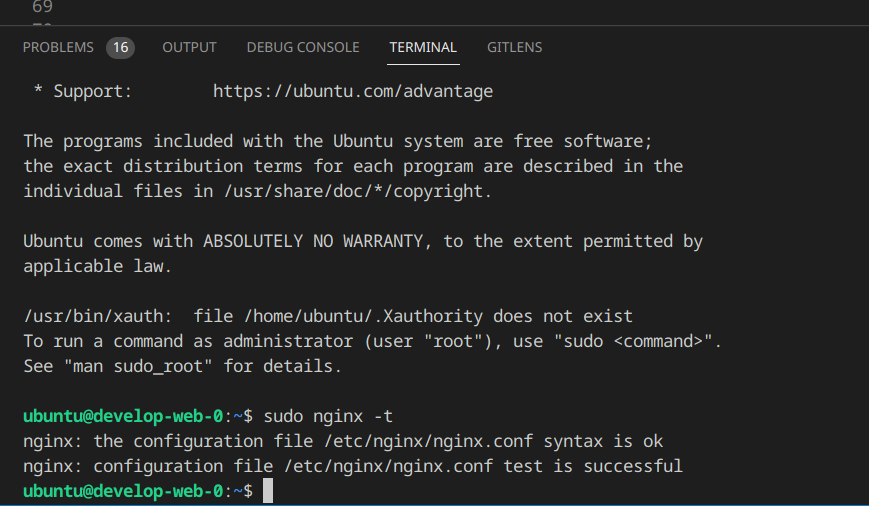
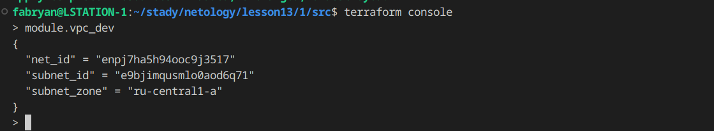
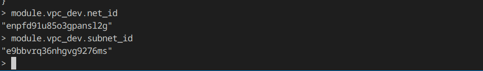
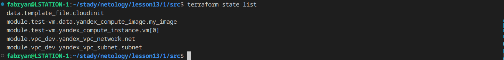
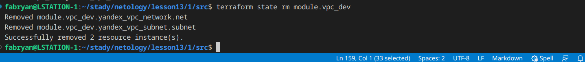
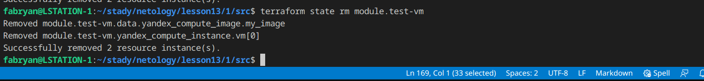
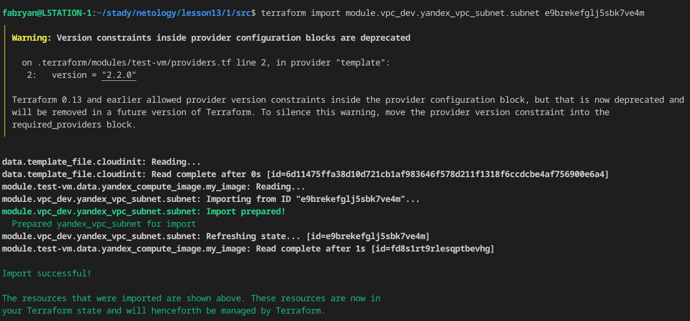
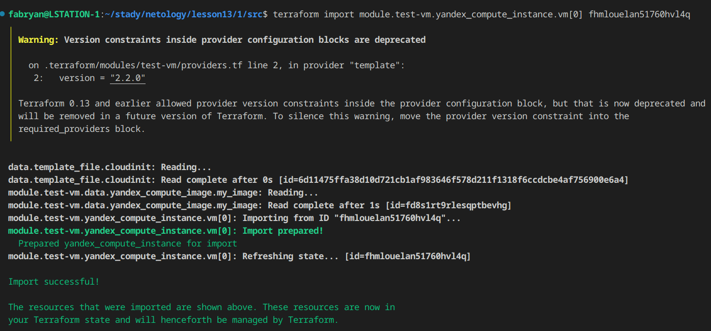
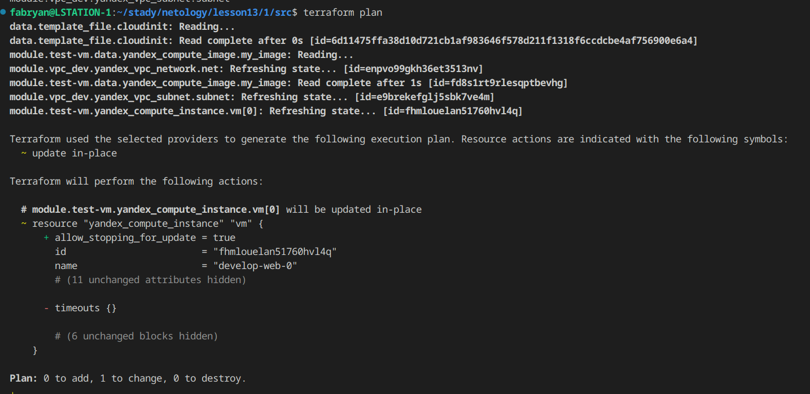

# Продвинутые методы работы с Terraform

### Задание 1
- Возьмите из демонстрации к лекции готовый код для создания ВМ с помощью remote-модуля. Создайте одну ВМ, используя этот модуль.
```
module "test-vm" {
  source          = "git::https://github.com/udjin10/yandex_compute_instance.git?ref=main"
  env_name        = "develop"
  network_id      = yandex_vpc_network.develop.id
  subnet_zones    = ["ru-central1-a"]
  subnet_ids      = [ yandex_vpc_subnet.develop.id ]
  instance_name   = "web"
  instance_count  = 1
  image_family    = "ubuntu-2004-lts"
  public_ip       = true
  
  metadata = {
      user-data          = data.template_file.cloudinit.rendered
      serial-port-enable = 1
  }

}
```
- В файле cloud-init.yml необходимо использовать переменную для ssh-ключа вместо хардкода.
```
#cloud-config
users:
  - name: ubuntu
    groups: sudo
    shell: /bin/bash
    sudo: ['ALL=(ALL) NOPASSWD:ALL']
    ssh_authorized_keys:
      - ${ssh_public_key}
package_update: true
package_upgrade: false
packages:
 - vim
```
- Передайте ssh-ключ в функцию template_file в блоке vars ={}.
```
data "template_file" "cloudinit" {
 template = file("./cloud-init.yml")
 vars = {
   ssh_public_key = file("~/.ssh/id_ed25519.pub")
 }
}

```
- Добавьте в файл cloud-init.yml установку nginx.
```
#cloud-config
users:
  - name: ubuntu
    groups: sudo
    shell: /bin/bash
    sudo: ['ALL=(ALL) NOPASSWD:ALL']
    ssh_authorized_keys:
      - ${ssh_public_key}
package_update: true
package_upgrade: false
packages:
 - vim
 - nginx
```
- Предоставьте скриншот подключения к консоли и вывод команды sudo nginx -t.
<p align="center">
  
</p>


### Задание 2
- Напишите локальный модуль vpc, который будет создавать 2 ресурса: одну сеть и одну подсеть в зоне, объявленной при вызове модуля, например: ru-central1-a.

```
resource "yandex_vpc_network" "net" {
  name = var.net_name
}

resource "yandex_vpc_subnet" "subnet" {
  name           = var.subnet_name
  zone           = var.zone
  network_id     = yandex_vpc_network.net.id
  v4_cidr_blocks = var.cidr
}
```
- Вы должны передать в модуль переменные с названием сети, zone и v4_cidr_blocks.

```
module "vpc_dev" {
  source       = "./vpc_dev"
  net_name     = "testing"
  subnet_name  = "test1"
  zone = "ru-central1-a"
  cidr = ["10.0.1.0/24"]
}
```
- Модуль должен возвращать в root module с помощью output информацию о yandex_vpc_subnet. Пришлите скриншот информации из terraform console о своем модуле.

```
output "net_id" {
    value = yandex_vpc_subnet.net.id
}

output "subnet_id" {
    value = yandex_vpc_subnet.subnet.id
}

output "subnet_zone" {
    value = yandex_vpc_subnet.subnet.zone
}
```
<p align="center">
  
</p>

- Замените ресурсы yandex_vpc_network и yandex_vpc_subnet созданным модулем. Не забудьте передать необходимые параметры сети из модуля vpc в модуль с виртуальной машиной.
```
module "test-vm" {
  source          = "git::https://github.com/udjin10/yandex_compute_instance.git?ref=main"
  env_name        = "develop"
  network_id      = module.vpc_dev.net_id
  subnet_zones    = ["ru-central1-a"]
  subnet_ids      = [ module.vpc_dev.subnet_id ]
  instance_name   = "web"
  instance_count  = 1
  image_family    = "ubuntu-2004-lts"
  public_ip       = true
  
  metadata = {
      user-data          = data.template_file.cloudinit.rendered
      serial-port-enable = 1
  }

}
```
<p align="center">
  
</p>

- Сгенерируйте документацию к модулю с помощью terraform-docs.</br>
[TER_DOC.md](./TER_DOC.md)

### Задание 3
- Выведите список ресурсов в стейте.
```
terraform state list
data.template_file.cloudinit
module.test-vm.data.yandex_compute_image.my_image
module.test-vm.yandex_compute_instance.vm[0]
module.vpc_dev.yandex_vpc_network.net
module.vpc_dev.yandex_vpc_subnet.subnet
```
<p align="center">
  
</p>

- Полностью удалите из стейта модуль vpc.
```
terraform state rm module.vpc_dev
Removed module.vpc_dev.yandex_vpc_network.net
Removed module.vpc_dev.yandex_vpc_subnet.subnet
Successfully removed 2 resource instance(s).
```
<p align="center">
  
</p>

- Полностью удалите из стейта модуль vm.
```
terraform state rm module.test-vm
Removed module.test-vm.data.yandex_compute_image.my_image
Removed module.test-vm.yandex_compute_instance.vm[0]
Successfully removed 2 resource instance(s).
```
<p align="center">
  
</p>

- Импортируйте всё обратно. Проверьте terraform plan. Изменений быть не должно. Приложите список выполненных команд и скриншоты процессы.

```
terraform import module.vpc_dev.yandex_vpc_network.net enpvo99gkh36et3513nv
```
<p align="center">
  
</p>

```
terraform import module.vpc_dev.yandex_vpc_subnet.subnet e9brekefglj5sbk7ve4m
```
<p align="center">
  
</p>

```
terraform import module.test-vm.yandex_compute_instance.vm[0] fhmlouelan51760hvl4q
```
<p align="center">
  
</p>

```
terraform plan
```
<p align="center">
  
</p>

### Весь код можно посмотреть по ссылке
https://github.com/so121183gak/devops-netology/tree/terraform-04/src