# Введение в Ansible

### Основная часть
1. Попробуйте запустить playbook на окружении из `test.yml`, зафиксируйте значение, которое имеет факт `some_fact` для указанного хоста при выполнении playbook.
<p align="center">
  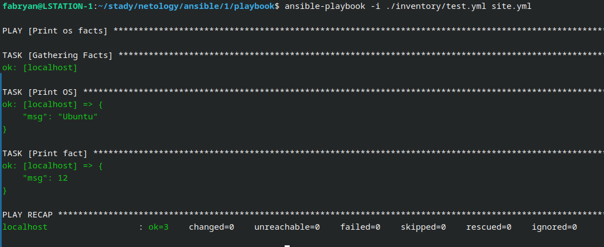
</p>

2. Найдите файл с переменными (group_vars), в котором задаётся найденное в первом пункте значение, и поменяйте его на `all default fact`.
<p align="center">
  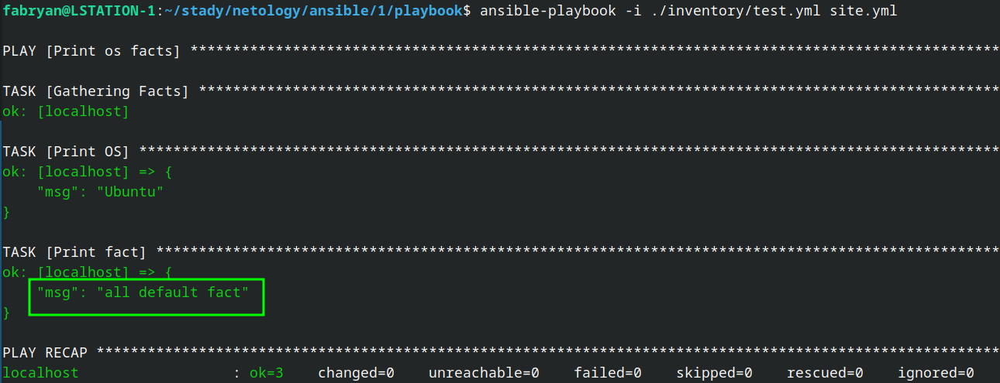
</p>

3. Воспользуйтесь подготовленным (используется `docker`) или создайте собственное окружение для проведения дальнейших испытаний.
<p align="center">
  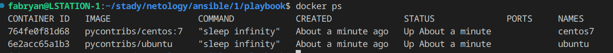
</p>

4. Проведите запуск playbook на окружении из `prod.yml`. Зафиксируйте полученные значения `some_fact` для каждого из `managed host`.
<p align="center">
  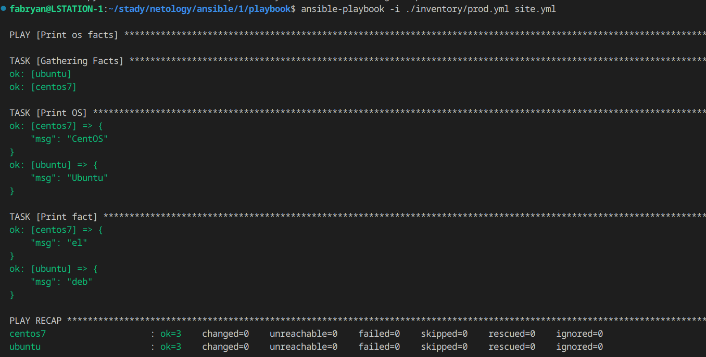
</p>

5. Добавьте факты в `group_vars` каждой из групп хостов так, чтобы для `some_fact` получились значения: для `deb` — `deb` default fact, для `el` — `el default fact`.
<p align="center">
  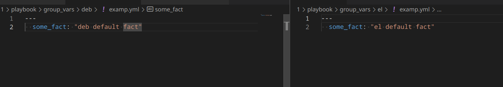
</p>

6. Повторите запуск playbook на окружении `prod.yml`. Убедитесь, что выдаются корректные значения для всех хостов.
<p align="center">
  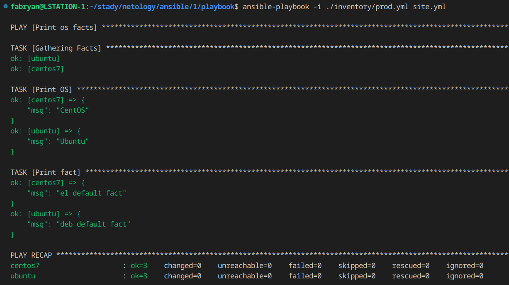
</p>

7. При помощи `ansible-vault` зашифруйте факты в `group_vars/deb` и `group_vars/el` с паролем `netology`.
<p align="center">
  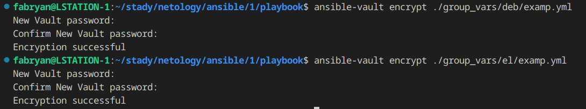
</p>

8. Запустите playbook на окружении `prod.yml`. При запуске `ansible` должен запросить у вас пароль. Убедитесь в работоспособности.
<p align="center">
  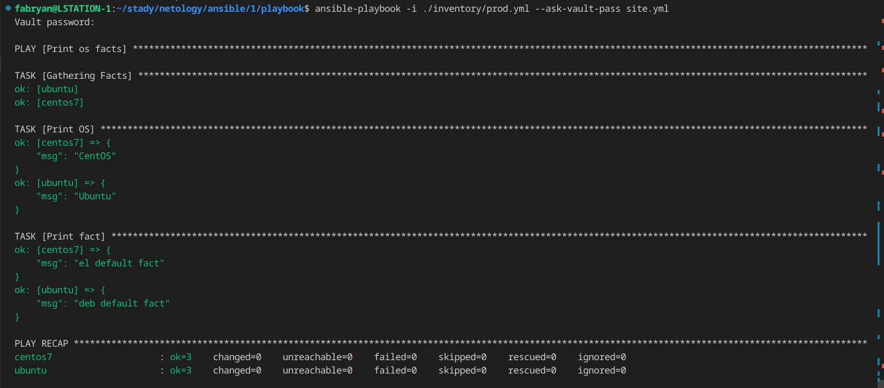
</p>

9. Посмотрите при помощи `ansible-doc` список плагинов для подключения. Выберите подходящий для работы на `control node`.
- Плагин для коннекта к `control node` называется `ansible.builtin.local`.

10. В `prod.yml` добавьте новую группу хостов с именем `local`, в ней разместите localhost с необходимым типом подключения.
```
local:
  hosts:
    localhost:
      ansible_connection: local
```
11. Запустите playbook на окружении `prod.yml`. При запуске `ansible` должен запросить у вас пароль. Убедитесь, что факты `some_fact` для каждого из хостов определены из верных `group_vars`.

<p align="center">
  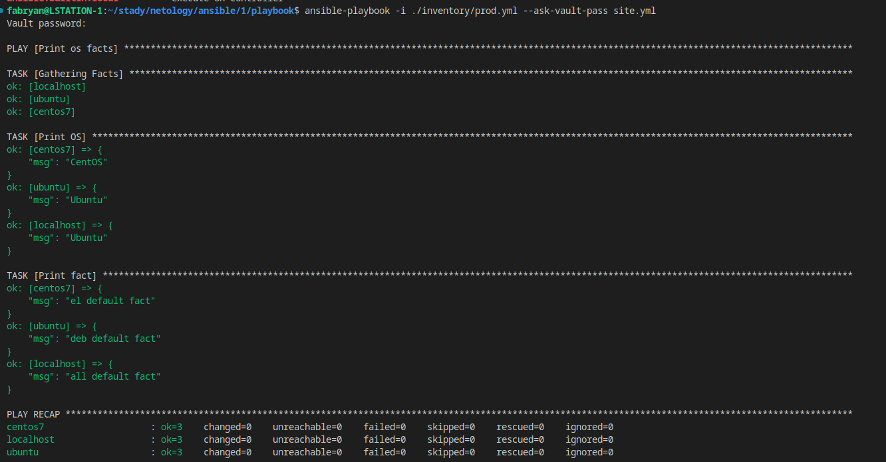
</p>

### Необязательная часть
1. При помощи `ansible-vault` расшифруйте все зашифрованные файлы с переменными.
<p align="center">
  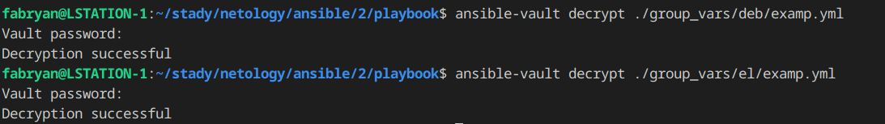
</p>

2. Зашифруйте отдельное значение `PaSSw0rd` для переменной `some_fact` паролем `netology`. Добавьте полученное значение в `group_vars/all/exmp.yml`.
<p align="center">
  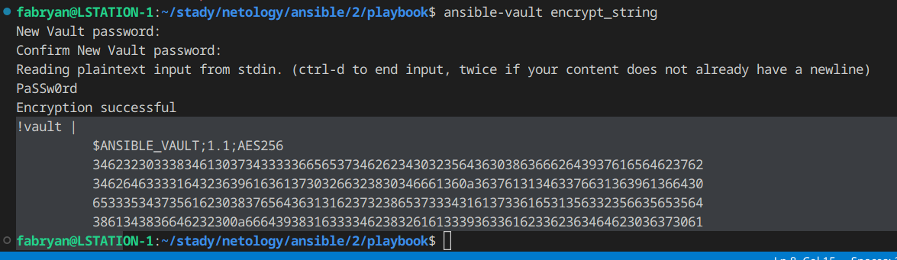
</p>

3. Запустите `playbook`, убедитесь, что для нужных хостов применился новый `fact`.
<p align="center">
  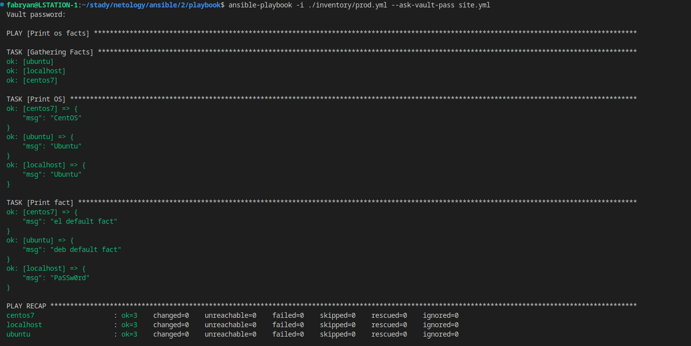
</p>

4. Добавьте новую группу хостов `fedora`, самостоятельно придумайте для неё переменную. В качестве образа можно использовать этот вариант.
<p align="center">
  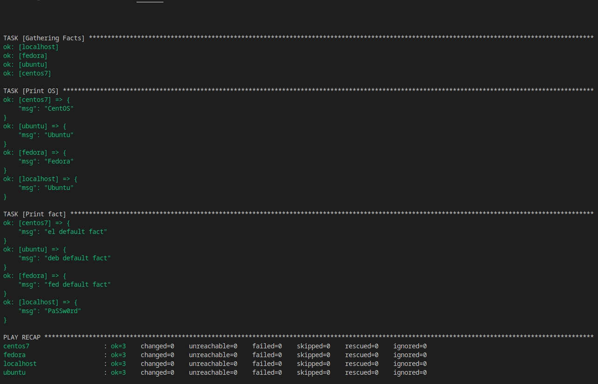
</p>

5. Напишите скрипт на bash: автоматизируйте поднятие необходимых контейнеров, запуск ansible-playbook и остановку контейнеров.
- Скрипт находится в папке **src** вместе с остальным кодом, под именем **start.sh**
<p align="center">
  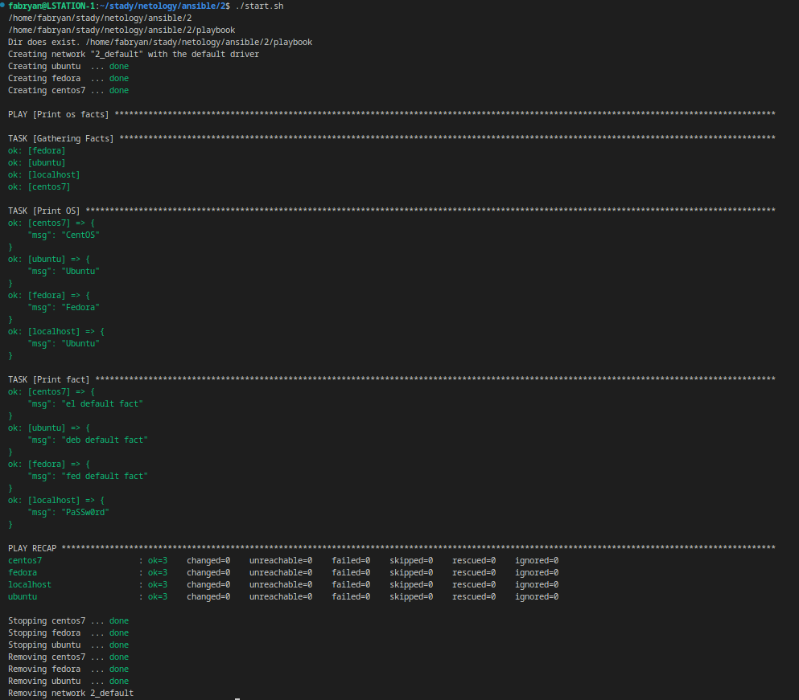
</p>

### Весь код можно посмотреть по ссылке
https://github.com/so121183gak/devops-netology/tree/main/ansible/lesson1/src