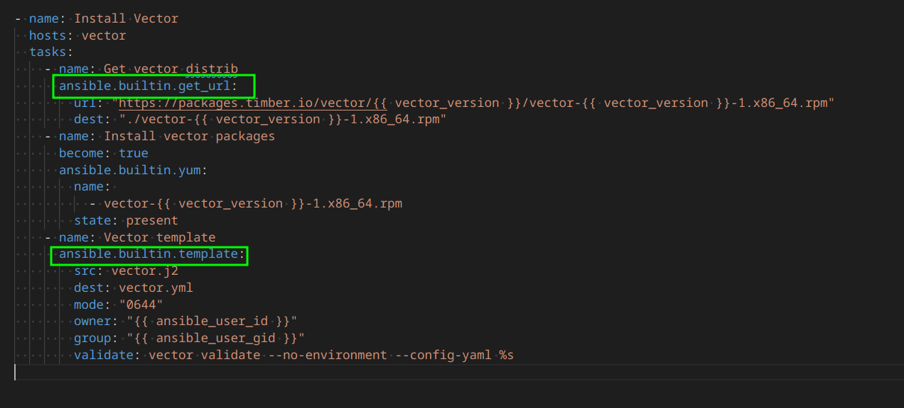
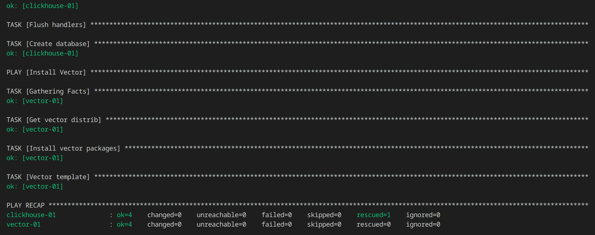
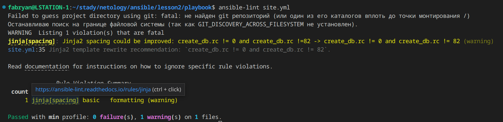
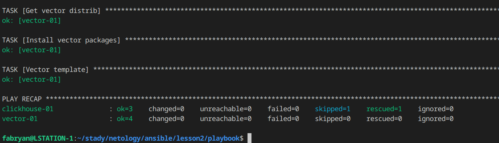
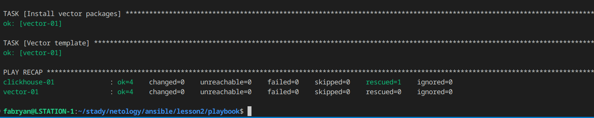
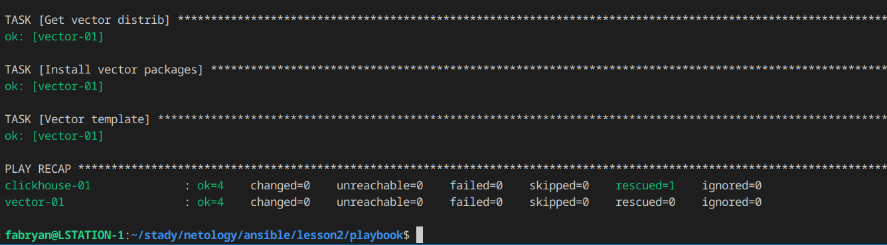

# Работа с Playbook

### Основная часть
1. Подготовьте свой inventory-файл `prod.yml`.
```
---
clickhouse:
  hosts:
    clickhouse-01:
      ansible_host: 62.84.125.102
      ansible_user: admin1

vector:
  hosts:
    vector-01:
      ansible_host: 62.84.125.102
      ansible_user: admin1
```


2. Допишите playbook: нужно сделать ещё один play, который устанавливает и настраивает **vector**. Конфигурация vector должна деплоиться через template файл jinja2.
```
- name: Install Vector
  hosts: vector
  tasks:
    - name: Get vector distrib
      ansible.builtin.get_url:
        url: "https://packages.timber.io/vector/{{ vector_version }}/vector-{{ vector_version }}-1.x86_64.rpm"
        dest: "./vector-{{ vector_version }}-1.x86_64.rpm"
    - name: Install vector packages
      become: true
      ansible.builtin.yum:
        name: 
          - vector-{{ vector_version }}-1.x86_64.rpm
        state: present
    - name: Vector template
      ansible.builtin.template:
        src: vector.j2
        dest: vector.yml
        mode: "0644"
        owner: "{{ ansible_user_id }}"
        group: "{{ ansible_user_gid }}"
        validate: vector validate --no-environment --config-yaml %s
```

3. При создании tasks рекомендую использовать модули: get_url, template, unarchive, file.
<p align="center">
  
</p>

4. Tasks должны: скачать дистрибутив нужной версии, выполнить распаковку в выбранную директорию, установить vector.
<p align="center">
  
</p>

5. Запустите ansible-lint site.yml и исправьте ошибки, если они есть.
- Ошибки
```
name[missing]: All tasks should be named.
site.yml:11 Task/Handler: block/always/rescue 

risky-file-permissions: File permissions unset or incorrect.
site.yml:12 Task/Handler: Get clickhouse distrib

risky-file-permissions: File permissions unset or incorrect.
site.yml:18 Task/Handler: Get clickhouse distrib

fqcn[action-core]: Use FQCN for builtin module actions (meta).
site.yml:30 Use `ansible.builtin.meta` or `ansible.legacy.meta` instead.

jinja[spacing]: Jinja2 spacing could be improved: create_db.rc != 0 and create_db.rc !=82 -> create_db.rc != 0 and create_db.rc != 82 (warning)
site.yml:32 Jinja2 template rewrite recommendation: `create_db.rc != 0 and create_db.rc != 82`.

risky-file-permissions: File permissions unset or incorrect.
site.yml:41 Task/Handler: Get vector distrib

yaml[trailing-spaces]: Trailing spaces
site.yml:48

Read documentation for instructions on how to ignore specific rule violations.

                    Rule Violation Summary                    
 count tag                    profile    rule associated tags 
     1 jinja[spacing]         basic      formatting (warning) 
     1 name[missing]          basic      idiom                
     1 yaml[trailing-spaces]  basic      formatting, yaml     
     3 risky-file-permissions safety     unpredictability     
     1 fqcn[action-core]      production formatting           

Failed after min profile: 6 failure(s), 1 warning(s) on 1 files
```
- Результат после исправлений
<p align="center">
  
</p>

6. Попробуйте запустить playbook на этом окружении с флагом `--check`.
<p align="center">
  
</p>

7. Запустите playbook на `prod.yml` окружении с флагом `--diff`. Убедитесь, что изменения на системе произведены.
<p align="center">
  
</p>

8. Повторно запустите playbook с флагом `--diff` и убедитесь, что playbook идемпотентен.
<p align="center">
  
</p>


### Весь код можно посмотреть по ссылке
https://github.com/so121183gak/devops-netology/tree/main/ansible/lesson1/src