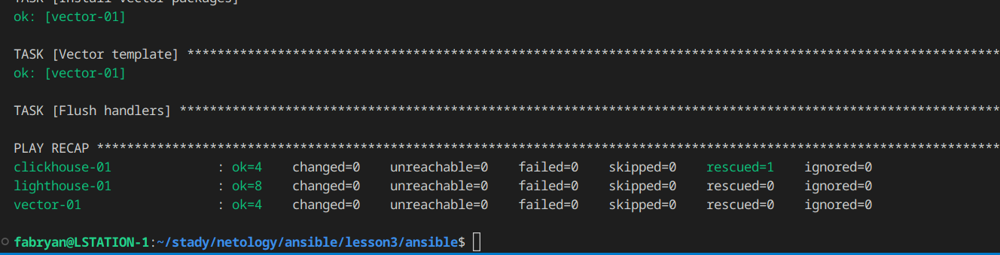

# Использование Ansible

### Основная часть
1. Допишите playbook: нужно сделать ещё один play, который устанавливает и настраивает LightHouse.

- Для **Lighthouse** необходим **http сервер**, по этому мы установим и настроим **nginx**.

```
- name: Nginx
  hosts: lighthouse
  handlers:
    - name: start-nginx
      become: true
      command: nginx
    - name: reload-nginx
      become: true
      command: nginx -s reload
  tasks:
    - name: Nginx Install epel-release
      become: true
      ansible.builtin.yum:
        name: epel-release
        state: present
    - name: Nginx Install
      become: true
      ansible.builtin.yum:
        name: nginx
        state: present
      notify: start-nginx
    - name: Nginx create config
      become: true
      ansible.builtin.template:
        src: templates/nginx.config.j2
        dest: /etc/nginx/nginx.conf
        mode: "0644"
      notify: reload-nginx
```
- Далее установим и настроим **Lighthouse**.

```
- name: Lighthouse
  hosts: lighthouse
  become: true
  handlers:
    - name: reload-nginx
      become: true
      command: nginx -s reload
  pre_tasks:
    - name: Lighthouse Install dependencies
      become: true
      ansible.builtin.yum:
        name: git
        state: present
  tasks:
    - name: Lighthouse copy from git
      git:
        repo: "{{ lighthouse_src }}"
        version: master
        dest: "{{ lighthouse_dst }}"
    - name: Lighthouse create config
      become: true
      template:
        src: nginx.lighthouse.config.j2
        dest: /etc/nginx/conf.d/default.conf
        mode: "0644"
      notify: reload-nginx
```


2. При создании tasks рекомендую использовать модули: `get_url`, `template`, `yum`, `apt`.
<p align="center">
  
</p>

3. Tasks должны: скачать статику LightHouse, установить Nginx или любой другой веб-сервер, настроить его конфиг для открытия LightHouse, запустить веб-сервер.
<p align="center">
  
</p>

4. Подготовьте свой inventory-файл `prod.yml`.
```
clickhouse:
  hosts:
    clickhouse-01:
      ansible_host: 158.160.107.191
      ansible_user: centos

lighthouse:
  hosts:
    lighthouse-01:
      ansible_host: 158.160.102.52
      ansible_user: centos

vector:
  hosts:
    vector-01:
      ansible_host: 158.160.98.13
      ansible_user: centos
```

5. Запустите `ansible-lint site.yml` и исправьте ошибки, если они есть.
- Ошибки
```
fqcn[action-core]: Use FQCN for builtin module actions (command).
site.yml:5 Use `ansible.builtin.command` or `ansible.legacy.command` instead.

name[casing]: All names should start with an uppercase letter.
site.yml:5 Task/Handler: start-nginx

fqcn[action-core]: Use FQCN for builtin module actions (command).
site.yml:8 Use `ansible.builtin.command` or `ansible.legacy.command` instead.

name[casing]: All names should start with an uppercase letter.
site.yml:8 Task/Handler: reload-nginx

fqcn[action-core]: Use FQCN for builtin module actions (command).
site.yml:35 Use `ansible.builtin.command` or `ansible.legacy.command` instead.

name[casing]: All names should start with an uppercase letter.
site.yml:35 Task/Handler: reload-nginx

fqcn[action-core]: Use FQCN for builtin module actions (git).
site.yml:45 Use `ansible.builtin.git` or `ansible.legacy.git` instead.

fqcn[action-core]: Use FQCN for builtin module actions (template).
site.yml:50 Use `ansible.builtin.template` or `ansible.legacy.template` instead.

jinja[spacing]: Jinja2 spacing could be improved: create_db.rc != 0 and create_db.rc !=82 -> create_db.rc != 0 and create_db.rc != 82 (warning)
site.yml:91 Jinja2 template rewrite recommendation: `create_db.rc != 0 and create_db.rc != 82`.

name[casing]: All names should start with an uppercase letter.
site.yml:100 Task/Handler: reload vector

Read documentation for instructions on how to ignore specific rule violations.

                 Rule Violation Summary                  
 count tag               profile    rule associated tags 
     1 jinja[spacing]    basic      formatting (warning) 
     4 name[casing]      moderate   idiom                
     5 fqcn[action-core] production formatting           

Failed after min profile: 9 failure(s), 1 warning(s) on 1 files.
```
- Результат после исправлений
<p align="center">
  
</p>

6. Попробуйте запустить playbook на этом окружении с флагом `--check`.
<p align="center">
  
</p>

7. Запустите playbook на `prod.yml` окружении с флагом `--diff`. Убедитесь, что изменения на системе произведены.
<p align="center">
  
</p>

8. Повторно запустите playbook с флагом `--diff` и убедитесь, что playbook идемпотентен.
<p align="center">
  
</p>


### Весь код можно посмотреть по ссылке
https://github.com/so121183gak/devops-netology/tree/main/ansible/lesson3/src

### Документацию по playbook можно посмотреть по ссылке
https://github.com/so121183gak/devops-netology/tree/main/ansible/lesson3/PLAYBOOK.md