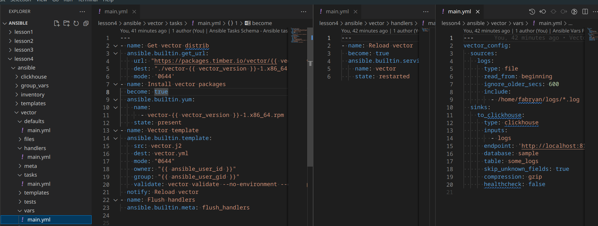
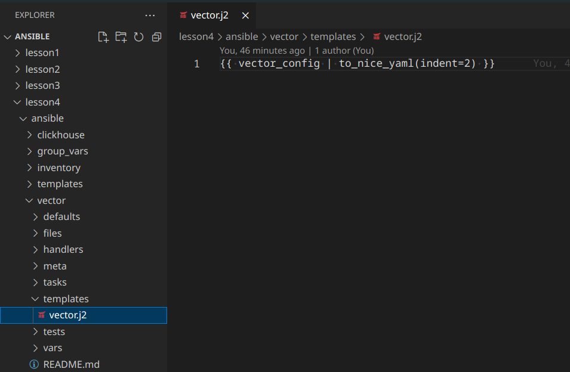
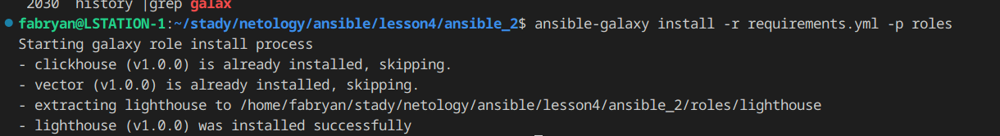

# Работа с roles

### Основная часть
1. Создайте в старой версии playbook файл requirements.yml и заполните его содержимым.
2. При помощи ansible-galaxy скачайте себе эту роль.
3. Создайте новый каталог с ролью при помощи ansible-galaxy role init vector-role.
4. На основе tasks из старого playbook заполните новую role. Разнесите переменные между vars и default.

  

5. Перенести нужные шаблоны конфигов в templates.

  

6. Опишите в README.md обе роли и их параметры.
https://github.com/so121183gak/ansible-vector-role/blob/master/README.md

7. Повторите шаги 3–6 для LightHouse. Помните, что одна роль должна настраивать один продукт.

  

### ССылка на роль Vector
https://github.com/so121183gak/ansible-vector-role

### ССылка на роль Lighthouse
https://github.com/so121183gak/ansible-lighthouse-role

### ССылка на Playbook
https://github.com/so121183gak/devops-netology/tree/main/ansible/lesson4/src
