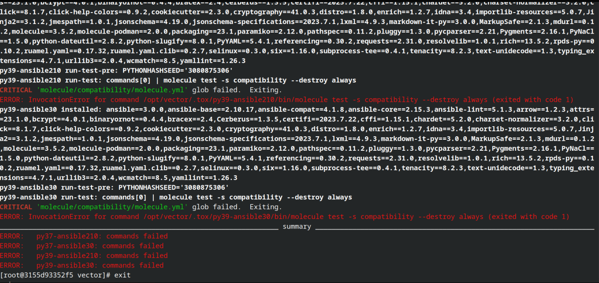
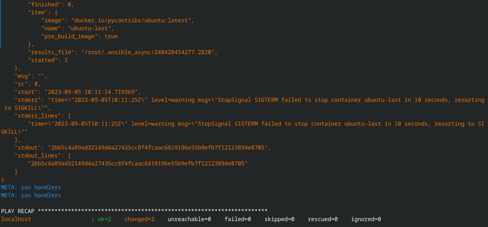

# Тестирование roles

### Основная часть
- Установите molecule: pip3 install "molecule==3.5.2"
<p align="center">
  
</p>

## Molecule
1. Запустите `molecule test -s centos_7` внутри корневой директории clickhouse-role, посмотрите на вывод команды. Данная команда может отработать с ошибками, это нормально. Наша цель - посмотреть как другие в реальном мире используют молекулу.
<p align="center">
  
</p>

2. Перейдите в каталог с ролью vector-role и создайте сценарий тестирования по умолчанию при помощи `molecule init scenario --driver-name docker`.
<p align="center">
  
</p>

3. Добавьте несколько разных дистрибутивов (centos:8, ubuntu:latest) для инстансов и протестируйте роль, исправьте найденные ошибки, если они есть.

- Первый запуск с ошибками
<p align="center">
  
</p>

- Запуск с исправленными ошибками
<p align="center">
  
</p>

4. Добавьте несколько assert в verify.yml-файл для проверки работоспособности vector-role (проверка, что конфиг валидный, проверка успешности запуска и др.).
<p align="center">
  
</p>

5. Запустите тестирование роли повторно и проверьте, что оно прошло успешно.
<p align="center">
  
</p>

7. Добавьте новый тег на коммит с рабочим сценарием в соответствии с семантическим версионированием.
https://github.com/so121183gak/ansible-vector-role/releases/tag/v1.1.0

## Tox
1. Добавьте в директорию с vector-role файлы из директории.
2. Запустите docker run --privileged=True -v <path_to_repo>:/opt/vector-role -w /opt/vector-role -it aragast/netology:latest /bin/bash, где path_to_repo — путь до корня репозитория с vector-role на вашей файловой системе.
3. Создайте облегчённый сценарий для `molecule` с драйвером `molecule_podman`. Проверьте его на исполнимость.
4. Внутри контейнера выполните команду tox, посмотрите на вывод.
<p align="center">
  
</p>

5. Пропишите правильную команду в tox.ini, чтобы запускался облегчённый сценарий.
```
commands =
    {posargs:molecule -vvv test -s light}
```
6. Запустите команду tox. Убедитесь, что всё отработало успешно.
<p align="center">
  
</p>
<p align="center">
  
</p>

7. Добавьте новый тег на коммит с рабочим сценарием в соответствии с семантическим версионированием.
https://github.com/so121183gak/ansible-vector-role/releases/tag/v1.1.1


### ССылка на роль Vector
https://github.com/so121183gak/ansible-vector-role

### ССылка на Playbook
https://github.com/so121183gak/devops-netology/tree/main/ansible/lesson5/src
