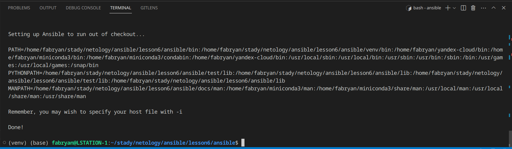
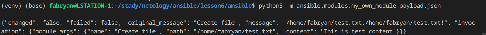
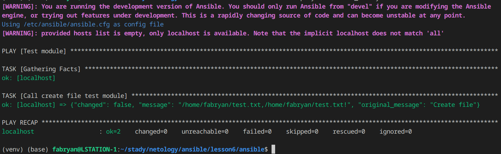
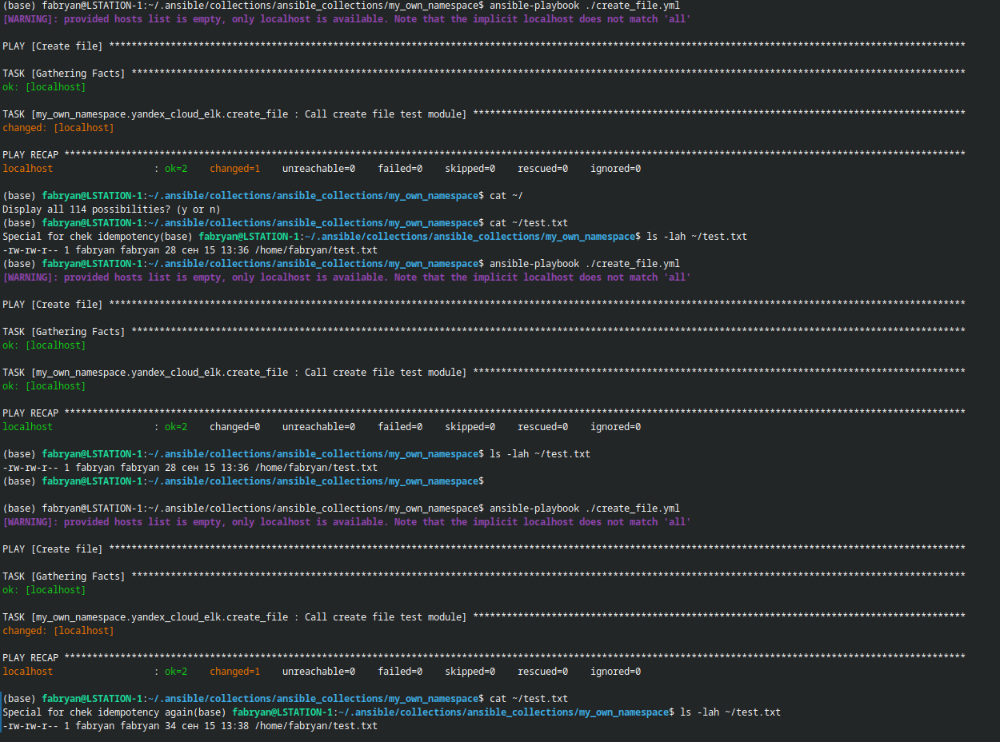
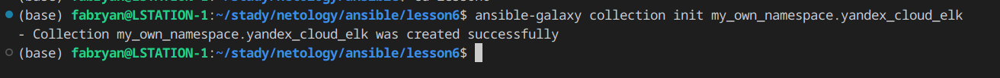
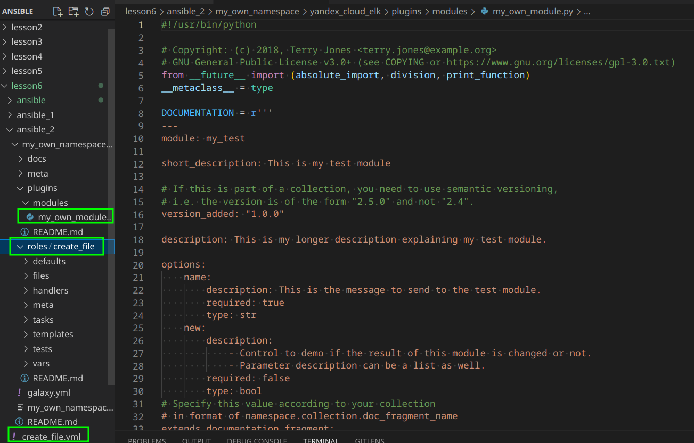
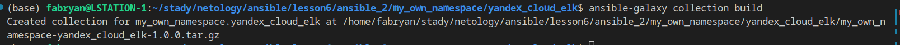
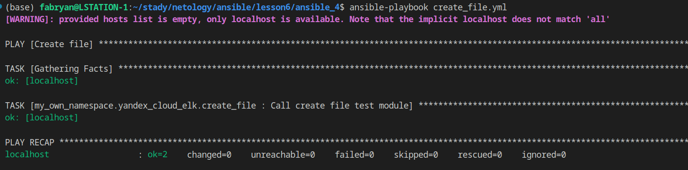

# Создание собственных модулей

### Основная часть
<p align="center">
  
</p>

1. В виртуальном окружении создайте новый my_own_module.py файл.
2. Наполните его содержимым
3. Заполните файл в соответствии с требованиями Ansible так, чтобы он выполнял основную задачу: module должен создавать текстовый файл на удалённом хосте по пути, определённом в параметре path, с содержимым, определённым в параметре content.
```
module_args = dict(
    name=dict(type='str', required=True),
    path=dict(type='str', required=True),
    content=dict(type='str', required=True),
)
```

```
module = AnsibleModule(
    argument_spec=module_args,
    supports_check_mode=True
)

path = module.params['path']
content = module.params['content']

existing_content = ""

try:
    with open(path, "r") as file:
        existing_content = file.read()
except FileNotFoundError:
    pass

existing_checksum = hashlib.md5(existing_content.encode()).hexdigest()
new_checksum = hashlib.md5(content.encode()).hexdigest()

if existing_checksum != new_checksum:
    result['changed'] = True
    with open(path, "w") as file:
        file.write(content)
else:
    result['changed'] = False
```

4. Проверьте module на исполняемость локально.
<p align="center">
  
</p>

 5. Напишите single task playbook и используйте module в нём.
 <p align="center">
  
</p>

 6. Проверьте через playbook на идемпотентность.
  <p align="center">
  
</p>

7. Выйдите из виртуального окружения.
8. Инициализируйте новую collection: ansible-galaxy collection init my_own_namespace.yandex_cloud_elk.
 6. Проверьте через playbook на идемпотентность.
  <p align="center">
  
</p>

9. В эту collection перенесите свой module в соответствующую директорию.
10. Single task playbook преобразуйте в single task role и перенесите в collection. У role должны быть default всех параметров module.
11. Создайте playbook для использования этой role.
  <p align="center">
  
</p>

12. Заполните всю документацию по collection, выложите в свой репозиторий, поставьте тег 1.0.0 на этот коммит.
https://github.com/so121183gak/ansible-collection-create-file

13. Создайте .tar.gz этой collection: ansible-galaxy collection build в корневой директории collection.
  <p align="center">
  
</p>

14. Создайте ещё одну директорию любого наименования, перенесите туда single task playbook и архив c collection.
15. Установите collection из локального архива: ansible-galaxy collection install <archivename>.tar.gz.
16. Запустите playbook, убедитесь, что он работает.
  <p align="center">
  
</p>


### ССылка на tar.gz
https://github.com/so121183gak/devops-netology/tree/main/ansible/lesson6/src/my_own_namespace-yandex_cloud_elk-1.0.0.tar.gz

### ССылка на Playbook
https://github.com/so121183gak/devops-netology/tree/main/ansible/lesson6/src/create_file.yml
