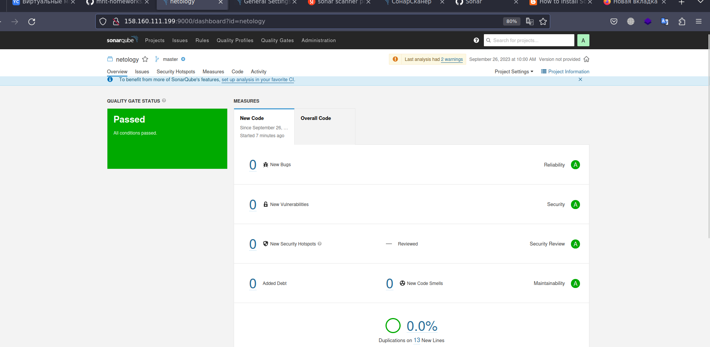
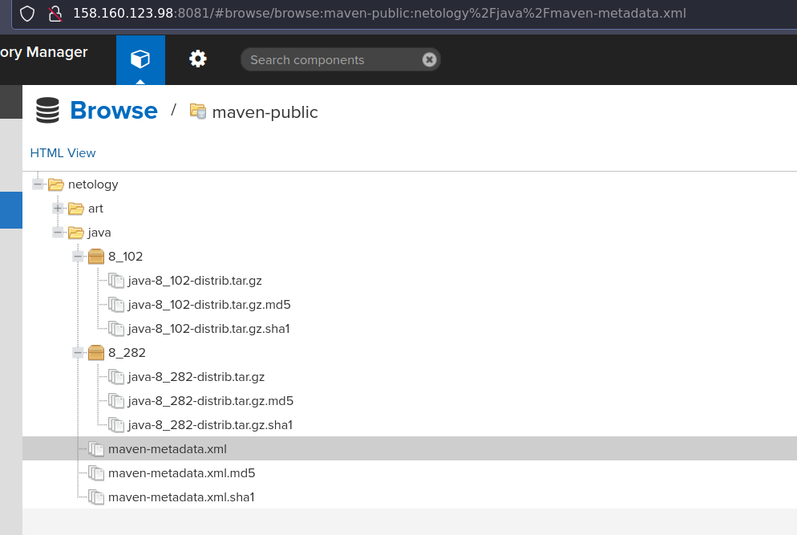
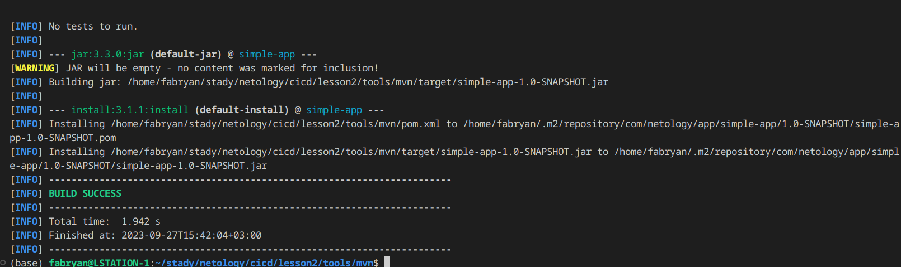
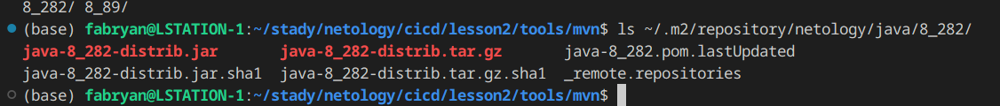

# Процессы CI/CD

## Знакомоство с SonarQube

### Основная часть


  1. Создайте новый проект, название произвольное.
  2. Скачайте пакет sonar-scanner, который вам предлагает скачать SonarQube.
  3. Сделайте так, чтобы binary был доступен через вызов в shell (или поменяйте переменную PATH, или любой другой, удобный вам способ).
  4. Проверьте sonar-scanner --version.
  5. Запустите анализатор против кода из директории example с дополнительным ключом -Dsonar.coverage.exclusions=fail.py.
  6. Посмотрите результат в интерфейсе.
  7. Исправьте ошибки, которые он выявил, включая warnings.
  8. Запустите анализатор повторно — проверьте, что QG пройдены успешно.
  9. Сделайте скриншот успешного прохождения анализа, приложите к решению ДЗ.
  
  ```
  sonar-scanner \
  -Dsonar.projectKey=netology \
  -Dsonar.sources=. \
  -Dsonar.host.url=http://158.160.111.199:9000 \
  -Dsonar.login=fe9d93222f2b502874fc81876d13180901b4fa19 \
  -Dsonar.coverage.exclusions=fail.py
  ```
<p align="center">
  
</p>

## Знакомство с Nexus
### Основная часть

  1. В репозиторий maven-public загрузите артефакт с GAV-параметрами:

  - groupId: netology;
  - artifactId: java;
  - version: 8_282;
  - classifier: distrib;
  - type: tar.gz.

  2. В него же загрузите такой же артефакт, но с version: 8_102.
  3. Проверьте, что все файлы загрузились успешно.

<p align="center">
  
</p>

  4. В ответе пришлите файл maven-metadata.xml для этого артефакта.

https://github.com/so121183gak/devops-netology/blob/main/cicd/lesson2/src/maven-metadata.xml


## Знакомство с Maven
### Основная часть

  1. Поменяйте в pom.xml блок с зависимостями под ваш артефакт из первого пункта задания для Nexus (java с версией 8_282).
  2. Запустите команду mvn package в директории с pom.xml, ожидайте успешного окончания.
<p align="center">
  
</p>

  3. Проверьте директорию ~/.m2/repository/, найдите ваш артефакт.
<p align="center">
  
</p>

  4. В ответе пришлите исправленный файл pom.xml.
https://github.com/so121183gak/devops-netology/blob/main/cicd/lesson2/src/pom.xml

