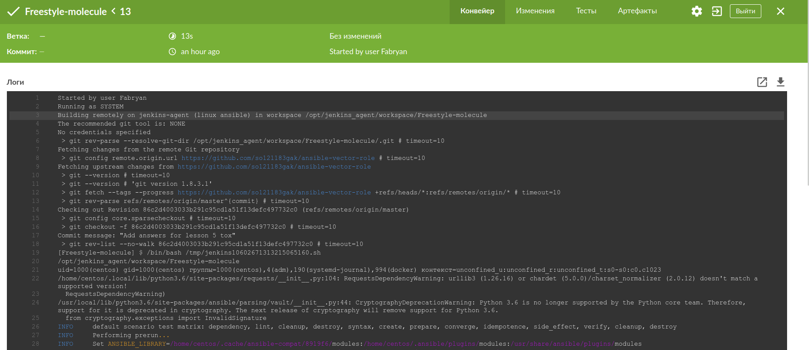

# Jenkins

## Знакомоство с SonarQube

### Основная часть

  1. Сделать Freestyle Job, который будет запускать molecule test из любого вашего репозитория с ролью.

  

  2. Сделать Declarative Pipeline Job, который будет запускать molecule test из любого вашего репозитория с ролью.

  

  3. Перенести Declarative Pipeline в репозиторий в файл Jenkinsfile.
  4. Создать Multibranch Pipeline на запуск `Jenkinsfile` из репозитория.

  

  5. Создать Scripted Pipeline, наполнить его скриптом из pipeline.
  6. Внести необходимые изменения, чтобы Pipeline запускал `ansible-playbook` без флагов `--check --diff`, если не установлен параметр при запуске джобы (prod_run = True). По умолчанию параметр имеет значение False и запускает прогон с флагами `--check --diff`.

  

  

  7. Проверить работоспособность, исправить ошибки, исправленный Pipeline вложить в репозиторий в файл `ScriptedJenkinsfile`.
  8. Отправить ссылку на репозиторий с ролью и Declarative Pipeline и Scripted Pipeline.

### Репазиторий с ролью
https://github.com/so121183gak/ansible-vector-role

### Ссылка на Declarative Pipeline
https://github.com/so121183gak/ansible-vector-role/blob/master/Jenkinsfile

### Ссылка на Scripted Pipeline
https://github.com/so121183gak/ansible-vector-role/blob/master/ScriptedJenkinsfile
