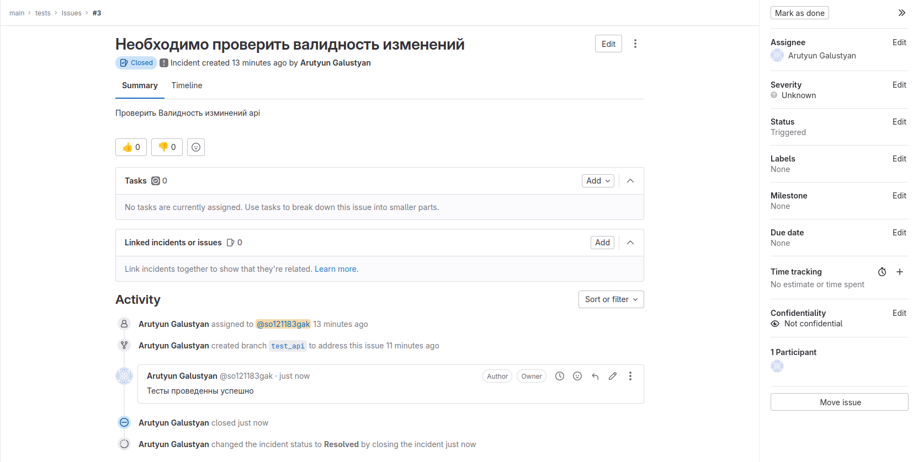

# Gitlab
### Основная часть

#### DevOps
  1. Образ собирается на основе centos:7.
  2. Python версии не ниже 3.7.
  3. Установлены зависимости: flask flask-jsonpify flask-restful.
  4. Создана директория /python_api.
  5. Скрипт из репозитория размещён в /python_api.
  6. Точка вызова: запуск скрипта.
  7. При комите в любую ветку должен собираться docker image с форматом имени hello:gitlab-$CI_COMMIT_SHORT_SHA. Образ должен быть выложен в Gitlab registry или yandex registry.

  

#### Product Owner
Вашему проекту нужна бизнесовая доработка: нужно поменять JSON ответа на вызов метода GET /rest/api/get_info, необходимо создать Issue в котором указать:

  1. Какой метод необходимо исправить.
  2. Текст с { "message": "Already started" } на { "message": "Running"}.
  3. Issue поставить label: feature.

  

  

  

##### Лог сборки
https://github.com/so121183gak/devops-netology/blob/main/cicd/lesson6/ProductOwner.log

#### Developer
Пришёл новый Issue на доработку, вам нужно:

  1. Создать отдельную ветку, связанную с этим Issue.
  2. Внести изменения по тексту из задания.
  3. Подготовить Merge Request, влить необходимые изменения в master, проверить, что сборка прошла успешно.

  

  

##### Лог сборки
https://github.com/so121183gak/devops-netology/blob/main/cicd/lesson6/Developer.log

#### Tester
Разработчики выполнили новый Issue, необходимо проверить валидность изменений:

  1. Поднять докер-контейнер с образом python-api:latest и проверить возврат метода на корректность.
  2. Закрыть Issue с комментарием об успешности прохождения, указав желаемый результат и фактически достигнутый.

  

  

  

  

##### Лог сборки
https://github.com/so121183gak/devops-netology/blob/main/cicd/lesson6/Tester.log

### Исходный код
https://github.com/so121183gak/devops-netology/blob/main/cicd/lesson6/src/

