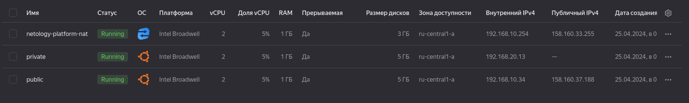

# Организация сети

Домашнее задание будет состоять из обязательной части, которую необходимо выполнить на провайдере Яндекс.Облако и дополнительной части в AWS по желанию. Все домашние задания в 15 блоке связаны друг с другом и в конце представляют пример законченной инфраструктуры.
Все задания требуется выполнить с помощью Terraform, результатом выполненного домашнего задания будет код в репозитории.

Перед началом работ следует настроить доступ до облачных ресурсов из Terraform используя материалы прошлых лекций и [ДЗ](https://github.com/netology-code/virt-homeworks/tree/master/07-terraform-02-syntax). А также заранее выбрать регион (в случае AWS) и зону.

### Основная часть

#### Задание 1. Яндекс.Облако (обязательное к выполнению)

1. Создать VPC.

 - Создать пустую VPC. Выбрать зону.

```
resource "yandex_vpc_network" "develop" {
  name = var.vpc_name
}
```

2. Публичная подсеть.

 - Создать в vpc subnet с названием public, сетью 192.168.10.0/24.
 - Создать в этой подсети NAT-инстанс, присвоив ему адрес 192.168.10.254. В качестве image_id использовать fd80mrhj8fl2oe87o4e1
 - Создать в этой публичной подсети виртуалку с публичным IP и подключиться к ней, убедиться что есть доступ к интернету.

```
resource "yandex_vpc_subnet" "public-subnet" {
  name           = "public"
  zone           = var.default_zone
  network_id     = yandex_vpc_network.develop.id
  v4_cidr_blocks = var.public_cidr
}
```
```
resource "yandex_compute_instance" "platform" {
  name        = local.nat_platform_name
  platform_id = var.vm_yandex_compute_instance_standart
  resources {
    cores         = var.vm_resources["nat"]["cores"]
    memory        = var.vm_resources["nat"]["memory"]
    core_fraction = var.vm_resources["nat"]["core_fraction"]
  }
  boot_disk {
    initialize_params {
      image_id = "fd80mrhj8fl2oe87o4e1"
    }
  }
  scheduling_policy {
    preemptible = true
  }
  network_interface {
    subnet_id = yandex_vpc_subnet.public-subnet.id
    ip_address         = "192.168.10.254"
    nat       = true
  }
  metadata = {
    serial-port-enable = var.vm_metadata["serial-port-enable"]
    ssh-keys = "ubuntu:${local.ssh-keys}"

    }
}
```
```
resource "yandex_compute_instance" "public" {
  name        = "public"
  platform_id = var.vm_yandex_compute_instance_standart
  resources {
    cores         = var.vm_resources["public"]["cores"]
    memory        = var.vm_resources["public"]["memory"]
    core_fraction = var.vm_resources["public"]["core_fraction"]
  }
  boot_disk {
    initialize_params {
      image_id = data.yandex_compute_image.ubuntu.image_id
    }
  }
  scheduling_policy {
    preemptible = true
  }
  network_interface {
    subnet_id  = yandex_vpc_subnet.public-subnet.id
    nat         = true
  }

  metadata = {
    serial-port-enable = var.vm_metadata["serial-port-enable"]
    ssh-keys = "ubuntu:${local.ssh-keys}"
    }
}
```


3. Приватная подсеть.

 - Создать в vpc subnet с названием private, сетью 192.168.20.0/24.
 - Создать route table. Добавить статический маршрут, направляющий весь исходящий трафик private сети в NAT-инстанс
 - Создать в этой приватной подсети виртуалку с внутренним IP, подключиться к ней через виртуалку, созданную ранее и убедиться что есть доступ к интернету

```
resource "yandex_vpc_subnet" "private-subnet" {
  name           = "private"
  zone           = var.default_zone
  network_id     = yandex_vpc_network.develop.id
  v4_cidr_blocks = var.private_cidr
  route_table_id = yandex_vpc_route_table.nat-instance-route.id
}
```
```
resource "yandex_vpc_route_table" "nat-instance-route" {
  name       = "private-into-nat"
  network_id = yandex_vpc_network.develop.id
  static_route {
    destination_prefix = "0.0.0.0/0"
    next_hop_address   = "192.168.10.254"
  }
}
```
```
resource "yandex_compute_instance" "vm-private"{
  name        = "private"
  platform_id = var.vm_yandex_compute_instance_standart
  resources {
    cores         = var.vm_resources["private"]["cores"]
    memory        = var.vm_resources["private"]["memory"]
    core_fraction = var.vm_resources["private"]["core_fraction"]
  }
  boot_disk {
    initialize_params {
      image_id = data.yandex_compute_image.ubuntu.image_id
    }
  }
  scheduling_policy {
    preemptible = true
  }
  network_interface {
    subnet_id = yandex_vpc_subnet.private-subnet.id
  }

  metadata = {
    serial-port-enable = var.vm_metadata["serial-port-enable"]
    ssh-keys = "ubuntu:${local.ssh-keys}"

    }
}
```
<p align="center">
  
</p>


### Весь код можно посмотреть по ссылке
https://github.com/so121183gak/devops-netology/tree/main/cloud/lesson1/src

Дополнительные материалы:
Resource terraform для ЯО

[VPC subnet](https://registry.terraform.io/providers/yandex-cloud/yandex/latest/docs/resources/vpc_subnet)<br>
[Route table](https://registry.terraform.io/providers/yandex-cloud/yandex/latest/docs/resources/vpc_route_table)<br>
[Compute Instance](https://registry.terraform.io/providers/yandex-cloud/yandex/latest/docs/resources/compute_instance)<br>


