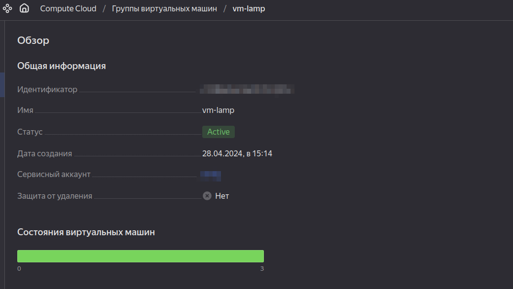

# Вычислительные мощности. Балансировщики нагрузки

Домашнее задание будет состоять из обязательной части, которую необходимо выполнить на провайдере Яндекс.Облако, и дополнительной части в AWS (можно выполнить по желанию). Все домашние задания в 15 блоке связаны друг с другом и в конце представляют пример законченной инфраструктуры. Все задания требуется выполнить с помощью Terraform, результатом выполненного домашнего задания будет код в репозитории. Перед началом работ следует настроить доступ до облачных ресурсов из Terraform, используя материалы прошлых лекций и ДЗ.

### Основная часть

#### Задание 1. Яндекс.Облако (обязательное к выполнению)

1. Создать bucket Object Storage и разместить там файл с картинкой:

  - Создать bucket в Object Storage с произвольным именем (например, имя_студента_дата);
  - Положить в bucket файл с картинкой;
  - Сделать файл доступным из Интернет.

```
# Создание корзины 
resource "yandex_storage_bucket" "test-bucket" {
  access_key    = yandex_iam_service_account_static_access_key.sa-static-key.access_key
  secret_key    = yandex_iam_service_account_static_access_key.sa-static-key.secret_key
  bucket        = "test-picture"
  acl           = "public-read"
  force_destroy = "true"
}

# Создаем обьект в корзине
resource "yandex_storage_object" "image-object" {
  access_key    = yandex_iam_service_account_static_access_key.sa-static-key.access_key
  secret_key    = yandex_iam_service_account_static_access_key.sa-static-key.secret_key
  bucket        = "test-picture"
  acl           = "public-read"
  key           = "test.png"
  source        = "~/test.png"
  depends_on    = [yandex_storage_bucket.test-bucket]
}
```
<p align="center">
  
</p>

2. Создать группу ВМ в public подсети фиксированного размера с шаблоном LAMP и web-страничкой, содержащей ссылку на картинку из bucket:

  - Создать Instance Group с 3 ВМ и шаблоном LAMP. Для LAMP рекомендуется использовать image_id = fd827b91d99psvq5fjit;
  - Для создания стартовой веб-страницы рекомендуется использовать раздел user_data в meta_data;
  - Разместить в стартовой веб-странице шаблонной ВМ ссылку на картинку из bucket;
  - Настроить проверку состояния ВМ.


```
# Создаем группу виртуальных машин
resource "yandex_compute_instance_group" "lamp" {
  name                = "vm-lamp"
  folder_id           = var.folder_id
  service_account_id  = "${yandex_iam_service_account.sa-ig.id}"
  deletion_protection = false
  instance_template {
    platform_id = var.vm_yandex_compute_instance_standart
    resources {
      memory = 2
      cores  = 2
    }
    boot_disk {
      mode = "READ_WRITE"
      initialize_params {
        image_id = "fd827b91d99psvq5fjit"
        size     = 4
      }
    }
    network_interface {
      network_id = "${yandex_vpc_network.develop.id}"
      subnet_ids = ["${yandex_vpc_subnet.public-subnet.id}"]
      nat        = "true"
    }
    metadata = {
      user-data          = data.template_file.cloudinit.rendered
  }
    network_settings {
      type = "STANDARD"
    }
  }

  scale_policy {
    fixed_scale {
      size = 3
    }
  }

  allocation_policy {
    zones = ["${var.default_zone}"]
  }

  deploy_policy {
    max_unavailable = 1
    max_creating    = 2
    max_expansion   = 2
    max_deleting    = 1
  }

  health_check {
    http_options {
      port = 80
      path = "/index.html"
    }
  }

  depends_on = [yandex_storage_bucket.test-bucket]

  load_balancer {
    target_group_name        = "vm-lamp"
    target_group_description = "test balancer"
  }
}

# Используя файл шаблона Cloudinit размещаем картинку
data "template_file" "cloudinit" {
 template = file("${path.module}/cloud-init.yml")
 vars = {
   ssh_public_key = local.ssh-keys
   image_id = var.image_id
 }
}

```
<p align="center">
  
</p>
<p align="center">
  
</p>
<p align="center">
  
</p>

3. Подключить группу к сетевому балансировщику:

  - Создать сетевой балансировщик;
  - Проверить работоспособность, удалив одну или несколько ВМ.

```
  attached_target_group {
    target_group_id = yandex_compute_instance_group.lamp.load_balancer.0.target_group_id

    healthcheck {
      name = "http"
      http_options {
        port = 80
        path = "/index.html"
      }
    }
  }
```
<p align="center">
  
</p>

4. *Создать Application Load Balancer с использованием Instance group и проверкой состояния.

<p align="center">
  
</p>

<p align="center">
  
</p>

<p align="center">
  
</p>

### Весь код можно посмотреть по ссылке
https://github.com/so121183gak/devops-netology/tree/main/cloud/lesson2/src

Документация:

[Compute instance group](https://registry.terraform.io/providers/yandex-cloud/yandex/latest/docs/resources/compute_instance_group)<br>
[Network Load Balancer](https://registry.terraform.io/providers/yandex-cloud/yandex/latest/docs/resources/lb_network_load_balancer)<br>
[Группа ВМ с сетевым балансировщиком](https://cloud.yandex.ru/docs/compute/operations/instance-groups/create-with-balancer)<br>


