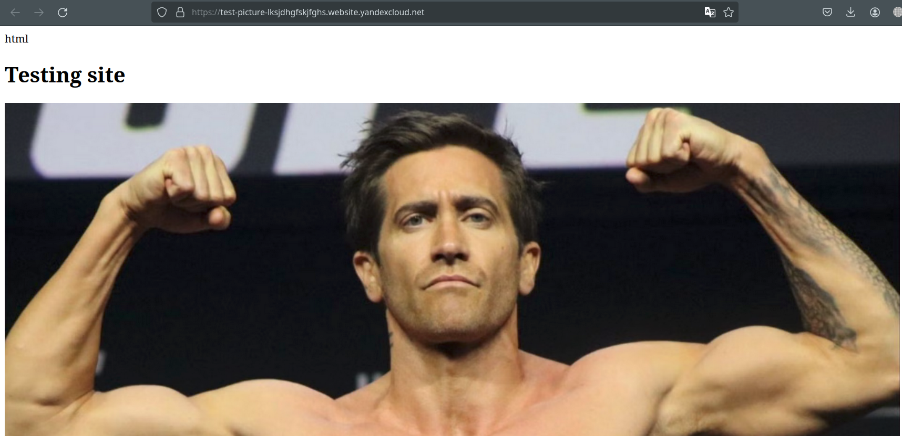

# Безопасность в облачных провайдерах

### Основная часть

#### Задание 1. Яндекс.Облако (обязательное к выполнению)


1. С помощью ключа в KMS необходимо зашифровать содержимое бакета:

  - Создать ключ в KMS,
  - С помощью ключа зашифровать содержимое бакета, созданного ранее.

  
```
# Создание ключа шифрования
resource "yandex_kms_symmetric_key" "key-a" {
  name              = "netology"
  description       = "Ключ шифрования для бакета test-picture"
  default_algorithm = "AES_128"
  rotation_period   = "8760h"
  lifecycle {
    prevent_destroy = false
  }
}

# Создание корзины 
resource "yandex_storage_bucket" "test-bucket" {
  access_key    = yandex_iam_service_account_static_access_key.sa-static-key.access_key
  secret_key    = yandex_iam_service_account_static_access_key.sa-static-key.secret_key
  bucket        = "test-picture-lksjdhgfskjfghs"
  acl           = "public-read"
  force_destroy = "true"
  max_size   = 1073741824
  server_side_encryption_configuration {
    rule {
      apply_server_side_encryption_by_default {
        kms_master_key_id = yandex_kms_symmetric_key.key-a.id
        sse_algorithm     = "aws:kms"
      }
    }
  }
}
```


2. (Выполняется НЕ в terraform) *Создать статический сайт в Object Storage c собственным публичным адресом и сделать доступным по HTTPS

  - Создать сертификат,
  - Создать статическую страницу в Object Storage и применить сертификат HTTPS,
  - В качестве результата предоставить скриншот на страницу с сертификатом в заголовке ("замочек").

<p align="center">
  
</p>

### Весь код можно посмотреть по ссылке
https://github.com/so121183gak/devops-netology/tree/main/cloud/lesson3/src

Документация:

[Настройка HTTPS статичного сайта](https://cloud.yandex.ru/docs/storage/operations/hosting/certificate)<br>
[Object storage bucket](https://registry.terraform.io/providers/yandex-cloud/yandex/latest/docs/resources/storage_bucket)<br>
[KMS key](https://registry.terraform.io/providers/yandex-cloud/yandex/latest/docs/resources/kms_symmetric_key)<br>


