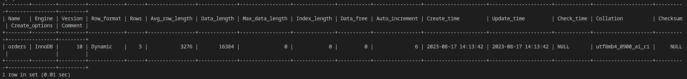

# Использование Terraform в команде

### Задание 1
- Изучите бэкап БД и восстановитесь из него.

```
create database test;
#mysql -p -D test < /opt/test_dump.sql
```
- Используя команду \h, получите список управляющих команд. Найдите команду для выдачи статуса БД и приведите в ответе из её вывода версию сервера БД.
```
\s
mysql  Ver 8.1.0 for Linux on x86_64 (MySQL Community Server - GPL)
```

- Подключитесь к восстановленной БД и получите список таблиц из этой БД.
```
\r
show tables;
+----------------+
| Tables_in_test |
+----------------+
| orders         |
+----------------+
```

- Приведите в ответе количество записей с price > 300.
```
SELECT count(*) FROM orders WHERE price > 300;
+----------+
| count(*) |
+----------+
|        1 |
+----------+
1 row in set (0.00 sec)
```

### Задание 2
- Создайте пользователя test в БД c паролем test-pass, используя:

     - плагин авторизации mysql_native_password
     - срок истечения пароля — 180 дней
     - количество попыток авторизации — 3
     - максимальное количество запросов в час — 100
     - аттрибуты пользователя:
        - Фамилия "Pretty"
        - Имя "James".

```
create user 'test'@'localhost' 
    identified with mysql_native_password by 'test-pass' 
    with max_queries_per_hour 100
    password expire interval 180 day 
    failed_login_attempts 3 
    attribute '{"name": "James","surname": "Pretty"}';
```
- Предоставьте привелегии пользователю test на операции SELECT базы test_db.
```
SELECT * FROM INFORMATION_SCHEMA.USER_ATTRIBUTES WHERE USER = "test";
+------+-----------+----------------------------------------+
| USER | HOST      | ATTRIBUTE                              |
+------+-----------+----------------------------------------+
| test | localhost | {"name": "James", "surname": "Pretty"} |
+------+-----------+----------------------------------------+
1 row in set (0.00 sec)
```

### Задание 3
- Установите профилирование SET profiling = 1. Изучите вывод профилирования команд SHOW PROFILES;.
```
SET profiling = 1;
Query OK, 0 rows affected, 1 warning (0.00 sec)

SHOW PROFILES;
Empty set, 1 warning (0.00 sec)
```

- Исследуйте, какой engine используется в таблице БД test_db и приведите в ответе.
```
SHOW TABLE STATUS WHERE NAME = "orders";
```
<p align="center">
  
</p>

- Измените engine и приведите время выполнения и запрос на изменения из профайлера в ответе:

    - на MyISAM,

    - на InnoDB.

```
ALTER TABLE orders ENGINE=MyISAM;
ALTER TABLE orders ENGINE=InnoDB;

SHOW PROFILES;
+----------+------------+-----------------------------------------+
| Query_ID | Duration   | Query                                   |
+----------+------------+-----------------------------------------+
|        1 | 0.00137900 | SHOW TABLE STATUS WHERE NAME = "ordrs"  |
|        2 | 0.00874250 | SHOW TABLE STATUS WHERE NAME = "orders" |
|        3 | 0.05496550 | ALTER TABLE orders ENGINE=InnoDB        |
|        4 | 0.03633500 | ALTER TABLE orders ENGINE=MyISAM        |
+----------+------------+-----------------------------------------+
```
### Задание 4
- Изучите файл my.cnf в директории /etc/mysql.

    - Измените его согласно ТЗ (движок InnoDB):

        - скорость IO важнее сохранности данных;
        - нужна компрессия таблиц для экономии места на диске;
        - размер буффера с незакомиченными транзакциями 1 Мб;
        - буффер кеширования 30% от ОЗУ;
        - размер файла логов операций 100 Мб.

- Приведите в ответе изменённый файл my.cnf.

```
# For advice on how to change settings please see
# http://dev.mysql.com/doc/refman/8.1/en/server-configuration-defaults.html

[mysqld]
#
# Remove leading # and set to the amount of RAM for the most important data
# cache in MySQL. Start at 70% of total RAM for dedicated server, else 10%.
# innodb_buffer_pool_size = 128M
#
# Remove leading # to turn on a very important data integrity option: logging
# changes to the binary log between backups.
# log_bin
#
# Remove leading # to set options mainly useful for reporting servers.
# The server defaults are faster for transactions and fast SELECTs.
# Adjust sizes as needed, experiment to find the optimal values.
# join_buffer_size = 128M
# sort_buffer_size = 2M
# read_rnd_buffer_size = 2M
innodb_flush_log_at_trx_commit = 0
innodb_file_per_table = 1
innodb_compression_algorithm = zlib
innodb_log_buffer_size	= 1M
innodb_buffer_pool_size = 4G
innodb_log_file_size = 100M

# Remove leading # to revert to previous value for default_authentication_plugin,
# this will increase compatibility with older clients. For background, see:
# https://dev.mysql.com/doc/refman/8.1/en/server-system-variables.html#sysvar_default_authentication_plugin
# default-authentication-plugin=mysql_native_password
skip-host-cache
skip-name-resolve
datadir=/var/lib/mysql
socket=/var/run/mysqld/mysqld.sock
secure-file-priv=/var/lib/mysql-files
user=mysql

pid-file=/var/run/mysqld/mysqld.pid
[client]
socket=/var/run/mysqld/mysqld.sock

!includedir /etc/mysql/conf.d/
```
