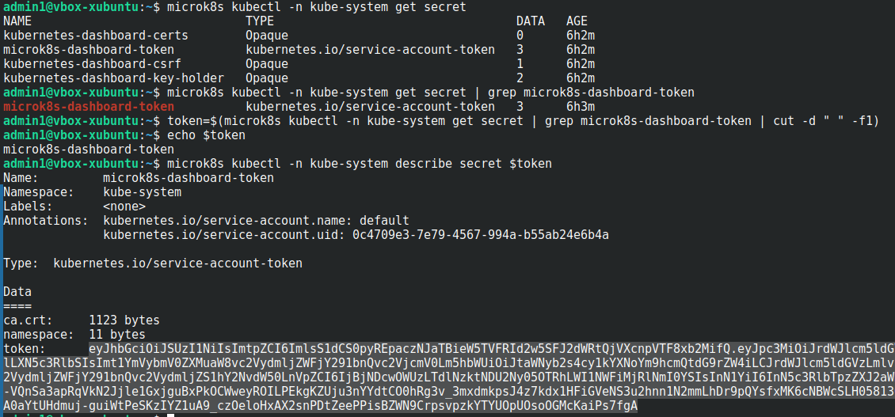

# Kubernetes. Причины появления. Команда kubectl

### Основная часть

#### Задание 1. Установка MicroK8S

1. Установить MicroK8S на локальную машину или на удалённую виртуальную машину.
<p align="center">
  
</p


2. Установить dashboard.

Включаем дополнение

<p align="center">
  
</p

3. Сгенерировать сертификат для подключения к внешнему ip-адресу.

- Вносим IP в конфиг **/var/snap/microk8s/current/certs/csr.conf.template**
<p align="center">
  
</p>

- Обновляем сертификаты ```sudo microk8s refresh-certs --cert front-proxy-client.crt```
<p align="center">
  
</p>


#### Задание 2. Установка и настройка локального kubectl


1. Установить на локальную машину kubectl.
<p align="center">
  
</p>

<p align="center">
  
</p>

2. Настроить локально подключение к кластеру.

- Узнаем данные для подключения к ноде и переносим их в локальную конфигурацию ~/.kube/config
<p align="center">
  
</p>

3. Подключиться к дашборду с помощью port-forward.
- Запускаем port-forward

<p align="center">
  
</p>

- Выдкргиваем токен 

<p align="center">
  
</p>

- Переходим на WEB интерфейс

<p align="center">
  
</p>