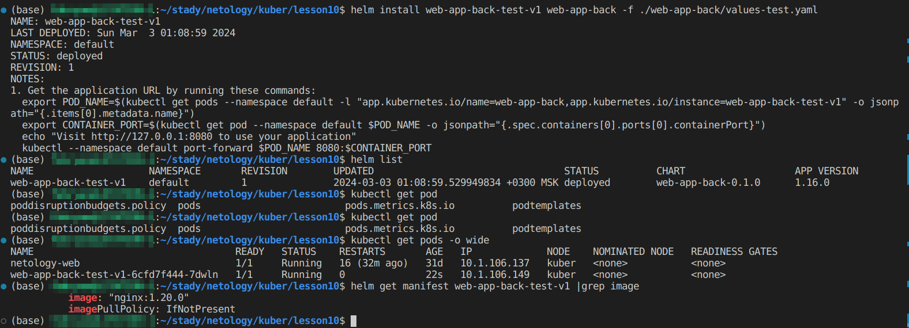
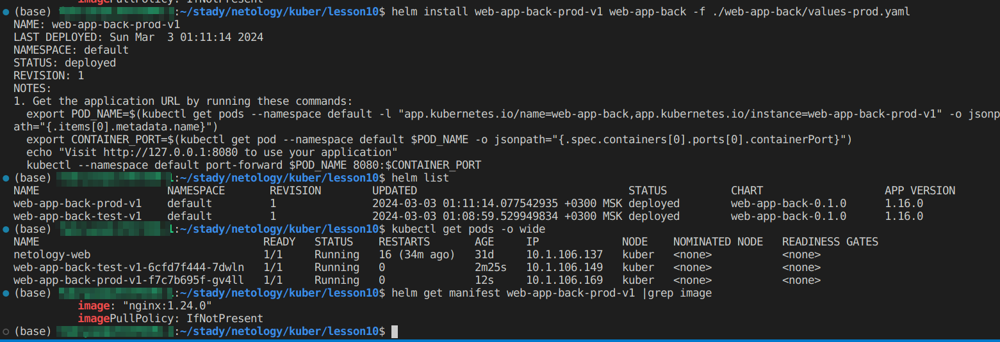
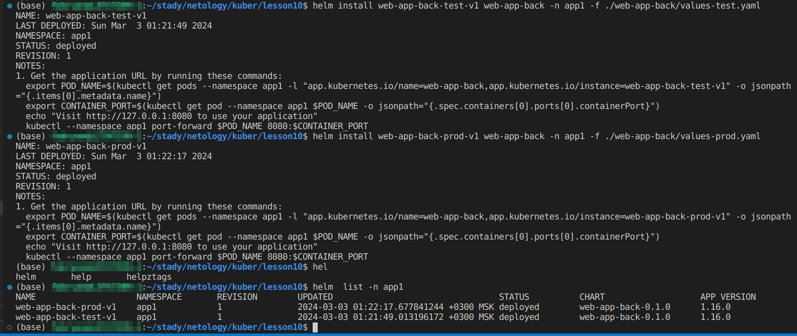
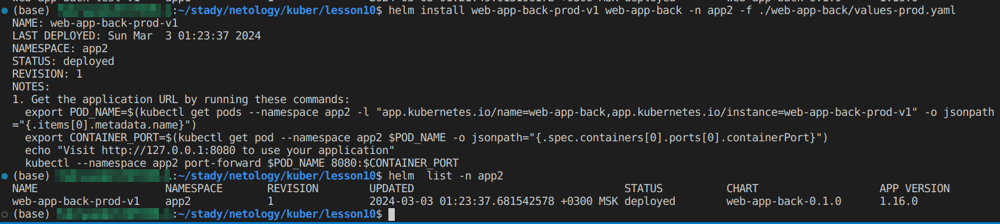

# Helm

### Основная часть

#### Задание 1 Подготовить Helm-чарт для приложения


1. Необходимо упаковать приложение в чарт для деплоя в разные окружения.
2. Каждый компонент приложения деплоится отдельным deployment’ом или statefulset’ом.
3. В переменных чарта измените образ приложения для изменения версии.

Создаем чарт
```
helm create web-app-back
```

Создаем переменные под каждое окружение
- test окружение
```
image:
  repository: nginx
  pullPolicy: IfNotPresent
  # Overrides the image tag whose default is the chart appVersion.
  tag: "1.20.0"

```

- prod окружение
```
image:
  repository: nginx
  pullPolicy: IfNotPresent
  # Overrides the image tag whose default is the chart appVersion.
  tag: "1.24.0"

```
<p align="center">
  
</p>
<p align="center">
  
</p>

#### Задание 2. Запустить две версии в разных неймспейсах

1. Подготовив чарт, необходимо его проверить. Запуститe несколько копий приложения.
2. Одну версию в namespace=app1, вторую версию в том же неймспейсе, третью версию в namespace=app2.
3. Продемонстрируйте результат.

<p align="center">
  
</p>

<p align="center">
  
</p>

### Весь код можно посмотреть по ссылке
https://github.com/so121183gak/devops-netology/tree/main/kuber/lesson10/src