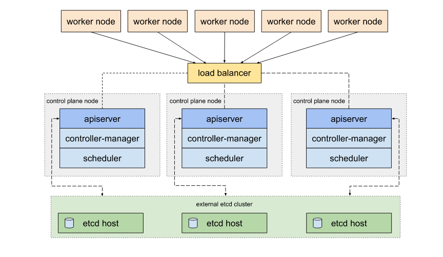

# Компоненты Kubernetes

#### Задание. Необходимо определить требуемые ресурсы

Известно, что проекту нужны база данных, система кеширования, а само приложение состоит из бекенда и фронтенда. Опишите, какие ресурсы нужны, если известно:

1. Необходимо упаковать приложение в чарт для деплоя в разные окружения.
2. База данных должна быть отказоустойчивой. Потребляет 4 ГБ ОЗУ в работе, 1 ядро. 3 копии.
3. Кеш должен быть отказоустойчивый. Потребляет 4 ГБ ОЗУ в работе, 1 ядро. 3 копии.
4. Фронтенд обрабатывает внешние запросы быстро, отдавая статику. Потребляет не более 50 МБ ОЗУ на каждый экземпляр, 0.2 ядра. 5 копий.
5. Бекенд потребляет 600 МБ ОЗУ и по 1 ядру на копию. 10 копий.

Правила приёма работы

1. Домашняя работа оформляется в своем Git-репозитории в файле README.md. Выполненное домашнее задание пришлите ссылкой на .md-файл в вашем репозитории.
2. Сначала сделайте расчёт всех необходимых ресурсов.
3. Затем прикиньте количество рабочих нод, которые справятся с такой нагрузкой.
4. Добавьте к полученным цифрам запас, который учитывает выход из строя как минимум одной ноды.
5. Добавьте служебные ресурсы к нодам. Помните, что для разных типов нод требовния к ресурсам разные.
6. В результате должно быть указано количество нод и их параметры.

#### Решение

Для организации правильно архитектуры высоконагруженного кластера, необходимо учесть много факторов и условий, нет единого метода или лекарства которое будет одинаково полезно во всех ситуациях.

#### Расчет ресурсов для Control Plane (master nodes)
На данном этапе приходится рассчитывать ресурсы относительно рекомендуемых значений которые приведенный в интернете, оговорюсь что значения стартовые и придется искать зону сбоя на экземплярах, масштабировать экземпляры сначала по вертикали, а затем по горизонтали, после достижения очередной зоны сбоя возвращаться к вертикальному масштабированию. К тому же необходимо делать минимум 3 узла для того что бы кластер был отказоустойчивым.
- Рекомендуемые ресурсы для старта:

ОЗУ = 4 ГБ 
ЦП  = 2 ядра

- Расчет ресурсов для трех узлов:

ОЗУ = 4 * 3 = 12 ГБ 
ЦП  = 2 * 3 = 6 ядер 

- Таблица рассчитанных ресурсов:

| ЦП (ядро) | ОЗУ (ГБ) | Количество узлов|
|----------|----------|----------|
| 6 | 12 | 3 |

Так же на данном этапе необходимо выбрать топологию того как будет работать **control plane**, а именно для большей производительности, на мой взгляд необходимо вывести элемент **etcd** в отдельный кластер

  

- Исходя из вышесказанного получаем итоговою таблицу ресурсов для старта

|Кластера| ЦП (ядро) | ОЗУ (ГБ) | Количество узлов|
|----------|----------|----------|----------|
|Control plane| 6 | 12 | 3 |
|ETCD| 6 | 12 | 3 |

#### Расчет ресурсов для Сервисов (worker nodes)
Для Сервисов так же нужна отказоустойчивость именно по этому я решил сделать 3 узла 
- Опираясь на условия задачи делаем расчет ресурсов для  приложений

БД: 
ОЗУ = 4 * 3 = 12 ГБ 
ЦП  = 1 * 3 = 3 ядра

Кэш: 
ОЗУ = 4 * 3 = 12 ГБ 
ЦП  = 1 * 3 = 3 ядра

Фронтенд: 
ОЗУ = 50 * 5 = 250 МБ (0.244 ГБ)  
ЦП  = 0.2 * 5 = 1 ядро

Бэкенд: 
ОЗУ = 600 * 10 = 6000 МБ (6 ГБ)  
ЦП  = 1 * 10  = 10 ядер

- Таблица первоначально расчета выгляди следующим образом

|Сервисы| ЦП (ядро) | ОЗУ (ГБ) | Количество реплик|
|----------|----------|----------|----------|
|БД| 3 | 12 | 3 |
|Кэш| 3 | 12 | 3 |
|Фронтенд| 1 | 0.244 | 5 |
|Бэкенд| 10 | 6 | 10 |
|Итог| 17 | 30.244 | 21 |

* Однако этих ресурсов недостаточно даже для старта так как мы должны еще прибавить сюда то что в каждом узле есть kubelet и какое-то количество оперативной памяти использует виртуальная машина на которой работает сам узел, что бы не упираться постоянно в зону сбоя нам необходимо понимать сколько оперативной памяти потребляет kubelet и иметь представление сколько примерно может потреблять виртуальная машина для своих нужд.
- для расчета потребления kubelet мы можем обратиться к документации и увидим что для рабочих нагрузок, kubernetes Использует 75% таким образом мы можем понять где у нас точка сбоя
30.244 * 0.75 = 22.683 
таким образом мы видим что 75% от 30.244 равно 22.683, а это значит что нам необходимо нивелировать 7.561 ГБ в узлах
- для расчета потребления оперативной памяти виртуальной машины мы будет отталкиваться из системных требований из интернета, для ОС Linux, среднее значение на 2024 год 512 (0.5 ГБ) МБ. 

- Расчет с учетом памяти для kubelet и виртуальной машину узла:

30.244 + 7.561 + 0.5 = 38,305 ГБ 
Таким образом для стартовой конфигурации Сервисов нам необходимо **38,305 ГБ** оперативной памяти

- Итоговая таблица ресурсов для трех узлов

|Сервисы| ЦП (ядро) | ОЗУ (ГБ) |
|----------|----------|----------|
|Узел 1| 9 | 19.1525 |
|Узел 2| 9 | 19.1525 |
|Узел 3| 9 | 19.1525 |
|Итог| 27 | 57,4575 |

* В случае выхода из строй одного узла работоспособность сервисов будет обеспеченна двумя узлами.

