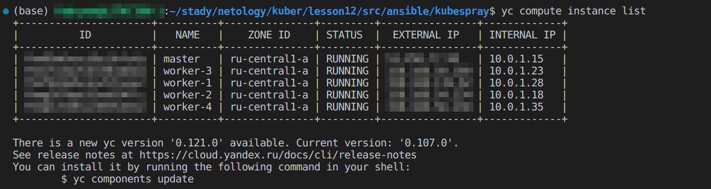
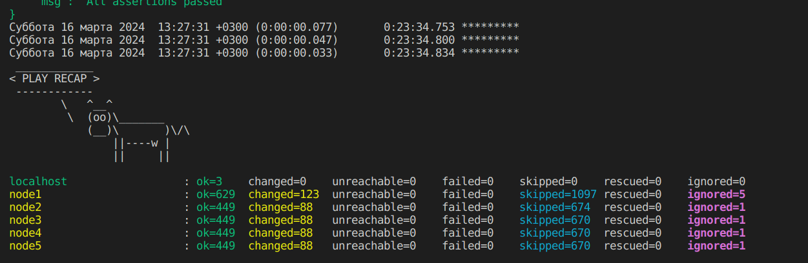
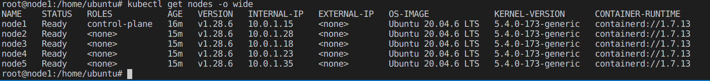
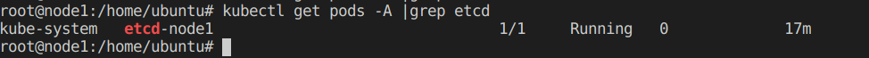

# Установка Kubernetes

#### Задание. Необходимо определить требуемые ресурсы

#### Чеклист готовности к домашнему заданию

1. Развёрнутые ВМ с ОС Ubuntu 20.04-lts.


#### Задание 1. Установить кластер k8s с 1 master node

1. Подготовка работы кластера из 5 нод: 1 мастер и 4 рабочие ноды.
2. В качестве CRI — containerd.
3. Запуск etcd производить на мастере.
4. Способ установки выбрать самостоятельно.

#### Решение

1. В качестве развертывания виртуальных машин, я использую terraform скрипт настроенный на **yandex** провайдера приложенный, к заданию, для того что бы секрипт работал небходимо поменять ключи в скрипте на ваши в файле [main.tf](https://github.com/so121183gak/devops-netology/tree/main/kuber/lesson12/src/main.tf)

```
locals {
  ssh-keys = "${file("~/.ssh/id_ed25519.pub")}"
  ssh-private-keys = "${file("~/.ssh/id_ed25519")}"
}
```
- Скрипт отрабатывает на версии terraform v1.5.3, предварительно вы должны убедится что у вас правильно настроена командная строка yandex.
- Так же на всех нодах с помощью cloud-init можно установить soft который в последствии будет полезен для работы, состав ПО можно задать [cloud-init.yml](https://github.com/so121183gak/devops-netology/tree/main/kuber/lesson12/src/cloud-init.yml)

```
packages:
- nano
- mc
- curl
- net-tools
- apt-transport-https
- snapd
```
- terraform подготавливает инвентраи файл для ansible и помещает его в папку ./ansible/kubespray/inventory/mycluster/hosts.yaml, для правки шаблона terraform под вашу конфигурацию кластера вы можете отредактировать файл [hosts.tftpl](https://github.com/so121183gak/devops-netology/tree/main/kuber/lesson12/src/hosts.tftpl).
- Для запуска скрипта перейдите в коревую папку где лежат конфигурации terraform и введите следующие команды:
  - terraform init
  - terraform plan
  - terraform apply

<p align="center">
  
</p>

2. Развертывание кластера происходит средствами ansible используется готовый скрипт развертывания kubespray версии 2.24, так же используется ansible 2.16.4 и python 3.11.6

- Для развертывания кластера необходимо перейти в  папку .ansible/kubespray и ввести команду:


```
ansible-playbook -i inventory/mycluster/hosts.yaml -u <имя пользователя ВМ> --become --become-user=root --private-key=<путь к вашему  приватному ключу> -e 'ansible_ssh_common_args="-o StrictHostKeyChecking=no"' cluster.yml --flush-cache
```

- В итоге мы получим установленный кластер согласно ТЗ.
<p align="center">
  
</p>

<p align="center">
  
</p>

<p align="center">
  
</p>


### Весь код можно посмотреть по ссылке
https://github.com/so121183gak/devops-netology/tree/main/kuber/lesson12/src