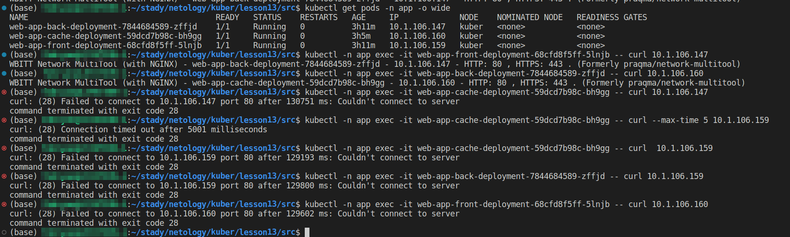

# Как работает сеть в K8s

#### Цель задания

Настроить сетевую политику доступа к подам.
#### Чеклист готовности к домашнему заданию

    Кластер K8s с установленным сетевым плагином Calico.

#### Инструменты и дополнительные материалы, которые пригодятся для выполнения задания

1. Документация Calico.
2. Network Policy.
3. About Network Policy.

#### Задание 1. Создать сетевую политику или несколько политик для обеспечения доступа

1. Создать deployment'ы приложений frontend, backend и cache и соответствующие сервисы.

- deployment
  - [frontend](https://github.com/so121183gak/devops-netology/tree/main/kuber/lesson12/src/dpl-web-app-frontend.yml)
  - [backend](https://github.com/so121183gak/devops-netology/tree/main/kuber/lesson12/src/dpl-web-app-backend.yml)
  - [cache](https://github.com/so121183gak/devops-netology/tree/main/kuber/lesson12/src/dpl-web-app-cache.yml)

- service
  - [frontend](https://github.com/so121183gak/devops-netology/tree/main/kuber/lesson12/src/svc-web-app-frontend.yml)
  - [backend](https://github.com/so121183gak/devops-netology/tree/main/kuber/lesson12/src/svc-web-app-backend.yml)
  - [cache](https://github.com/so121183gak/devops-netology/tree/main/kuber/lesson12/src/svc-web-app-cache.yml)

2. В качестве образа использовать network-multitool.
3. Разместить поды в namespace App.
4. Создать политики, чтобы обеспечить доступ frontend -> backend -> cache. Другие виды подключений должны быть запрещены.
- policy
  - [all](https://github.com/so121183gak/devops-netology/tree/main/kuber/lesson12/src/np-web-app.yml)

5. Продемонстрировать, что трафик разрешён и запрещён.

  

### Весь код можно посмотреть по ссылке
https://github.com/so121183gak/devops-netology/tree/main/kuber/lesson13/src