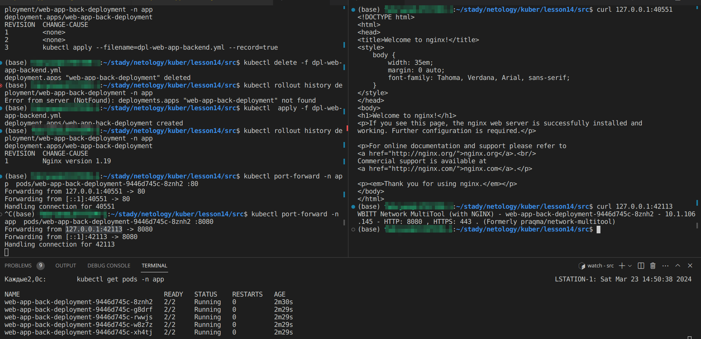
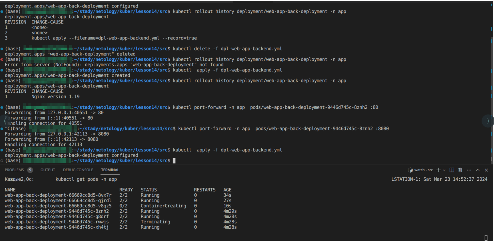
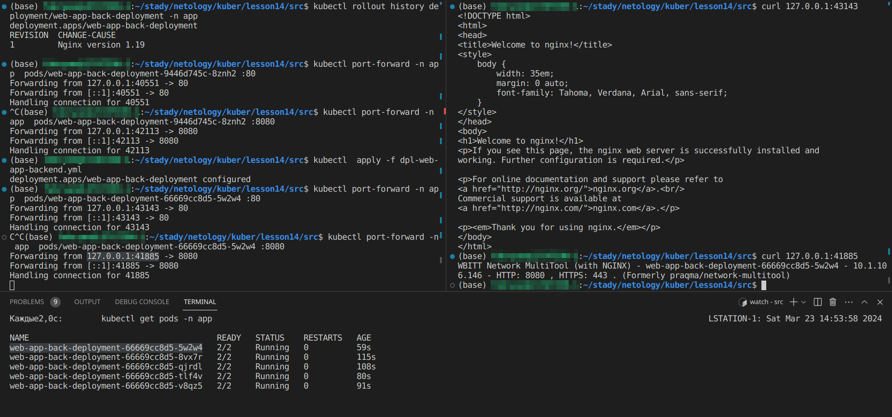
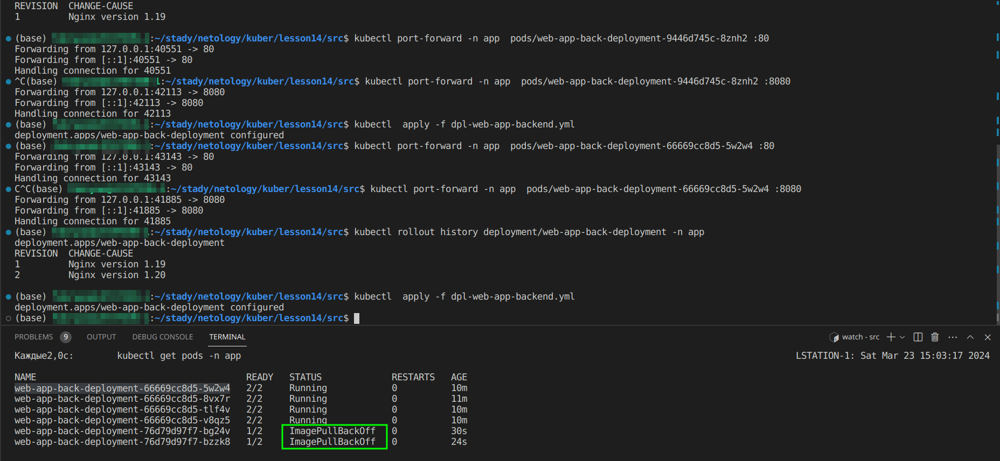
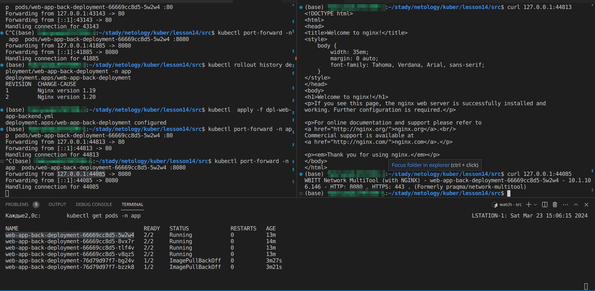
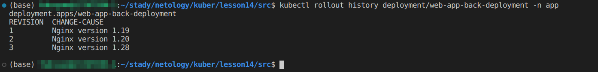
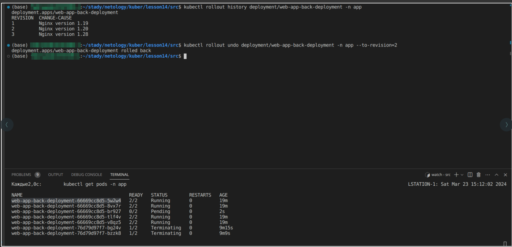
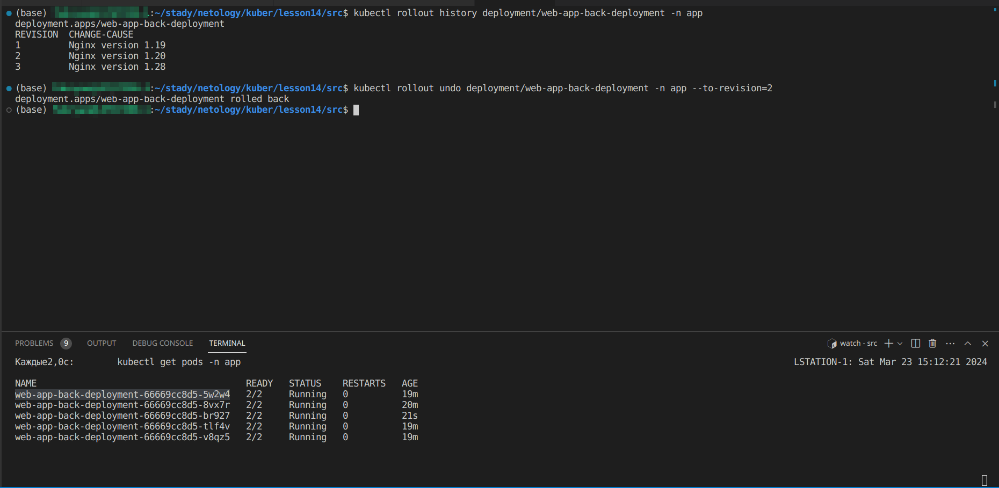

# Обновление приложений

#### Цель задания

Выбрать и настроить стратегию обновления приложения.
#### Чеклист готовности к домашнему заданию

1. Кластер K8s.

#### Инструменты и дополнительные материалы, которые пригодятся для выполнения задания


1. [Документация Updating a Deployment.](https://kubernetes.io/docs/concepts/workloads/controllers/deployment/#updating-a-deployment)
2. [Статья про стратегии обновлений.](https://habr.com/ru/companies/flant/articles/471620/)


#### Задание 1. Выбрать стратегию обновления приложения и описать ваш выбор

1. Имеется приложение, состоящее из нескольких реплик, которое требуется обновить.
2. Ресурсы, выделенные для приложения, ограничены, и нет возможности их увеличить.
3. Запас по ресурсам в менее загруженный момент времени составляет 20%.
4. Обновление мажорное, новые версии приложения не умеют работать со старыми.
5. Вам нужно объяснить свой выбор стратегии обновления приложения.

#### Решение
Для данного случая подходит стратегия Rolling Update, так как не нужно много ресурсов для реализации этой стратегии, так же она обеспечит плавный переход от одной версии приложения к другой (новые поды с приложением будут создаваться, тогда как старые поды будут постепенно удалятся). Однако конкретно в нашем случае придется делать обновление в тот период когда нет большой нагрузки, к тому же что бы не привести кластер к пределу ресурсов необходимо в стратегии обновления указать следующие параметры:
```
maxSurge: 20%
maxUnavailable: 20%
```

#### Задание 2. Обновить приложение

1. Создать deployment приложения с контейнерами nginx и multitool. Версию nginx взять 1.19. Количество реплик — 5.

```
kubectl  apply -f dpl-web-app-backend.yml
```
```
apiVersion: apps/v1
kind: Deployment
metadata:
  name: web-app-back-deployment
  namespace: app
  labels:
    app: web-app-back
  annotations:
    kubernetes.io/change-cause: "Nginx version 1.19"
spec:
  replicas: 5
  selector:
    matchLabels:
      app: web-app-back
  strategy:
    type: RollingUpdate
    rollingUpdate:
      maxSurge: 1
      maxUnavailable: 1
  template:
    metadata:
      labels:
        app: web-app-backSS
    spec:
      containers:
      - name: back-nginx
        image: nginx:1.19
        ports:
        - containerPort: 80
          name: nginx-port
        env:
          - name: NGINX_PORT
            value: "80"
          - name: NGINX_LISTEN
            value: "0.0.0.0"
      - name: back-multitool
        image: wbitt/network-multitool
        ports:
        - containerPort: 8080
          name: multitool-port
        env:
          - name: HTTP_PORT
            value: "8080"

```
2. Обновить версию nginx в приложении до версии 1.20, сократив время обновления до минимума. Приложение должно быть доступно.
```
kubectl  apply -f dpl-web-app-backend.yml
```
```
apiVersion: apps/v1
kind: Deployment
metadata:
  name: web-app-back-deployment
  namespace: app
  labels:
    app: web-app-back
  annotations:
    kubernetes.io/change-cause: "Nginx version 1.20"
spec:
  replicas: 5
  selector:
    matchLabels:
      app: web-app-back
  strategy:
    type: RollingUpdate
    rollingUpdate:
      maxSurge: 1
      maxUnavailable: 1
  template:
    metadata:
      labels:
        app: web-app-backSS
    spec:
      containers:
      - name: back-nginx
        image: nginx:1.20
        ports:
        - containerPort: 80
          name: nginx-port
        env:
          - name: NGINX_PORT
            value: "80"
          - name: NGINX_LISTEN
            value: "0.0.0.0"
      - name: back-multitool
        image: wbitt/network-multitool
        ports:
        - containerPort: 8080
          name: multitool-port
        env:
          - name: HTTP_PORT
            value: "8080"

```
<p align="center">
  
</p>

<p align="center">
  
</p>

<p align="center">
  
</p>

3. Попытаться обновить nginx до версии 1.28, приложение должно оставаться доступным.
```
kubectl  apply -f dpl-web-app-backend.yml
```
```
apiVersion: apps/v1
kind: Deployment
metadata:
  name: web-app-back-deployment
  namespace: app
  labels:
    app: web-app-back
  annotations:
    kubernetes.io/change-cause: "Nginx version 1.28"
spec:
  replicas: 5
  selector:
    matchLabels:
      app: web-app-back
  strategy:
    type: RollingUpdate
    rollingUpdate:
      maxSurge: 1
      maxUnavailable: 1
  template:
    metadata:
      labels:
        app: web-app-backSS
    spec:
      containers:
      - name: back-nginx
        image: nginx:1.28
        ports:
        - containerPort: 80
          name: nginx-port
        env:
          - name: NGINX_PORT
            value: "80"
          - name: NGINX_LISTEN
            value: "0.0.0.0"
      - name: back-multitool
        image: wbitt/network-multitool
        ports:
        - containerPort: 8080
          name: multitool-port
        env:
          - name: HTTP_PORT
            value: "8080"

```
<p align="center">
  
</p>

<p align="center">
  
</p>

4. Откатиться после неудачного обновления.
- Смотрим историю бэкапов
```
kubectl rollout history deployment/web-app-back-deployment -n app
```
<p align="center">
  
</p>

- Откатываем приложение
```
kubectl rollout undo deployment/web-app-back-deployment -n app --to-revision=2
```
<p align="center">
  
</p>

<p align="center">
  
</p>

### Весь код можно посмотреть по ссылке
https://github.com/so121183gak/devops-netology/tree/main/kuber/lesson14/src