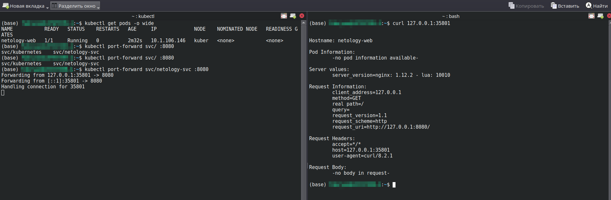

# Базовые объекты K8S

### Основная часть

#### Задание 1. Создать Pod с именем hello-world

1. Создать манифест (yaml-конфигурацию) Pod.
2. Использовать image - gcr.io/kubernetes-e2e-test-images/echoserver:2.2.

```
apiVersion: v1
kind: Pod
metadata:
  name: hello-world
  labels:
    app: web
spec:
  containers:
  - name: hello
    image: gcr.io/kubernetes-e2e-test-images/echoserver:2.2
```

3. Подключиться локально к Pod с помощью kubectl port-forward и вывести значение (curl или в браузере).

<p align="center">
  
</p
</br>

#### Задание 2. Создать Service и подключить его к Pod

1. Создать Pod с именем netology-web.
2. Использовать image — gcr.io/kubernetes-e2e-test-images/echoserver:2.2.
3. Создать Service с именем netology-svc и подключить к netology-web.

```
apiVersion: v1
kind: Pod
metadata:
  name: netology-web
  labels:
    app: web
spec:
  containers:
  - name: hello
    image: gcr.io/kubernetes-e2e-test-images/echoserver:2.2

---
apiVersion: v1
kind: Service
metadata:
  name: netology-svc
spec:
  ports:
  - name: netology-web
    port: 8080
  selector: 
    app: web
```

4. Подключиться локально к Service с помощью kubectl port-forward и вывести значение (curl или в браузере).

<p align="center">
  
</p
</br>

### Весь код можно посмотреть по ссылке
https://github.com/so121183gak/devops-netology/tree/main/kuber/lesson2/src