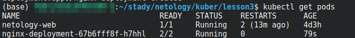
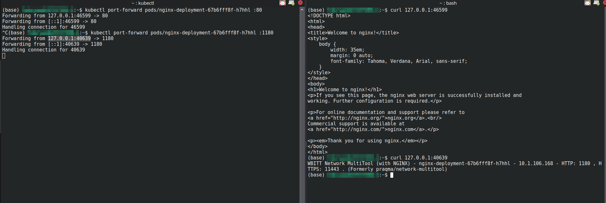
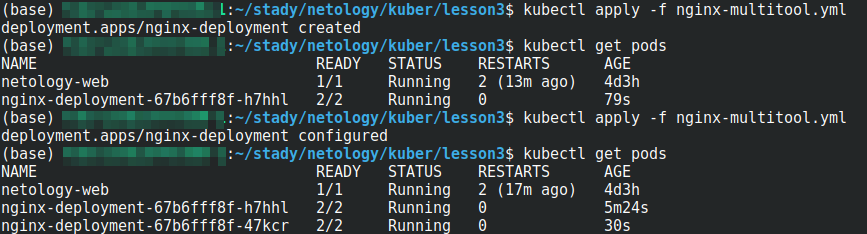
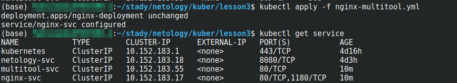
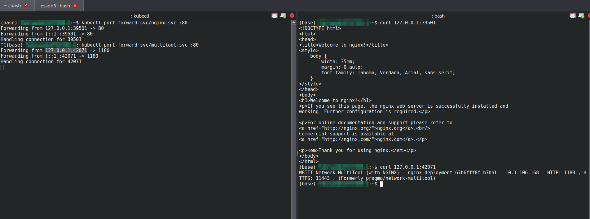
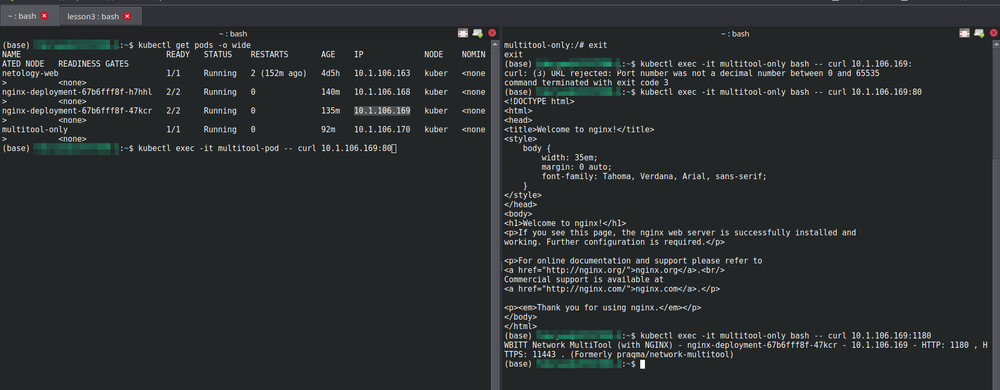
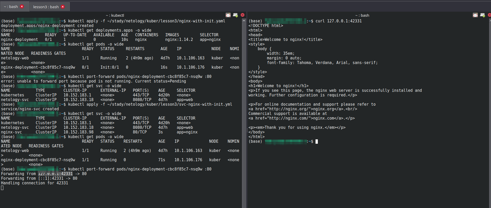

# Запуск приложений в K8S

### Основная часть

#### Задание 1. Создать Deployment и обеспечить доступ к репликам приложения из другого Pod

1. Создать Deployment приложения, состоящего из двух контейнеров — nginx и multitool. Решить возникшую ошибку.

```
apiVersion: apps/v1
kind: Deployment
metadata:
  name: nginx-deployment
  labels:
    app: nginx
spec:
  replicas: 3
  selector:
    matchLabels:
      app: nginx
  template:
    metadata:
      labels:
        app: nginx
    spec:
      containers:
      - name: nginx
        image: nginx:1.14.2
        ports:
        - containerPort: 80
      - name: multitool
        image: wbitt/network-multitool
        ports:
        - containerPort: 1180 
        env:  
        - name: HTTP_PORT
          value: "1180"
```
<p align="center">
  
</p>

<p align="center">
  
</p>
</br>

2. После запуска увеличить количество реплик работающего приложения до 2.
3. Продемонстрировать количество подов до и после масштабирования.

<p align="center">
  
</p>
</br>


4. Создать Service, который обеспечит доступ до реплик приложений из п.1.

<p align="center">
  
</p>

<p align="center">
  
</p>
</br>

5. Создать отдельный Pod с приложением multitool и убедиться с помощью curl, что из пода есть доступ до приложений из п.1.
```
kubectl apply -f multitool.yml 
pod/multitool-only created
```
<p align="center">
  
</p>
</br>


#### Задание 2. Создать Deployment и обеспечить старт основного контейнера при выполнении условий

1. Создать Deployment приложения nginx и обеспечить старт контейнера только после того, как будет запущен сервис этого приложения.

```
apiVersion: apps/v1
kind: Deployment
metadata:
  name: nginx-deployment
  labels:
    app: nginx
spec:
  replicas: 1
  selector:
    matchLabels:
      app: nginx
  template:
    metadata:
      labels:
        app: nginx
    spec:
      initContainers:
      - name: busybox
        image: busybox
        command: ['sh', '-c', 'until nslookup nginx-svc | grep "Name:"; do echo "Wait Service for get endpoint"; sleep 4; done']
      containers:
      - name: nginx
        image: nginx:1.14.2
        ports:
        - containerPort: 80
```

2. Убедиться, что nginx не стартует. В качестве Init-контейнера взять busybox.
3. Создать и запустить Service. Убедиться, что Init запустился.
4. Продемонстрировать состояние пода до и после запуска сервиса.

```
apiVersion: v1
kind: Service
metadata:
  name: nginx-svc
spec:
  selector:
    app: nginx
  ports:
    - name: nginx-svc
      protocol: TCP
      port: 80
```
<p align="center">
  
</p>
</br>


### Весь код можно посмотреть по ссылке
https://github.com/so121183gak/devops-netology/tree/main/kuber/lesson3/src