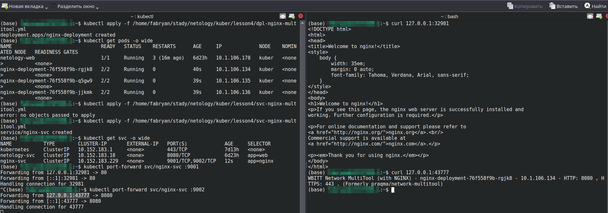
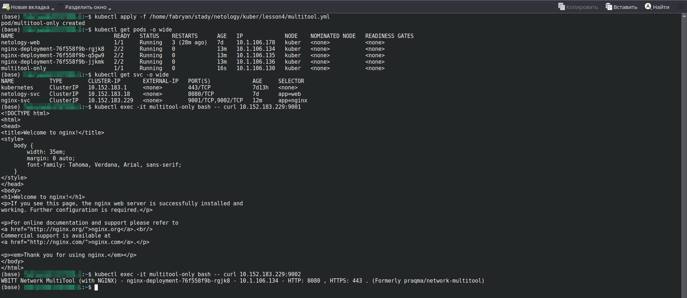
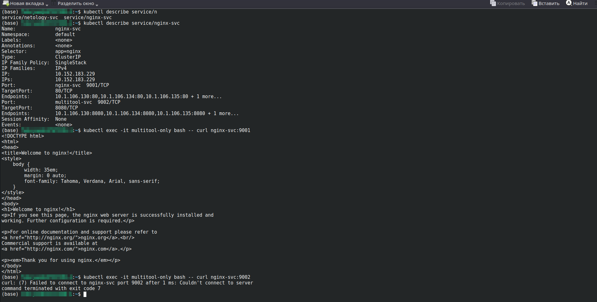
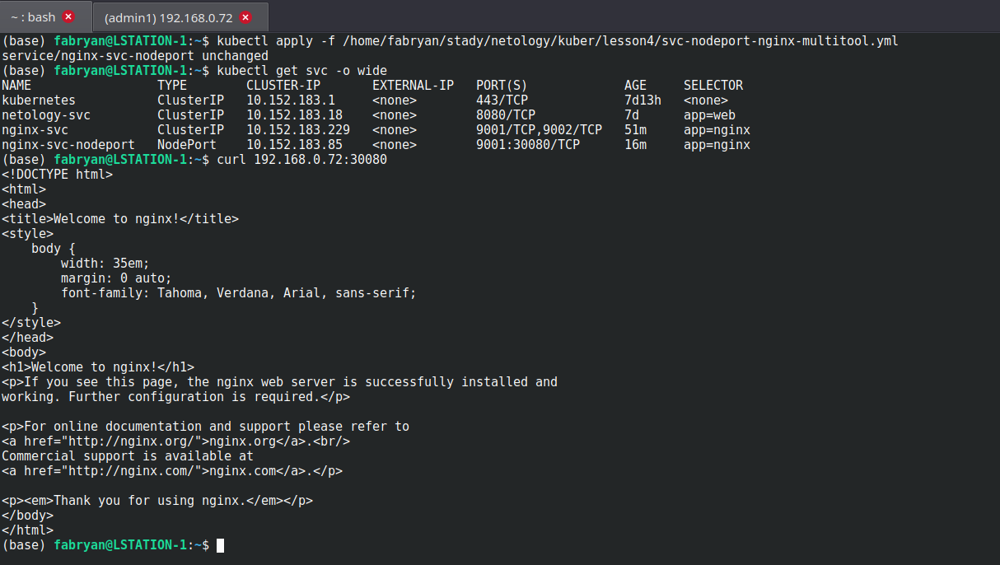

# Сетевое взаимодействие в K8S. Часть 1

### Основная часть

#### Задание 1. Создать Deployment и обеспечить доступ к контейнерам приложения по разным портам из другого Pod внутри кластера

1. Создать Deployment приложения, состоящего из двух контейнеров (nginx и multitool), с количеством реплик 3 шт.

```
apiVersion: apps/v1
kind: Deployment
metadata:
  name: nginx-deployment
  labels:
    app: nginx
spec:
  replicas: 3
  selector:
    matchLabels:
      app: nginx
  template:
    metadata:
      labels:
        app: nginx
    spec:
      containers:
      - name: nginx
        image: nginx:1.14.2
        ports:
        - containerPort: 80
      - name: multitool
        image: wbitt/network-multitool
        ports:
        - containerPort: 8080 
        env:  
        - name: HTTP_PORT
          value: "8080"
```
2. Создать Service, который обеспечит доступ внутри кластера до контейнеров приложения из п.1 по порту 9001 — nginx 80, по 9002 — multitool 8080.

```
apiVersion: v1
kind: Service
metadata:
  name: nginx-svc
spec:
  selector:
    app: nginx
  ports:
    - name: nginx-svc
      protocol: TCP
      port: 9001
      targetPort: 80
    - name: multitool-svc
      protocol: TCP
      port: 9002
      targetPort: 8080
```
<p align="center">
  
</p>
</br>

3. Создать отдельный Pod с приложением multitool и убедиться с помощью curl, что из пода есть доступ до приложения из п.1 по разным портам в разные контейнеры.

<p align="center">
  
</p>
</br>


4. Продемонстрировать доступ с помощью curl по доменному имени сервиса.

<p align="center">
  
</p>


#### Задание 2. Создать Service и обеспечить доступ к приложениям снаружи кластера

1. Создать отдельный Service приложения из Задания 1 с возможностью доступа снаружи кластера к nginx, используя тип NodePort.

```
apiVersion: v1
kind: Service
metadata:
  name: nginx-svc-nodeport
spec:
  selector:
    app: nginx
  ports:
    - name: nginx-svc-nodeport
      protocol: TCP
      port: 9001
      nodePort: 30080
      targetPort: 80
  type: NodePort
```

2. Продемонстрировать доступ с помощью браузера или curl с локального компьютера.
<p align="center">
  
</p>

### Весь код можно посмотреть по ссылке
https://github.com/so121183gak/devops-netology/tree/main/kuber/lesson4/src