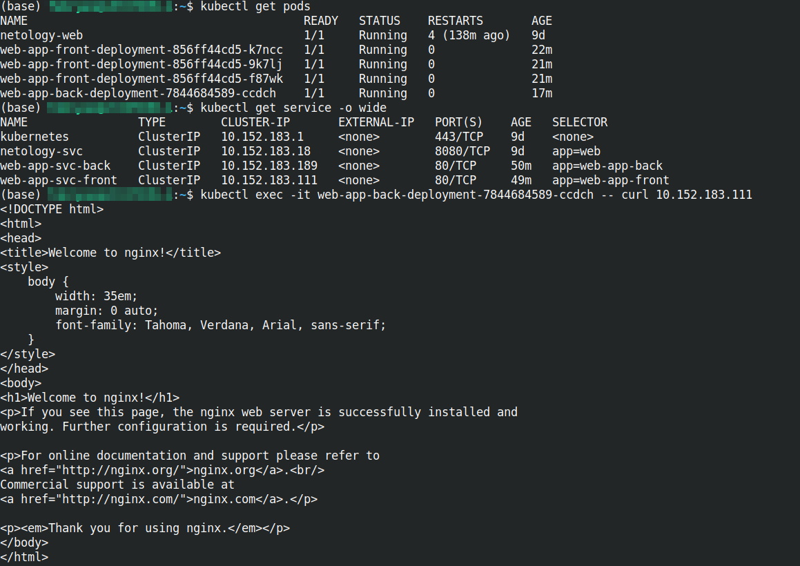
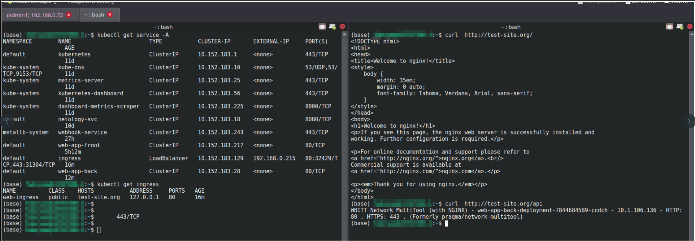

# Сетевое взаимодействие в K8S. Часть 2

### Основная часть

#### Задание 1. Создать Deployment и обеспечить доступ к контейнерам приложения по разным портам из другого Pod внутри кластера

1. Создать Deployment приложения frontend из образа nginx с количеством реплик 3 шт.

```
apiVersion: apps/v1
kind: Deployment
metadata:
  name: web-app-front-deployment
spec:
  replicas: 3
  selector:
    matchLabels:
      app: web-app-front
  template:
    metadata:
      labels:
        app: web-app-front
    spec:
      containers:
      - name: front-nginx
        image: nginx:1.14.2
        ports:
        - containerPort: 80
          name: front-port
```
2. Создать Deployment приложения backend из образа multitool.

```
apiVersion: apps/v1
kind: Deployment
metadata:
  name: web-app-back-deployment
spec:
  replicas: 1
  selector:
    matchLabels:
      app: web-app-back
  template:
    metadata:
      labels:
        app: web-app-back
    spec:
      containers:
      - name: back-multitool
        image: wbitt/network-multitool
        ports:
        - containerPort: 80
          name: back-port
```
3. Добавить Service, которые обеспечат доступ к обоим приложениям внутри кластера.

```
apiVersion: v1
kind: Service
metadata:
  name: web-app-front
spec:
  selector:
    app: web-app-front
  ports:
    - name: front-svc
      protocol: TCP
      port: 80
      targetPort: front-port

```
```
apiVersion: v1
kind: Service
metadata:
  name: web-app-back
spec:
  selector:
    app: web-app-back
  ports:
    - name: back-svc
      protocol: TCP
      port: 80
      targetPort: back-port
```


4. Продемонстрировать, что приложения видят друг друга с помощью Service.

<p align="center">
  
</p>


#### Задание 2. Создать Ingress и обеспечить доступ к приложениям снаружи кластера

1. Включить Ingress-controller в MicroK8S.
- Включаем **Ingress-controller**
```
microk8s enable ingress
```

- Что бы **Ingress-controller** отрабатывал MicroK8S необходимо задейстовать Metallb балансировщик нагрузки и запустить его дополнительный сервис, который бы выводил трафик на Ingress.
```
microk8s enable metallb:192.168.0.215-192.168.0.220
```
- Так же на ПК с которого идет проверка необходимо сделать редирект в файле localhost
```
test-site.org  127.0.0.1
```

```
apiVersion: networking.k8s.io/v1
kind: Ingress
metadata:
  name: web-ingress
  annotations:
    kubernetes.io/ingress.class: public
    nginx.ingress.kubernetes.io/rewrite-target: /
spec:
  ingressClassName: "public"
  rules:
    - host: test-site.org
      http:
        paths:
        - path: /
          pathType: Prefix
          backend:
            service:
              name: web-app-front
              port:
                name: front-svc
        - path: /api
          pathType: Prefix
          backend:
            service:
              name: web-app-back
              port:
                name: back-svc

---
apiVersion: v1
kind: Service
metadata:
  name: ingress
spec:
  selector:
    name: nginx-ingress-microk8s
  type: LoadBalancer
  loadBalancerIP: 192.168.0.215
  ports:
    - name: http
      protocol: TCP
      port: 80
      targetPort: 80
    - name: https
      protocol: TCP
      port: 443
      targetPort: 443

```

2. Продемонстрировать доступ с помощью браузера или curl с локального компьютера.
<p align="center">
  
</p>

### Весь код можно посмотреть по ссылке
https://github.com/so121183gak/devops-netology/tree/main/kuber/lesson5/src