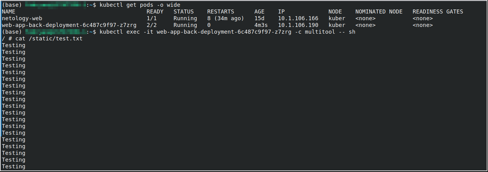
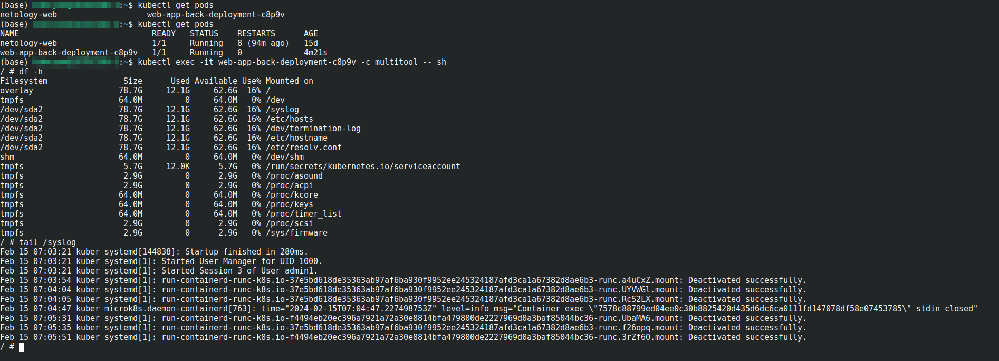

# Хранение в K8s. Часть 1

### Основная часть

#### Задание 1 Создать Deployment приложения, состоящего из двух контейнеров и обменивающихся данными.

1. Создать Deployment приложения, состоящего из контейнеров busybox и multitool.
2. Сделать так, чтобы busybox писал каждые пять секунд в некий файл в общей директории.
3. Обеспечить возможность чтения файла контейнером multitool.

```
apiVersion: apps/v1
kind: Deployment
metadata:
  name: web-app-back-deployment
  labels:
    app: web-app-back
spec:
  replicas: 1
  selector:
    matchLabels:
      app: web-app-back
  template:
    metadata:
      labels:
        app: web-app-back
    spec:
      containers:
      - name: busybox
        image: busybox
        command: ['sh', '-c', 'while true; do echo "Testing" >> /static/test.txt; sleep 5; done']
        volumeMounts:
        - name: static
          mountPath: /static
      - name: multitool
        image: wbitt/network-multitool
        volumeMounts:
        - name: static
          mountPath: /static
      volumes:
      - name: static
        emptyDir: {}
```


4. Продемонстрировать, что multitool может читать файл, который периодоически обновляется.

<p align="center">
  
</p>


#### Задание 2 Создать DaemonSet приложения, которое может прочитать логи ноды.

1. Создать DaemonSet приложения, состоящего из multitool.
2. Обеспечить возможность чтения файла /var/log/syslog кластера MicroK8S.

```
apiVersion: apps/v1
kind: DaemonSet
metadata:
  name: web-app-back-deployment
  labels:
    app: web-app-back
spec:
  selector:
    matchLabels:
      app: web-app-back
  template:
    metadata:
      labels:
        app: web-app-back
    spec:
      containers:
      - name: multitool
        image: wbitt/network-multitool
        volumeMounts:
        - name: syslog
          mountPath: /syslog
      volumes:
      - name: syslog
        hostPath:
          path: /var/log/syslog

```
3. Продемонстрировать возможность чтения файла изнутри пода.
<p align="center">
  
</p>

### Весь код можно посмотреть по ссылке
https://github.com/so121183gak/devops-netology/tree/main/kuber/lesson6/src