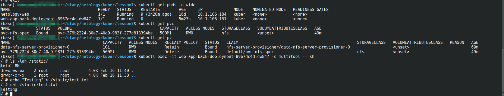

# Хранение в K8s. Часть 2

### Основная часть

#### Задание 1 Создать Deployment приложения, использующего локальный PV, созданный вручную.

1. Создать Deployment приложения, состоящего из контейнеров busybox и multitool.
```
apiVersion: apps/v1
kind: Deployment
metadata:
  name: web-app-back-deployment
  labels:
    app: web-app-back
spec:
  replicas: 1
  selector:
    matchLabels:
      app: web-app-back
  template:
    metadata:
      labels:
        app: web-app-back
    spec:
      containers:
      - name: busybox
        image: busybox
        command: ['sh', '-c', 'while true; do echo "Testing" >> /static/test.txt; sleep 5; done']
        volumeMounts:
        - name: static
          mountPath: /static
      - name: multitool
        image: wbitt/network-multitool
        volumeMounts:
        - name: static
          mountPath: /static
      volumes:
      - name: static
        persistentVolumeClaim:
          claimName: pvc-spec-local

```
2. Создать PV и PVC для подключения папки на локальной ноде, которая будет использована в поде.
```
apiVersion: v1
kind: PersistentVolumeClaim
metadata:
  name: pvc-spec-local
spec:
  storageClassName: local-storage
  volumeMode: Filesystem
  accessModes:
  - ReadWriteOnce
  resources:
    requests:
      storage: 200Mi
```
```
apiVersion: v1
kind: PersistentVolume
metadata:
  name: pv-vol-local
spec:
  capacity:
    storage: 1Gi
  volumeMode: Filesystem
  accessModes:
  - ReadWriteOnce
  persistentVolumeReclaimPolicy: Retain
  storageClassName: local-storage
  local:
    path: /mnt/local-storage
  nodeAffinity:
    required:
      nodeSelectorTerms:
      - matchExpressions:
        - key: kubernetes.io/hostname
          operator: In
          values:
          - kuber
```
3. Продемонстрировать, что multitool может читать файл, в который busybox пишет каждые пять секунд в общей директории.


4. Удалить Deployment и PVC. Продемонстрировать, что после этого произошло с PV. Пояснить, почему.
<p align="center">
  
</p>

- PV перешел из статуса **Bound** в статус **Released** так как не использует ни одним из PVC.

4. Продемонстрировать, что файл сохранился на локальном диске ноды. Удалить PV. Продемонстрировать что произошло с файлом после удаления PV. Пояснить, почему.

<p align="center">
  
</p>

<p align="center">
  
</p>

<p align="center">
  
</p>

- Данные сохранились на диске ноды так как была выставлена соответствующая политика **persistentVolumeReclaimPolicy: Retain**.


#### Задание 2 Создать Deployment приложения, которое может хранить файлы на NFS с динамическим созданием PV.

1. Включить и настроить NFS-сервер на MicroK8S.
- Что бы включить NFS для MicroK8S необходимо сначала включить расширения сообщества
```
sudo microk8s enable e nfs
```
- Далее включаем сам NFS
```
sudo microk8s enable nfs
```
2. Создать Deployment приложения состоящего из multitool, и подключить к нему PV, созданный автоматически на сервере NFS.

```
apiVersion: apps/v1
kind: Deployment
metadata:
  name: web-app-back-deployment
  labels:
    app: web-app-back
spec:
  replicas: 1
  selector:
    matchLabels:
      app: web-app-back
  template:
    metadata:
      labels:
        app: web-app-back
    spec:
      containers:
      - name: multitool
        image: wbitt/network-multitool
        volumeMounts:
        - name: static
          mountPath: /static
      volumes:
      - name: static
        persistentVolumeClaim:
          claimName: pvc-nfs-spec
```
* В случае с MicroK8S у вас могут быть проблемы когда вы запускайте деплоймент, потому как расширение **nfs** использует пакет **nfs-common** который надо установить на ноде
```
sudo apt-get install -y nfs-common
```

2. Продемонстрировать возможность чтения и записи файла изнутри пода.

<p align="center">
  
</p>

### Весь код можно посмотреть по ссылке
https://github.com/so121183gak/devops-netology/tree/main/kuber/lesson7/src