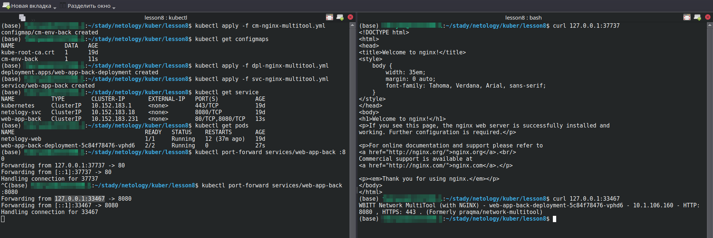
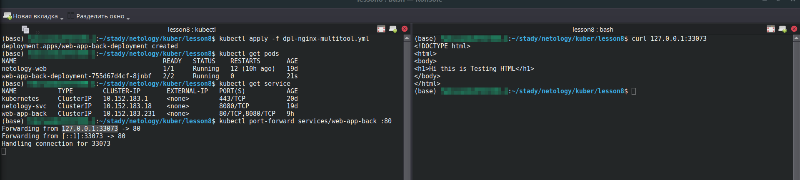
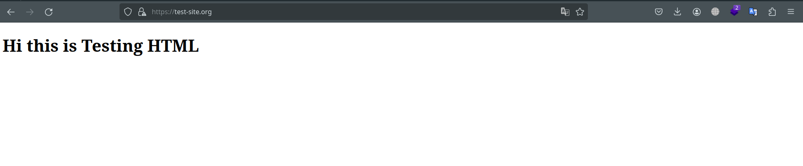

# Конфигурация приложений

### Основная часть

#### Задание 1 Создать Deployment приложения и решить возникшую проблему с помощью ConfigMap. Добавить веб-страницу

1. Создать Deployment приложения, состоящего из контейнеров nginx и multitool.
2. Решить возникшую проблему с помощью ConfigMap.

```
apiVersion: apps/v1
kind: Deployment
metadata:
  name: web-app-back-deployment
  labels:
    app: web-app-back
spec:
  replicas: 1
  selector:
    matchLabels:
      app: web-app-back
  template:
    metadata:
      labels:
        app: web-app-back
    spec:
      containers:
      - name: nginx
        image: nginx:1.14.2
        ports:
        - containerPort: 80
      - name: multitool
        image: wbitt/network-multitool
        ports:
        - containerPort: 8080
        env:
        - name: HTTP_PORT
          valueFrom:
            configMapKeyRef:
              name: cm-env-back
              key: multitool-port
```
```
apiVersion: v1
kind: Service
metadata:
  name: web-app-back
spec:
  selector:
    app: web-app-back
  ports:
  - name: nginx-svc
    protocol: TCP
    port: 80
    targetPort: 80
  - name: multitool-svc
    protocol: TCP
    port: 8080
    targetPort: 8080
```

```
apiVersion: v1
kind: ConfigMap
metadata:
  name: cm-env-back
data:
  multitool-port: "8080"
```
3. Продемонстрировать, что pod стартовал и оба конейнера работают.
```
apiVersion: apps/v1
kind: Deployment
metadata:
  name: web-app-back-deployment
  labels:
    app: web-app-back
spec:
  replicas: 1
  selector:
    matchLabels:
      app: web-app-back
  template:
    metadata:
      labels:
        app: web-app-back
    spec:
      containers:
      - name: nginx
        image: nginx:1.14.2
        ports:
        - containerPort: 80
        volumeMounts:
        - name: cm-file-front-vol
          mountPath: /usr/share/nginx/html
      - name: multitool
        image: wbitt/network-multitool
        ports:
        - containerPort: 8080
        env:
        - name: HTTP_PORT
          valueFrom:
            configMapKeyRef:
              name: cm-env-back
              key: multitool-port
      volumes:
      - name: cm-file-front-vol
        configMap:
          name: cm-file-front
```
<p align="center">
  
</p>

4. Сделать простую веб-страницу и подключить её к Nginx с помощью ConfigMap. Подключить Service и показать вывод curl или в браузере.
<p align="center">
  
</p>

#### Задание 2 Создать приложение с вашей веб-страницей, доступной по HTTPS

1. Создать Deployment приложения, состоящего из Nginx.
2. Создать собственную веб-страницу и подключить её как ConfigMap к приложению.
```
apiVersion: apps/v1
kind: Deployment
metadata:
  name: web-app-back-deployment
  labels:
    app: web-app-back
spec:
  replicas: 1
  selector:
    matchLabels:
      app: web-app-back
  template:
    metadata:
      labels:
        app: web-app-back
    spec:
      containers:
      - name: nginx
        image: nginx:1.14.2
        ports:
        - containerPort: 80
        volumeMounts:
        - name: cm-file-front-vol
          mountPath: /usr/share/nginx/html
      volumes:
      - name: cm-file-front-vol
        configMap:
          name: cm-file-front
```
```
apiVersion: v1
kind: Service
metadata:
  name: web-app-back
spec:
  selector:
    app: web-app-back
  ports:
  - name: nginx-svc
    protocol: TCP
    port: 80
    targetPort: 80
```
```
apiVersion: v1
kind: ConfigMap
metadata:
  name: cm-file-front
data:
  index.html: |
    <!DOCTYPE html>
    <html>
    <body>
    <h1>Hi this is Testing HTML</h1>
    </body>
    </html>
```
3. Выпустить самоподписной сертификат SSL. Создать Secret для использования сертификата.

```
openssl req -x509 -newkey rsa:2048 -keyout ./key.pem -out ./cert.pem -sha256 -days 3650 -nodes -subj "/C=RU/ST=StateName/L=Moscow/O=RogaKopyta/OU=CompanySectionName/CN=localhost"
```
- Конвертируем сертификат в base64 для использования внутри секрета
```
cat ./key.pem | base64 -w 0
cat ./cert.pem | base64 -w 0
```
```
apiVersion: v1
kind: Secret
metadata:
  name: site-cert-tls
data:
  tls.crt: <base64>
  tls.key: <base64>
type: kubernetes.io/tls
```

4. Создать Ingress и необходимый Service, подключить к нему SSL в вид. Продемонстировать доступ к приложению по HTTPS.

```
apiVersion: networking.k8s.io/v1
kind: Ingress
metadata:
  name: web-ingress
  annotations:
    kubernetes.io/ingress.class: public
    nginx.ingress.kubernetes.io/rewrite-target: /
spec:
  ingressClassName: "public"
  tls:
  - hosts:
    - test-site.org
    secretName: site-cert-tls
  rules:
  - host: test-site.org
    http:
      paths:
      - path: /
        pathType: Prefix
        backend:
          service:
            name: web-app-back
            port:
              number: 80

---
apiVersion: v1
kind: Service
metadata:
  name: ingress
  # namespace: ingress
spec:
  selector:
    name: nginx-ingress-microk8s
  type: LoadBalancer
  loadBalancerIP: 192.168.0.215
  ports:
  - name: http
    protocol: TCP
    port: 80
    targetPort: 80
  - name: https
    protocol: TCP
    port: 443
    targetPort: 443

```
- Что бы **Ingress-controller** отрабатывал MicroK8S необходимо задействовать Metallb балансировщик нагрузки и запустить его дополнительный сервис, который бы выводил трафик на Ingress.
```
microk8s enable metallb:192.168.0.215-192.168.0.220
```
- Так же на ПК с которого идет проверка необходимо сделать редирект в файле localhost
```
test-site.org  127.0.0.1
```
<p align="center">
  
</p>

### Весь код можно посмотреть по ссылке
https://github.com/so121183gak/devops-netology/tree/main/kuber/lesson8/src