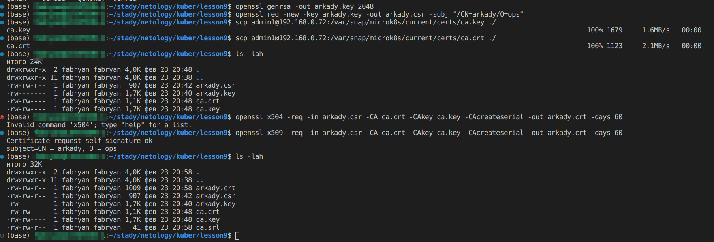
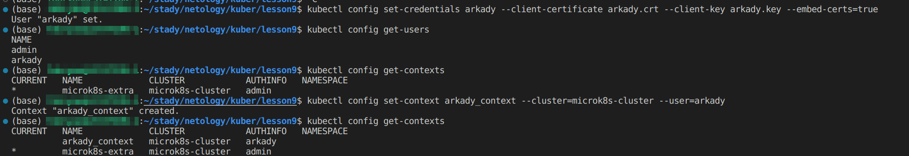
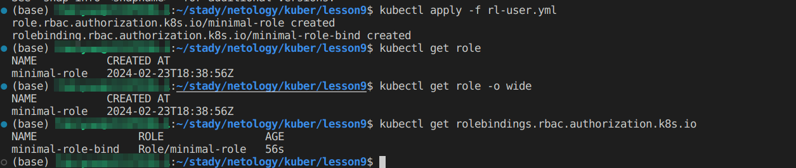
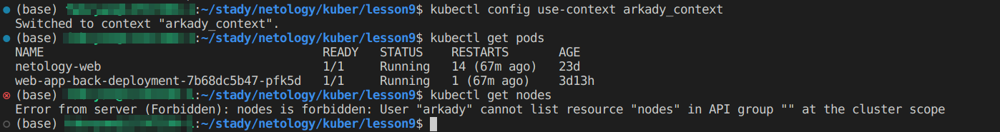

# Конфигурация приложений

### Основная часть

#### Задание 1 Создайте конфигурацию для подключения пользователя

1. Создайте и подпишите SSL-сертификат для подключения к кластеру.

- Генерируем key и csr пользователя
```
openssl genrsa -out arkady.key 2048
openssl req -new -key arkady.key -out arkady.csr -subj "/CN=arkady/O=ops"

```
- Скачиваем ca.key и ca.crt кластера
```
scp admin1@192.168.0.72:/var/snap/microk8s/current/certs/ca.key ./
scp admin1@192.168.0.72:/var/snap/microk8s/current/certs/ca.crt ./
```

- Создаем crt пользователя используя ранее скаченные ca.key и ca.crt кластера
```
openssl x509 -req -in arkady.csr -CA ca.crt -CAkey ca.key -CAcreateserial -out arkady.crt -days 60
```

<p align="center">
  
</p>

2. Настройте конфигурационный файл kubectl для подключения.

- Добавляем нового пользователя
```
kubectl config set-credentials arkady --client-certificate arkady.crt --client-key arkady.key --embed-certs=true
```
- Добавляем контекст для нового пользователя
```
kubectl config set-context arkady_context --cluster=microk8s-cluster --user=arkady
```

<p align="center">
  
</p>

3. Создайте роли и все необходимые настройки для пользователя.

```
apiVersion: rbac.authorization.k8s.io/v1
kind: Role
metadata:
  name: minimal-role
rules:
- apiGroups: [""]
  resources: ["pods", "pods/log"]
  verbs: ["get", "list", "watch"]

---

apiVersion: rbac.authorization.k8s.io/v1
kind: RoleBinding
metadata:
  name: minimal-role-bind
subjects:
- kind: User
  name: arkady
  apiGroup: rbac.authorization.k8s.io
roleRef:
  kind: Role
  name: minimal-role
  apiGroup: rbac.authorization.k8s.io
```

<p align="center">
  
</p>

5. Предусмотрите права пользователя. Пользователь может просматривать логи подов и их конфигурацию (kubectl logs pod <pod_id>, kubectl describe pod <pod_id>).

<p align="center">
  
</p>


### Весь код можно посмотреть по ссылке
https://github.com/so121183gak/devops-netology/tree/main/kuber/lesson9/src