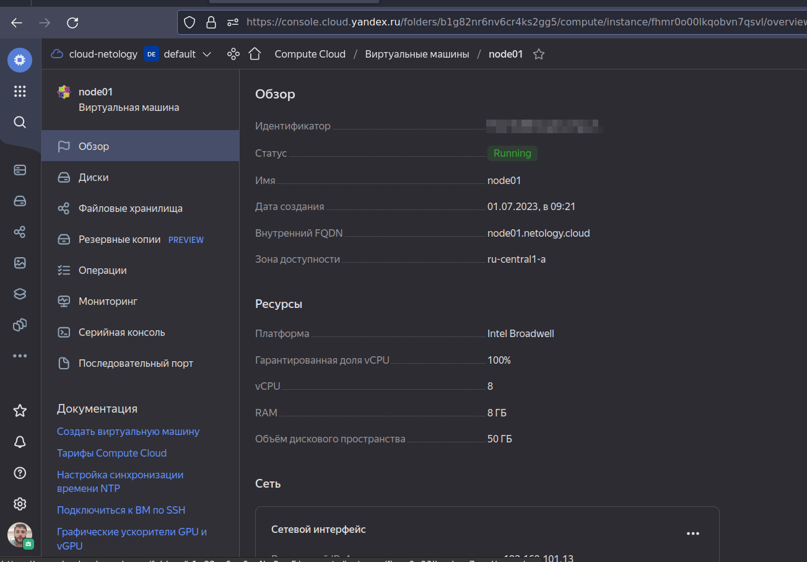
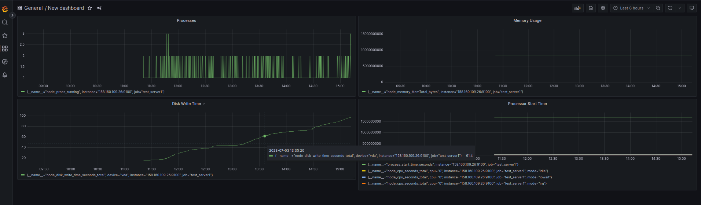

# Оркестрация группой Docker-контейнеров на примере Docker Compose

### 1. Задача
- Скриншот страницы с образом
<p align="center">
  
</p>

### 2. Задача
- 2.1. Страница свойств виртуальной машины
<p align="center">
  
</p>

- 2.2. Вывод команды terraform apply
```
terraform apply

Terraform used the selected providers to generate the following execution plan. Resource actions are indicated with the following symbols:
  + create

Terraform will perform the following actions:

  # yandex_compute_instance.node01 will be created
  + resource "yandex_compute_instance" "node01" {
      + allow_stopping_for_update = true
      + created_at                = (known after apply)
      + folder_id                 = (known after apply)
      + fqdn                      = (known after apply)
      + gpu_cluster_id            = (known after apply)
      + hostname                  = "node01.netology.cloud"
      + id                        = (known after apply)
      + metadata                  = {
          + "ssh-keys" = <<-EOT
                centos:ssh-rsa AAAAB3NzaC1yc2EAAAADAQABAAABgQC0C5w9qevshVVzFaROYQcR7pxlh1be2Y4zdKOhxkrHmmbX2tiIyzbawvBITh6oU6r9hL9aeJDK42GItBOnFxsOzFoQrFeQkOKCrYo2ZiJj/++1fQZrrZM/y1Vp7XjWHHvP6y34uMrjNw4klKH8khK9MbQW6y/wq//QJT41s+UK0IAb/nUtHHJ6Hp9sv2NU8DhpVFZnd5yEfrVLBt6HpGUljBA12TvHuSnLDReJOZs8l8GYc1glzP7tSeVrXV7YZfrpI3p/PcNE+Dc1AL+TkXefHb31/kf3E+5IDiBmNUQrsrBL21iaODFd71bThp/EujrFzJQJiDh4/6I+VUJxP+NKoy+IoM3JYzun+FMvl2vcZKcAkV3lyPRf/ElGBDijKfNLJWGWT01BB0hvAW3LoNwOd7Ls/o65wV6JKLeOGR+D4GqS1M2GelmjCbH4AEqdYg15Cr1tGfhdUL2PGAeJUFYbrPfDc0s4mmtSMJ2E+VhOPg7YO9WHQp1/K3zSYjmjqxU= fabryan@LSTATION-1
            EOT
        }
      + name                      = "node01"
      + network_acceleration_type = "standard"
      + platform_id               = "standard-v1"
      + service_account_id        = (known after apply)
      + status                    = (known after apply)
      + zone                      = "ru-central1-a"

      + boot_disk {
          + auto_delete = true
          + device_name = (known after apply)
          + disk_id     = (known after apply)
          + mode        = (known after apply)

          + initialize_params {
              + block_size  = (known after apply)
              + description = (known after apply)
              + image_id    = "fd88mb93h336tjtdub66"
              + name        = "root-node01"
              + size        = 50
              + snapshot_id = (known after apply)
              + type        = "network-nvme"
            }
        }

      + network_interface {
          + index              = (known after apply)
          + ip_address         = (known after apply)
          + ipv4               = true
          + ipv6               = (known after apply)
          + ipv6_address       = (known after apply)
          + mac_address        = (known after apply)
          + nat                = true
          + nat_ip_address     = (known after apply)
          + nat_ip_version     = (known after apply)
          + security_group_ids = (known after apply)
          + subnet_id          = "e9b6rp1ld750obla2q8j"
        }

      + resources {
          + core_fraction = 100
          + cores         = 8
          + memory        = 8
        }
    }

Plan: 1 to add, 0 to change, 0 to destroy.

Changes to Outputs:
  + external_ip_address_node01_yandex_cloud = (known after apply)
  + internal_ip_address_node01_yandex_cloud = (known after apply)

Do you want to perform these actions?
  Terraform will perform the actions described above.
  Only 'yes' will be accepted to approve.

  Enter a value: yes

yandex_compute_instance.node01: Creating...
yandex_compute_instance.node01: Still creating... [10s elapsed]
yandex_compute_instance.node01: Still creating... [20s elapsed]
yandex_compute_instance.node01: Still creating... [30s elapsed]
yandex_compute_instance.node01: Still creating... [40s elapsed]
yandex_compute_instance.node01: Still creating... [50s elapsed]
yandex_compute_instance.node01: Still creating... [1m0s elapsed]
yandex_compute_instance.node01: Creation complete after 1m2s [id=fhmr0o00lkqobvn7qsvl]

Apply complete! Resources: 1 added, 0 changed, 0 destroyed.

Outputs:

external_ip_address_node01_yandex_cloud = "158.160.37.19"
internal_ip_address_node01_yandex_cloud = "192.168.101.13"
```

Страница свойств ВМ
<p align="center">
  
</p>


### 3. Задача
- Вывод команды docker ps
```
[root@centos-ansible ~]# docker ps
CONTAINER ID   IMAGE                              COMMAND                  CREATED          STATUS                    PORTS                                                                              NAMES
2d94c51d151d   prom/pushgateway:v1.2.0            "/bin/pushgateway"       30 minutes ago   Up 30 minutes             9091/tcp                                                                           pushgateway
8393d0748581   prom/node-exporter:v0.18.1         "/bin/node_exporter …"   30 minutes ago   Up 30 minutes             9100/tcp                                                                           nodeexporter
7bb5602759a1   stefanprodan/caddy                 "/sbin/tini -- caddy…"   30 minutes ago   Up 30 minutes             0.0.0.0:3000->3000/tcp, 0.0.0.0:9090-9091->9090-9091/tcp, 0.0.0.0:9093->9093/tcp   caddy
b15cca0a7d57   prom/prometheus:v2.17.1            "/bin/prometheus --c…"   30 minutes ago   Up 30 minutes             9090/tcp                                                                           prometheus
e60b4ef095a2   prom/alertmanager:v0.20.0          "/bin/alertmanager -…"   30 minutes ago   Up 30 minutes             9093/tcp                                                                           alertmanager
406f77e19214   grafana/grafana:7.4.2              "/run.sh"                30 minutes ago   Up 30 minutes             3000/tcp                                                                           grafana
e9632e837d17   gcr.io/cadvisor/cadvisor:v0.47.0   "/usr/bin/cadvisor -…"   30 minutes ago   Up 30 minutes (healthy)   8080/tcp 
```

### 4. Задача
- Cкриншот работающего веб-интерфейса Grafana
<p align="center">
  
</p>

### 5. Задача
- Cкриншот из Grafana добавленного сервера
<p align="center">
  
</p>


