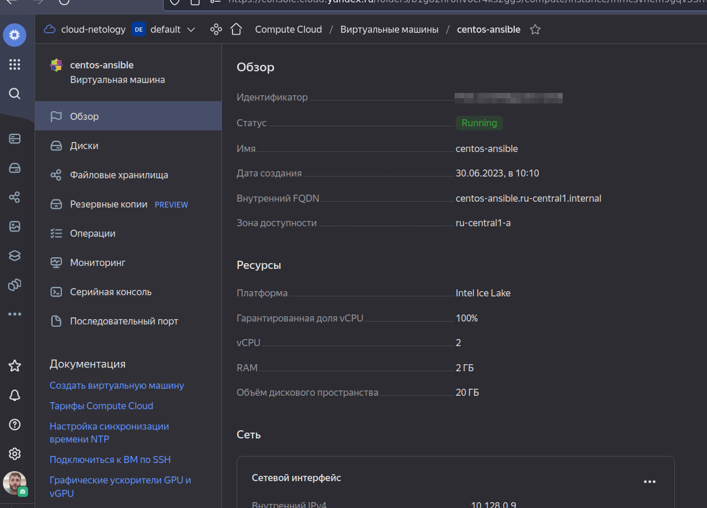
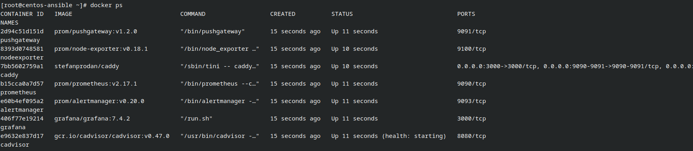
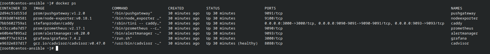

# Введение в виртуализацию

### 1. Задача
- Скриншот страницы с образом

  

### 2. Задача
- Страница свойств виртуальной машины

  

### 3. Задача
- Вывод команды docker ps

  

### 4. Задача
- Ссылка на репозиторий с образом Ansible
https://hub.docker.com/repository/docker/so121183gak/ansible/general

