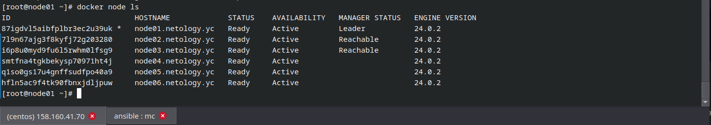
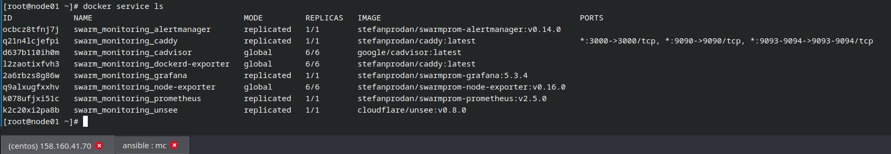
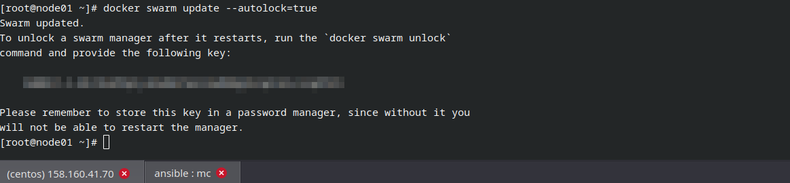

# Оркестрация кластером Docker контейнеров на примере Docker Swarm

### 1. Задача
- В чём отличие режимов работы сервисов в Docker Swarm-кластере: **replication** и **global**?
1. В режиме **replication** сервис запускается с определенным количеством реплик (которое можно указать при создании сервиса), на разных узлах кластера (на доступных узлах).
2. В режиме **global** каждый узел в кластере запускает только одну реплику сервиса. Все доступные узлы в кластере будут иметь одну и ту же реплику сервиса.
- Какой алгоритм выбора лидера используется в Docker Swarm-кластере?
В Docker Swarm кластере используется алгоритм поддержания распределенного консенсуса — Raft. Лидера выбирается голосованием, если manager ноды не слышат лидера, они переходят в статус кандидата, далее отправляет остальным нодам запрос на голосование, большинством голосов, выбирается лидер.
- Что такое Overlay Network?
Overlay Network обеспечивает связность и обмен данными между контейнерами и хостами в разных узлах (нодах) кластера, даже если они находятся в разных подсетях или физических сетях. Оно позволяет контейнерам общаться друг с другом, как будто они находятся в одной локальной сети.

### 2. Задача
- Создайте ваш первый Docker Swarm-кластер в Яндекс Облаке.

  

### 3. Задача
- Создайте ваш первый, готовый к боевой эксплуатации кластер мониторинга, состоящий из стека микросервисов.

  

### 4. Задача
- Выполните на лидере Docker Swarm-кластера команду **docker swarm update --autolock=true**
Данная команда включением функции автоматической блокировки кластера. Данный функционал обеспечивает защиту кластера от несанкционированного доступа и блокирует его при изменении его состояния и настроек, кроме ситуации когда добавляется новый узел.
Когда **docker** перезапускает ключ **TLS**, используемый для шифрования связи между узлами и ключ используемый для шифрования и расшифровки данных конфигурации которые загружаются в память каждого узла, **docker** может защитить оба ключа, зашифровав эти ключи, требующие ручной разблокировки менеджеров, предоставляющих ключ разблокировки. Когда автоблокировка включена, **docker** требует сначала разблокировать рой, используя ключ шифрования, (который ранее был сгенерирован данной командой) когда кластер был заблокирован.

  

