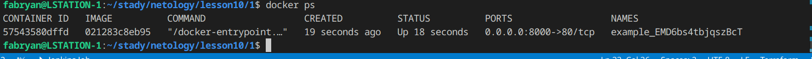

# Оркестрация кластером Docker контейнеров на примере Docker Swarm

### 1. Задача
#### 1.1. Найдите в State-файле секретное содержимое созданного ресурса **random_password**, пришлите в качестве ответа конкретный ключ и его значение.
- Ответ: **"result": "nKgU6O9ET3w0BGnk"** 
#### 1.2. Объясните в чем заключаются намеренно допущенные ошибки? Исправьте их.
- Ответ: в **terraform** имя внутри конфигурации должно начинаться с буквы или символа подчеркивания в данном случае имя **1nginx** не верно, исправил на **nginx1**.
- Ответ: в блоке **resource** необходимо указывать два аргумента имя и значение, в данном коде было пропущено имя, я исправил этот пробел добавив имя **nginx**.
- Ответ **random_string_FAKE** не был объявлен в корневом модуле, я думаю такая запись не допускается синтаксисом, исправил на **random_string**.Так же как и запись **resulT** переделал на **result**
#### 1.3. Выполните код. В качестве ответа приложите вывод команды docker ps
<p align="center">
  
</p>
#### 1.4. Замените имя docker-контейнера в блоке кода на hello_world, выполните команду terraform apply -auto-approve.
Опасность заключается в том что идет не контролируемое действие, в данном конкретном случае мы удалили контейнер nginx1 так как забыли не сменили его название в скрипте, к тому же контейнер c названием **hello_world** отсутствует на docker hub и при его закачке мы получаем ошибку:
```
 Error: Unable to read Docker image into resource: unable to pull image hello_world: error pulling image hello_world: Error response from daemon: pull access denied for hello_world, repository does not exist or may require 'docker login': denied: requested access to the resource is denied
```<br><br>

Правильное название контейнера **hello-world**, если мы полностью хотим переделать запуск **nginx** на **hello-world** то тогда нам следует изменить наш код:


