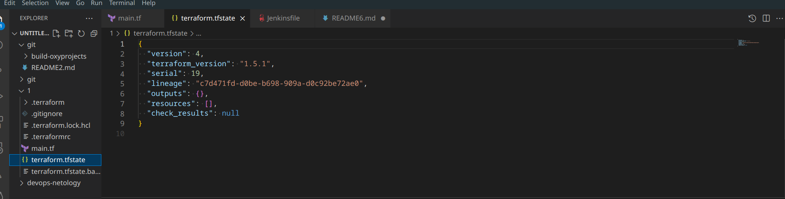

# Введение в Terraform

### 1. Задача
#### 1.1. Найдите в State-файле секретное содержимое созданного ресурса **random_password**, пришлите в качестве ответа конкретный ключ и его значение.
- Ответ: **"result": "EMD6bs4tbjqszBcT"** 
#### 1.2. Объясните в чем заключаются намеренно допущенные ошибки? Исправьте их.
- Ответ: в **terraform** имя внутри конфигурации должно начинаться с буквы или символа подчеркивания в данном случае имя **1nginx** не верно, исправил на **nginx1**.
- Ответ: в блоке **resource** необходимо указывать два аргумента имя и значение, в данном коде было пропущено имя, я исправил этот пробел добавив имя **nginx**.
- Ответ **random_string_FAKE** не был объявлен в корневом модуле, я думаю такая запись не допускается синтаксисом, исправил на **random_string**.Так же как и запись **resulT** переделал на **result**
#### 1.3. Выполните код. В качестве ответа приложите вывод команды docker ps
<p align="center">
  
</p>

#### 1.4. Замените имя docker-контейнера в блоке кода на hello_world, выполните команду terraform apply -auto-approve.
Опасность заключается в том что идет не контролируемое действие, не смотря на то что мы сменили имя контейнеру, мы тем не менее формируем его имя другим образом **example_${random_password.random_string.result}**, это значит что у нас на сервере уже есть контейнер с таким именем и команда **terraform apply -auto-approve** приведет к ниже указанной ошибке:
```
 Error: Unable to create container: Error response from daemon: Conflict. The container name "/example_EMD6bs4tbjqszBcT" is already in use by container "c87a3587c7aa07f7cde85d82c538c82d45e40f7cee507c1ac3dada84513273d0". You have to remove (or rename) that container to be able to reuse that name.
```


#### 1.5. Уничтожьте созданные ресурсы с помощью terraform.
<p align="center">
  
</p>

#### 1.6. Объясните, почему при этом не был удален docker образ nginx:latest ? 

- Ответ: образ **nginx:latest** не был удален из за того что у нас в скрипте terraform стоит опция **keep_locally = true** при значении **true** образ docker не удаляется при вводе команды **terraform destroy**.