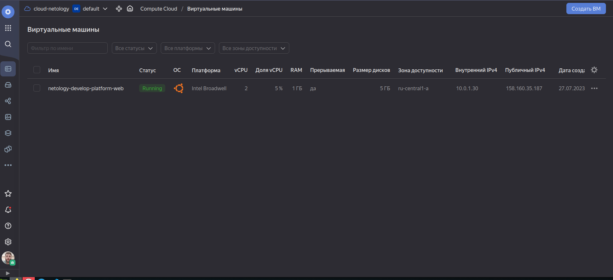
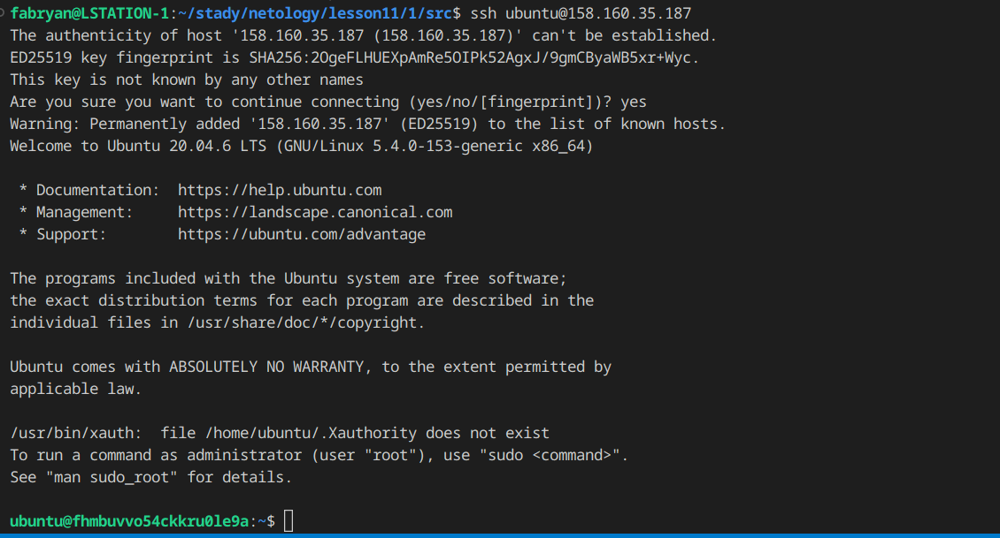
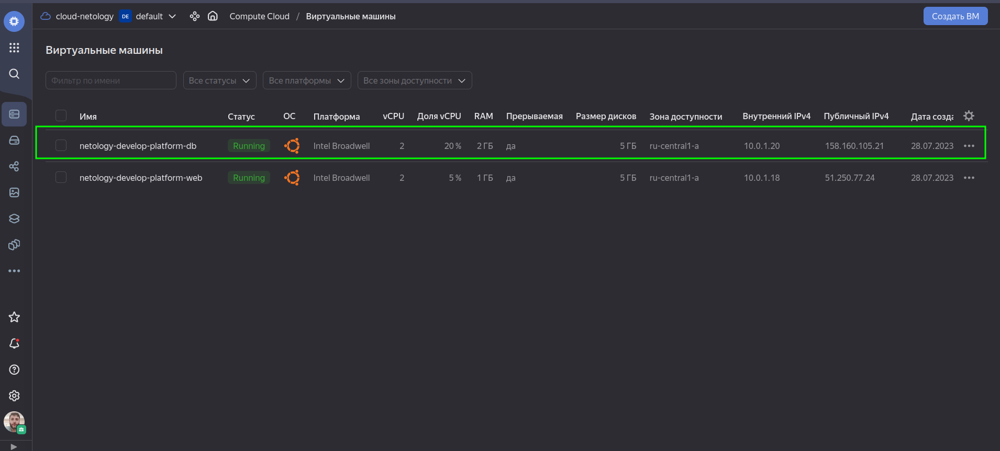
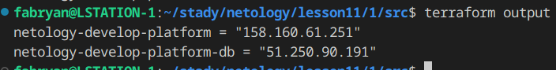

# Основы Terraform. Yandex Cloud

### Задание 0
- Запросите preview доступ к данному функционалу в ЛК Yandex Cloud.
<p align="center">
  
</p>

### Задание 1
- У Yandex Cloud нет платформы **standart-v4** в сетке доступных стандартных платформ есть платформы **standard-v1**, **standard-v2** и самая производительная из всех стандартных платформ **standard-v3**. Так как мне пока не надо использовать производительную платформу то я выберу **standard-v1**.
- В документации Yandex Cloud обозначены минимальные значения по использованию vCPU по этому я исправляю значение **cores = 1** на значение **cores = 2**
https://cloud.yandex.ru/docs/compute/concepts/performance-levels

- **preemptible = true** эта опция означает что виртуальная машина является вытесняемой/прерываемой такие ВМ могут быть остановлены в силу ряда причин, например у Yandex Cloud если с момента запуска прошло 24 часа, или если не хватает ресурсов для запуска обычной ВМ в той же зоне доступности. Такие ВМ доступны по более приемлемым ценам если сравнивать их с обычными.

- **core_fraction=5** Данная опция позволяет указать производительность процессора в процентах. Данная функция поможет тем что может ограничивать доступ к вычислительной мощности ядер как минимум на протяжении указанного процента от единицы времени, для не слишком тяжелых приложений, либо наоборот повысить доступ для требовательных приложений. Например если мы укажем 5% это значит что ВМ будет иметь доступ к физическим ядрам как минимум 5% времени, в течении каждой секунды.


- скриншот ЛК Yandex Cloud с созданной ВМ
<p align="center">
  
</p>

- скриншот успешного подключения к консоли ВМ через ssh
<p align="center">
  
</p>

### Задание 2
- Замените все хардкод-значения для ресурсов yandex_compute_image и yandex_compute_instance на отдельные переменные.
```
data "yandex_compute_image" "ubuntu" {
  family = var.vm_db_yandex_compute_image
}
resource "yandex_compute_instance" "platform" {
  name        = "${var.vm_yandex_compute_instance_global_name}-${var.vm_web_yandex_compute_instance_platform_name}"
  platform_id = var.vm_web_yandex_compute_instance[0]
  resources {
    cores         = var.vm_web_yandex_compute_instance[1]
    memory        = var.vm_web_yandex_compute_instance[2]
    core_fraction = var.vm_web_yandex_compute_instance[3]
  }
```
- Объявите нужные переменные в файле variables.tf, обязательно указывайте тип переменной. Заполните их default прежними значениями из main.tf

```
variable "vm_yandex_compute_instance_global_name" {
  type        = string
  default     = "netology-develop"
  description = "Global name"
}

variable "vm_web_yandex_compute_instance_platform_name" {
  type        = string
  default     = "platform-web"
  description = "Instance name"
}

variable "vm_web_yandex_compute_image" {
  type        = string
  default     = "ubuntu-2004-lts"
  description = "OS image"
}

variable "vm_web_yandex_compute_instance" {
  type        = tuple([string, number, number, number])
  default     = ["standard-v1", 2, 1, 5]
  description = "Instance envs"
}
```
### Задание 3
- Скопируйте блок ресурса и создайте с его помощью вторую ВМ в файле main.tf: "netology-develop-platform-db" , cores = 2, memory = 2, core_fraction = 20. Объявите её переменные с префиксом vm_db_ в том же файле ('vms_platform.tf').
<p align="center">
  
</p>


### Задание 4
- В качестве решения приложите вывод значений ip-адресов команды **terraform output**
<p align="center">
  
</p>

### Задание 5
- В файле locals.tf опишите в одном local-блоке имя каждой ВМ, используйте интерполяцию ${..} с несколькими переменными по примеру из лекции.
```
locals {
  web_platform_name = "${var.vm_yandex_compute_instance_global_name}-${var.vm_web_yandex_compute_instance_platform_name}"
  db_platform_name = "${var.vm_yandex_compute_instance_global_name}-${var.vm_db_yandex_compute_instance_platform_name}"  
}
```
- Замените переменные с именами ВМ из файла variables.tf на созданные вами local-переменные.

```
resource "yandex_compute_instance" "platform" {
  name        = local.web_platform_name
  platform_id = var.vm_web_yandex_compute_instance[0]
  resources {
    cores         = var.vm_web_yandex_compute_instance[1]
    memory        = var.vm_web_yandex_compute_instance[2]
    core_fraction = var.vm_web_yandex_compute_instance[3]
  }
```

```
resource "yandex_compute_instance" "db" {
  name        = local.db_platform_name
  platform_id = var.vm_db_yandex_compute_instance[0]
  resources {
    cores         = var.vm_db_yandex_compute_instance[1]
    memory        = var.vm_db_yandex_compute_instance[2]
    core_fraction = var.vm_db_yandex_compute_instance[3]
  }
```

### Задание 6
- Вместо использования трёх переменных ".._cores",".._memory",".._core_fraction" в блоке resources {...}, объедините их в переменные типа map с именами "vm_web_resources" и "vm_db_resources".

```
variable "vm_web_resources" {
type = map(number)
default = {
  cores = 2
  memory = 1
  core_fraction = 5
}
description = "Instance web envs"
}

variable "vm_db_resources" {
type = map(number)
default = {
  cores = 2
  memory = 2
  core_fraction = 20
}
description = "Instance db envs"
}
```
```
resource "yandex_compute_instance" "platform" {
  name        = local.web_platform_name
  platform_id = var.vm_yandex_compute_instance_standart

  resources {
    cores         = var.vm_web_resources["cores"]
    memory        = var.vm_web_resources["memory"]
    core_fraction = var.vm_web_resources["core_fraction"]
  }
```
```
resource "yandex_compute_instance" "db" {
  name        = local.db_platform_name
  platform_id = var.vm_yandex_compute_instance_standart

  resources {
    cores         = var.vm_db_resources["cores"]
    memory        = var.vm_db_resources["memory"]
    core_fraction = var.vm_db_resources["core_fraction"]
  }
```
-  В качестве продвинутой практики попробуйте создать одну map-переменную vms_resources и уже внутри неё конфиги обеих ВМ — вложенный map.

```
variable "vm_resources" {
type = map(map(number))
default = {
  web = {
    cores         = 2
    memory        = 1
    core_fraction = 5
  }
  db = {
    cores         = 2
    memory        = 2
    core_fraction = 20
  }
}
```
```
resource "yandex_compute_instance" "platform" {
  name        = local.web_platform_name
  platform_id = var.vm_yandex_compute_instance_standart
  resources {
    cores         = var.vm_resources["web"]["cores"]
    memory        = var.vm_resources["web"]["memory"]
    core_fraction = var.vm_resources["web"]["core_fraction"]
  }
```
```
resource "yandex_compute_instance" "db" {
  name        = local.db_platform_name
  platform_id = var.vm_yandex_compute_instance_standart
  resources {
    cores         = var.vm_resources["db"]["cores"]
    memory        = var.vm_resources["db"]["memory"]
    core_fraction = var.vm_resources["db"]["core_fraction"]
  }
```
- Также поступите с блоком metadata {serial-port-enable, ssh-keys}, эта переменная должна быть общая для всех ваших ВМ.

```
variable "vm_metadata" {
type = object({
  serial-port-enable = number
  ssh-keys           = string
})
default = {
    serial-port-enable  = 1
    ssh-keys            = null
}
description = "Instance envs"
}
```
```
metadata = merge(var.vm_metadata, local.vm_metadata_override)
```
### Весь код можно посмотреть по ссылке
https://github.com/so121183gak/devops-netology/tree/main/lesson8/src