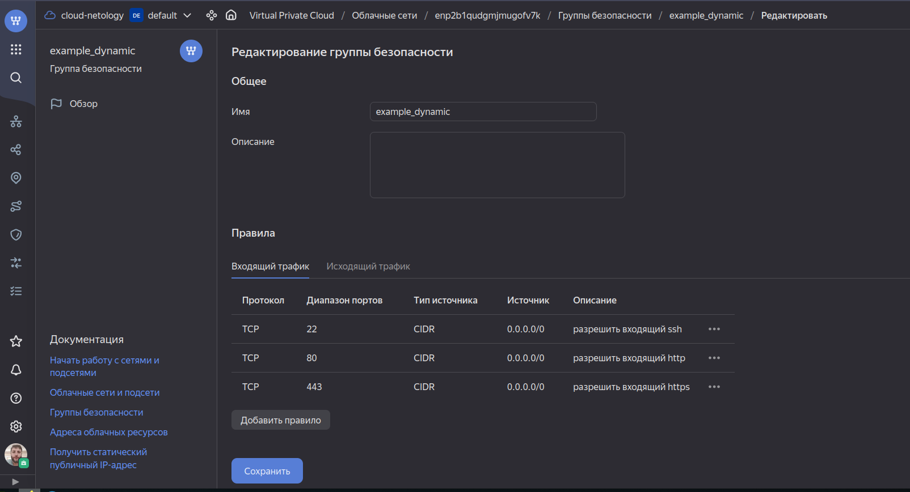
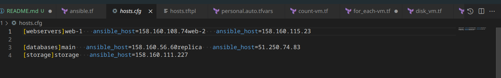

# Управляющие конструкции в коде Terraform

### Задание 1
- Приложите скриншот входящих правил «Группы безопасности» в ЛК Yandex Cloud.
<p align="center">
  
</p>

### Задание 2
- Создайте файл count-vm.tf. Опишите в нём создание двух одинаковых ВМ web-1 и web-2 (не web-0 и web-1) с минимальными параметрами, используя мета-аргумент count loop.

```
resource "yandex_compute_instance" "web" {
  name        = "web-${count.index + 1}"
  platform_id = "standard-v1"
  
  count = 2

  resources {
    cores  = 2
    memory = 1
    core_fraction = 20
  }

  boot_disk {
    initialize_params {
      image_id = data.yandex_compute_image.ubuntu-2004-lts.image_id
      type = "network-hdd"
      size = 5
    }   
  }
```
- Назначьте ВМ созданную в первом задании группу безопасности.(как это сделать узнайте в документации провайдера yandex/compute_instance)

```
  network_interface { 
    subnet_id = yandex_vpc_subnet.develop.id
    nat       = true

    security_group_ids = [yandex_vpc_security_group.example.id]
  }
```
- Создайте файл for_each-vm.tf. Опишите в нём создание двух ВМ с именами "main" и "replica" разных по cpu/ram/disk , используя мета-аргумент for_each loop.

```
resource "yandex_compute_instance" "vm" {
  for_each = { for key, val in var.vm_resources : key => val }

  name        = each.value.vm_name
  platform_id = "standard-v1"
  resources {
    cores         = each.value.cpu
    memory        = each.value.ram
  }
  boot_disk {
    initialize_params {
      image_id = data.yandex_compute_image.ubuntu-2004-lts.image_id
      size = each.value.disk
    }
  }
  scheduling_policy {
    preemptible = true
  }
  network_interface {
    subnet_id = yandex_vpc_subnet.develop.id
    nat       = true
  }
  ```
  - Используйте для обеих ВМ одну общую переменную типа list(object({ vm_name=string, cpu=number, ram=number, disk=number })).
  
  ```
  variable "vm_resources" {
  type    = list(object({
    vm_name       = string
    cpu           = number
    ram           = number
    disk          = number
  }))
  default = [
    {
      vm_name       = "main"
      cpu           = 4
      ram           = 4
      disk          = 5
    },
    {
      vm_name       = "replica"
      cpu           = 2
      ram           = 2
      disk          = 6
    }
  ]
}
```
- ВМ из пункта 2.2 должны создаваться после создания ВМ из пункта 2.1.

```
depends_on = [yandex_compute_instance.web]
```

- Используйте функцию file в local-переменной для считывания ключа ~/.ssh/id_rsa.pub и его последующего использования в блоке metadata, взятому из ДЗ 2.
```
variable "public_key" {
type = object({
  ssh-keys           = string
})
default = {
    ssh-keys            = null
}
description = "Instance envs"
}
```


### Задание 3
- Создайте 3 одинаковых виртуальных диска размером 1 Гб с помощью ресурса yandex_compute_disk и мета-аргумента count в файле disk_vm.tf.

```
resource "yandex_compute_disk" "vol" {
  name        = "disk-${count.index + 1}"

  count = 3

  type = "network-hdd"
  zone = var.default_zone
  size = 1

}
```
- Создайте в том же файле одну ВМ c именем "storage" .
```
resource "yandex_compute_instance" "storage" {
  name        = "storage"
  platform_id = "standard-v1"

  resources {
    cores  = 2
    memory = 2
    core_fraction = 20
  }

  boot_disk {
    initialize_params {
      image_id = data.yandex_compute_image.ubuntu-2004-lts.image_id
      type = "network-hdd"
      size = 5
    }   
  }
```
- Используйте блок dynamic secondary_disk{..} и мета-аргумент for_each для подключения созданных вами дополнительных дисков.
```
  dynamic "secondary_disk" {
    for_each = yandex_compute_disk.vol.*.id
    content {
      disk_id     = secondary_disk.value
      mode        = "READ_WRITE"
    }
  }
```

### Задание 4
- В файле ansible.tf создайте inventory-файл для ansible. Используйте функцию tepmplatefile и файл-шаблон для создания ansible inventory-файла из лекции.
```
resource "local_file" "hosts_cfg" {
 content = templatefile("${path.module}/hosts.tftpl",
    {
 webservers = yandex_compute_instance.web
 databases = yandex_compute_instance.vm
 storage = [yandex_compute_instance.storage]
    }
  )
 filename = "${(path.module)}/hosts.cfg"
}
```
- Передайте в него в качестве переменных группы виртуальных машин из задания 2.1, 2.2 и 3.2, т. е. 5 ВМ.
```
[webservers]
%{~ for i in webservers ~}
${i["name"]}   ansible_host=${i["network_interface"][0]["nat_ip_address"]} 
%{~ endfor ~}


[databases]
%{~ for i in databases ~}
${i["name"]}   ansible_host=${i["network_interface"][0]["nat_ip_address"]} 
%{~ endfor ~}

[storage]
%{~ for i in storage ~}
${i["name"]}   ansible_host=${i["network_interface"][0]["nat_ip_address"]} 
%{~ endfor ~}
```

- Приложите скриншот получившегося файла.
<p align="center">
  
</p>

- Для общего зачёта создайте в вашем GitHub-репозитории новую ветку terraform-03. Закоммитьте в эту ветку свой финальный код проекта, пришлите ссылку на коммит.
https://github.com/so121183gak/devops-netology/commit/9b5990f6b8a7798382f6c25475a2e019915039c8


### Весь код можно посмотреть по ссылке
https://github.com/so121183gak/devops-netology/tree/terraform-03/src