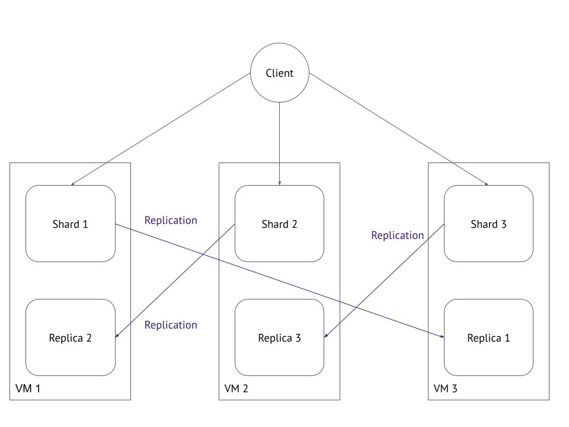

# Микросервисы: масштабирование

### Основная часть

Вы работаете в крупной компании, которая строит систему на основе микросервисной архитектуры. Вам как DevOps-специалисту необходимо выдвинуть предложение по организации инфраструктуры для разработки и эксплуатации.

#### Задача 1: Кластеризация

Предложите решение для обеспечения развёртывания, запуска и управления приложениями. Решение может состоять из одного или нескольких программных продуктов и должно описывать способы и принципы их взаимодействия.

Решение должно соответствовать следующим требованиям:

    поддержка контейнеров;
    обеспечивать обнаружение сервисов и маршрутизацию запросов;
    обеспечивать возможность горизонтального масштабирования;
    обеспечивать возможность автоматического масштабирования;
    обеспечивать явное разделение ресурсов, доступных извне и внутри системы;
    обеспечивать возможность конфигурировать приложения с помощью переменных среды, в том числе с возможностью безопасного хранения чувствительных данных таких как пароли, ключи доступа, ключи шифрования и т. п.

Обоснуйте свой выбор.

#### Ответ
При выборе решения хотелось бы иметь целостную систему которая может обеспечить все требования, по итогу определились два кандидата:

| Требования | Kubernetes | Amazon ECS  |
|----------|----------|----------|
| Поддержка контейнеров    | + | + |
| Обнаружение сервисов и маршрутизация запросов    | + | + |
| Возможность горизонтального масштабирования    | + | + |
| Возможность автоматического масштабирования    | + | + |
| Явное разделение ресурсов доступных извне и внутри системы    | + | + |
| Возможность конфигурировать приложения с помощью переменных среды, в том числе с возможностью безопасного хранения чувствительных данных таких как пароли, ключи доступа, ключи шифрования и т.п.    | + | + |

Оба решения подходят, однако мой выбор пал на Kubernetes, так как по сути именно он на данный момент становится стандартом для отрасли, а такие решения как **Microsoft Azure Kubernetes Service**, **Google Kubernetes Engine** и даже  **Amazon Elastic Kubernetes Service** по сути являются тем же Kubernetes в своей упаковке (естественно их развертование и эксплуатация упрощенны, а так же можно легко интегрировать их в экосистему провайдоров которые их предоставляют), если даже большие компании используют его в качестве стандарта, следовательно мы имеет определенную уверенность, что проект будет развиваться и мы смело можем его использовать для наших целей. К тому же в нужный момент можно будет переехать на инфраструктуру другого провайдера или и вовсе сделать свою (для экономии бюджета, или безопасности например) и там развернуть все на Kubernetes.

#### Задача 2: Распределённый кеш * (необязательная)

Разработчикам вашей компании понадобился распределённый кеш для организации хранения временной информации по сессиям пользователей. Вам необходимо построить Redis Cluster, состоящий из трёх шард с тремя репликами.
Схема:

  

#### Ответ
Специально для реалтзации задачи был разработан playbook ansible, который устанавливает все что нужно на шарды и поднимает кластер. 

  

  

Пользоваться им довольно просто необходимо в **inventory** прописать креды для ваших шардов.

### Весь код можно посмотреть по ссылке
https://github.com/so121183gak/devops-netology/tree/main/microservices/lesson4/src

