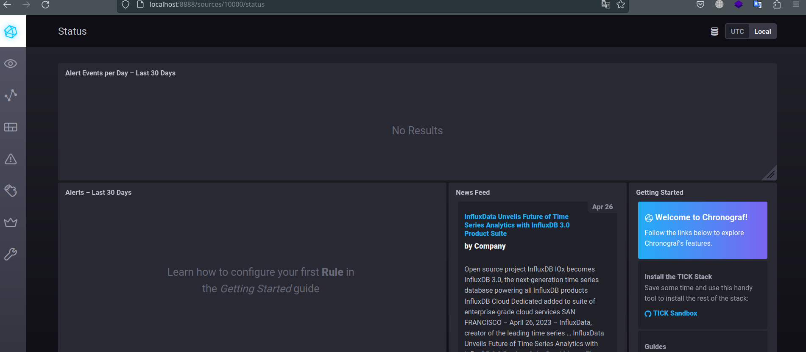
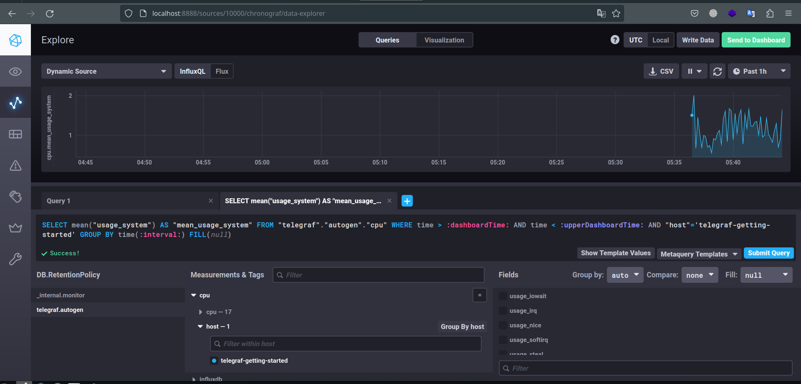
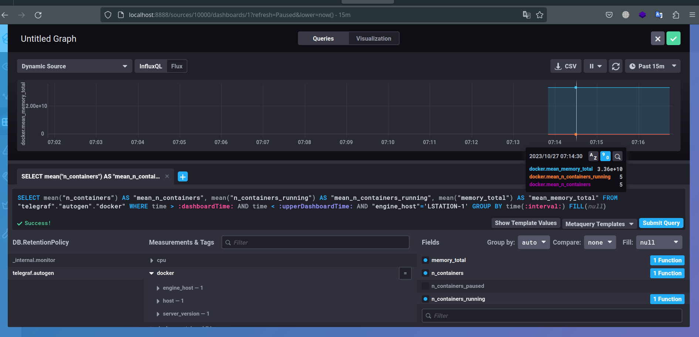

# Системы мониторинга
### Основная часть

1. Вас пригласили настроить мониторинг на проект. На онбординге вам рассказали, что проект представляет из себя платформу для вычислений с выдачей текстовых отчетов, которые сохраняются на диск. Взаимодействие с платформой осуществляется по протоколу http. Также вам отметили, что вычисления загружают ЦПУ. Какой минимальный набор метрик вы выведите в мониторинг и почему?

Ответ:
Я бы ввел следующие метрики
- HTTP response time, нам необходим контроль производительности сервера а так же понимание того в какие промежутки времени у нас занимает ответ на запрос клиента, таким образом можно добиться оптимальных настроек нашего сервера.

- HTTP requests total, эта метрика поможет оценить общий объем трафика на наш сервер, в следствии чего поможет понять как нам дальше масштабировать нашу систему.

- HTTP requests errors total, данная метрика поможет нам понять объем запросов  которые завершились с ошибками, а их детальное изучение и соотнесение с работой системы может нас натолкнуть на варианты по оптимизации системы и уменьшения этого показателя.

- Disk utilization, данная метрика поможет нам понять на сколько загружен диск и страдает ли от этого производительность, так как наши отчеты сохраняются на диск. По результатом этой метрики мы можем принимать решения относительно масштабирования системы, в части подхода к вопросу относительно того куда сохранять отчеты.

- CPU utilization, еще одна метрика которая поможет нам вычислить проблемы с производительностью если они будут, при высокой степени нагрузки на CPU надо будет задуматься, все ли хорошо с нашим приложением, либо проблема действительно в нехватке ресурсов.

- Memory usage, данная метрика также даст нам понять какой объем памяти используется и в какое время, это нам позволит соотнести данную информацию с работой приложения и понять какие процессы в приложении у нас не оптимальны и стоит ли увеличивать ресурсы, за место того что бы оптимизировать приложение.

2. Менеджер продукта посмотрев на ваши метрики сказал, что ему непонятно что такое RAM/inodes/CPUla. Также он сказал, что хочет понимать, насколько мы выполняем свои обязанности перед клиентами и какое качество обслуживания. Что вы можете ему предложить?

Ответ:

- RAM (Random Access Memory) это обозначение обычно оперативной памяти сервера или ПК, используется для временного хранения данных с которым работает процессор. RAM хранит данные только во время работы компьютера, после выключения данные стираются.

- CPU load это мера использования центрального процессора в определенный момент времени, обычно эта мера представляется в виде процента использования процессора, либо средним значением по ядрам процессора.

- Inodes это индексные дескрипторы структуры данных в файловых системах, используемые для хранения метаданных о файлах и каталогах. Благодаря им мы можем например не копировать одни ите же бинарные файлы в разные каталоги, а можем просто сделать символическую ссылку в том место где нам нужен этот бинарный файл. Inode не бесконечны, если мы их расходуем на определенном разделе, у нас может быт такая ситуация что мы не сможем создать новый файл или каталог.

- Что бы понять выполняем ли мы обязанности перед клиентами нам необходимо посмотреть на показатели:

    SLO. Целевой уровень качества обслуживания. Целевое значение или диапазон значений.
    SLA. Соглашение об уровне обслуживания. Явный или неявный контракт с внешними пользователями, включающий в себя последствия невыполнения SLO.
    SLI. Индикатор качества обслуживания. Конкретная величина предоставляемого обслуживания.

Например при SLO установленно 99 % отдачи запросов отличных от 4xx/5xx, 1% остается на техническое обслуживание мы понимаем какой уровень обслуживания нам нужен и можем его подсчитать если возьмем данные из метрик. SLI это сумма summ_2xx_requests + summ_3xx_requests / summ_all_requests 

При детальном рассмотрении мы понимаем что уровень SLI должен быть выше уровня SLA, однако уровень не должен быть по разнице слишком большим, так как у клиентов могут быть завышенные ожидания о качестве работы системы, если и передвигать границы SLA то их надо передвигать очень медленно и взвешено, что бы была возможность действительно держать эту планку. 

3. Вашей DevOps команде в этом году не выделили финансирование на построение системы сбора логов. Разработчики в свою очередь хотят видеть все ошибки, которые выдают их приложения. Какое решение вы можете предпринять в этой ситуации, чтобы разработчики получали ошибки приложения?

- Ответ: 
Можно поднять zabbix сервер так как он идет по лицензии GNU GPL проблем с использованием не будет. Мы можем развернуть zabbix агентов в тех местах где у нас работает наше приложение и смело переводить логи на сервер zabbix. Разработчки получат систему единого окна им не придется ходить на ВМ или сервера что бы посмотреть логи приложений.

4. Вы, как опытный SRE, сделали мониторинг, куда вывели отображения выполнения SLA=99% по http кодам ответов. Вычисляете этот параметр по следующей формуле: summ_2xx_requests/summ_all_requests. Данный параметр не поднимается выше 70%, но при этом в вашей системе нет кодов ответа 5xx и 4xx. Где у вас ошибка?

Ответ: 
Стоит использовать следующую формулу
summ_2xx_requests / (summ_2xx_requests + summ_5xx_requests + summ_4xx_requests)

5. Опишите основные плюсы и минусы pull и push систем мониторинга.

- Ответ:

Push модель плюсы
- упрощение репликации данных в разные системы мониторинга или их резервные копии
- гибкая настройка отправки данных с метриками
- возможность передачи мтерик по UDP протоколу

Push модель минусы
- накладные расходы на сеть, если стоит слишком частая отправка данных
- зависимость от доступности сервера

Pull модель плюсы
- централизованный контроль агентов
- возможность настройки централизованного proxy server до агентов
- упрощенная отладка получения данных с агентов

Pull модель минусы
- зависимость от активности агента
- задержка при обнаружении проблем, так как сервер будет захватывать метрики с периодичностью

6. Какие из ниже перечисленных систем относятся к push модели, а какие к pull? А может есть гибридные?
    Prometheus
    TICK
    Zabbix
    VictoriaMetrics
    Nagios

- Ответ:
- Prometheus-pull модель
- TICK- push модель
- Zabbix- pull и push модель
- VictoriaMetrics - pull модель
- Nagios- pull и push модель

7. Склонируйте себе репозиторий и запустите TICK-стэк, используя технологии docker и docker-compose.

В виде решения на это упражнение приведите скриншот веб-интерфейса ПО chronograf (http://localhost:8888).

P.S.: если при запуске некоторые контейнеры будут падать с ошибкой - проставьте им режим Z, например ./data:/var/lib:Z

- Ответ:

  

8. Перейдите в веб-интерфейс Chronograf (http://localhost:8888) и откройте вкладку Data explorer.
    Нажмите на кнопку Add a query
    Изучите вывод интерфейса и выберите БД telegraf.autogen
    В measurments выберите cpu->host->telegraf-getting-started, а в fields выберите usage_system. Внизу появится график утилизации cpu.
    Вверху вы можете увидеть запрос, аналогичный SQL-синтаксису. Поэкспериментируйте с запросом, попробуйте изменить группировку и интервал наблюдений.

Для выполнения задания приведите скриншот с отображением метрик утилизации cpu из веб-интерфейса.

  

    Изучите список telegraf inputs. Добавьте в конфигурацию telegraf следующий плагин - docker:

[[inputs.docker]]
  endpoint = "unix:///var/run/docker.sock"

9. Дополнительно вам может потребоваться донастройка контейнера telegraf в docker-compose.yml дополнительного volume и режима privileged:

  telegraf:
    image: telegraf:1.4.0
    privileged: true
    volumes:
      - ./etc/telegraf.conf:/etc/telegraf/telegraf.conf:Z
      - /var/run/docker.sock:/var/run/docker.sock:Z
    links:
      - influxdb
    ports:
      - "8092:8092/udp"
      - "8094:8094"
      - "8125:8125/udp"

После настройке перезапустите telegraf, обновите веб интерфейс и приведите скриншотом список measurments в веб-интерфейсе базы telegraf.autogen . Там должны появиться метрики, связанные с docker.

  

