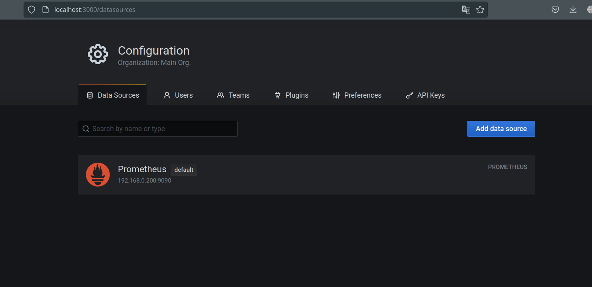
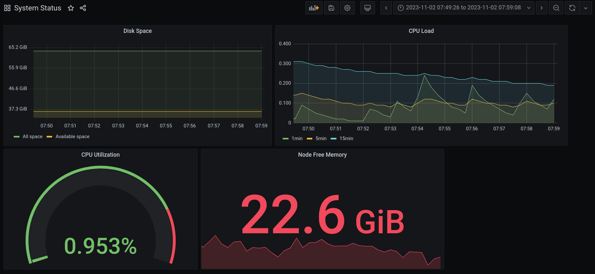
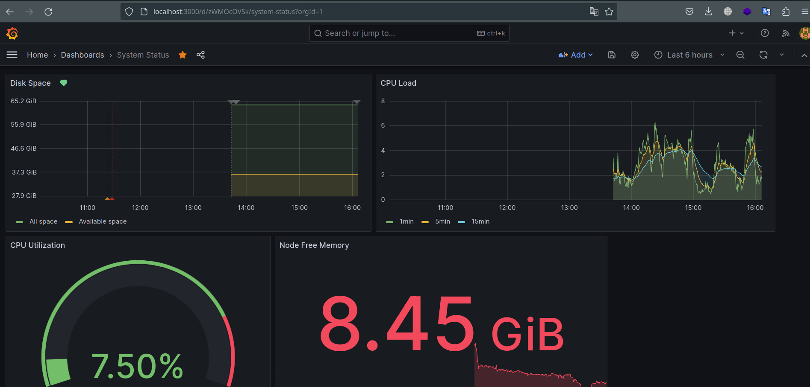

# Средство визуализации Grafana
### Основная часть

#### Задание 1

  1. Используя директорию help внутри этого домашнего задания, запустите связку prometheus-grafana.
  2. Зайдите в веб-интерфейс grafana, используя авторизационные данные, указанные в манифесте docker-compose.
  3. Подключите поднятый вами prometheus, как источник данных.
  4. Решение домашнего задания — скриншот веб-интерфейса grafana со списком подключенных Datasource.

- Ответ:
<p align="center">
  
</p>

#### Задание 2

Создайте Dashboard и в ней создайте Panels:

    утилизация CPU для nodeexporter (в процентах, 100-idle);
    CPULA 1/5/15;
    количество свободной оперативной памяти;
    количество места на файловой системе.

Для решения этого задания приведите promql-запросы для выдачи этих метрик, а также скриншот получившейся Dashboard.

- Ответ:

**CPU Utilization**
```
100 - (avg (rate(node_cpu_seconds_total{job=~"nodeexporter",mode="idle"}[1m])) * 100)
```

**CPU Load**
```
avg(node_load1)
avg(node_load5)
avg(node_load15)
```

**Node Free Memory**
```
node_memory_MemFree_bytes{instance="nodeexporter:9100", job="nodeexporter"}
```

**Disk Space**
```
node_filesystem_size_bytes{device="/dev/sdc2", fstype="ext4", instance="nodeexporter:9100", job="nodeexporter", mountpoint="/"}
node_filesystem_avail_bytes{device="/dev/sdc2", fstype="ext4", instance="nodeexporter:9100", job="nodeexporter", mountpoint="/"}
```

<p align="center">
  
</p>

#### Задание 3

1. Создайте для каждой Dashboard подходящее правило alert — можно обратиться к первой лекции в блоке «Мониторинг».
2. В качестве решения задания приведите скриншот вашей итоговой Dashboard.

<p align="center">
  
</p>

#### Задание 4

1. Сохраните ваш Dashboard.Для этого перейдите в настройки Dashboard, выберите в боковом меню «JSON MODEL». Далее скопируйте отображаемое json-содержимое в отдельный файл и сохраните его.
2. В качестве решения задания приведите листинг этого файла.

https://github.com/so121183gak/devops-netology/tree/main/monitoring/lesson2/src/Json-model.json
